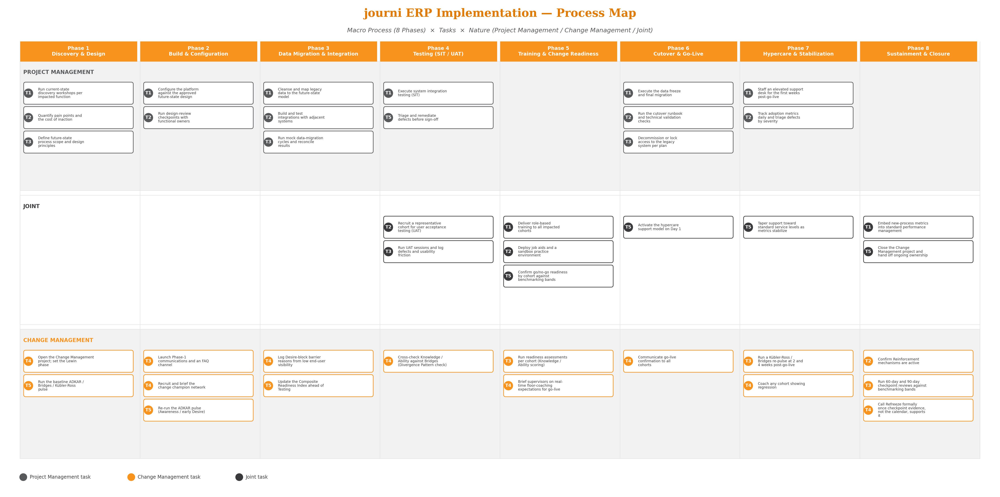

**POWERACT CONSULTING**

**Running an ERP Implementation on journi**

**A Practical User Guide**

*Executive Summary · Process Map · Week-by-Week Playbook*

*SIPOC, Techniques & RACSI per Task and Step · Tracking Dashboard · Simulated Data Walkthrough*

*Applied to a 12-Month, Vendor-Agnostic ERP Program*

Built on journi\'s Framework Interaction Map v2.1

Lewin · Prosci ADKAR · Bridges\' Transition Model · Kübler-Ross Change Curve

Version 2.0 · August 2026 · Confidential

**Table of Contents**

**Executive Summary**4

> What This Guide Contains4
>
> How to Use It4

**1. Introduction**5

> 1.1 Purpose of This Guide5
>
> 1.2 Who This Guide Is For5
>
> 1.3 How the Eight journi Phases Map to a 12-Month Calendar5

**2. Getting Started in journi**7

> 2.1 Core Modules Referenced Throughout This Guide7
>
> 2.2 One Rule Before You Start Logging Anything7
>
> 2.3 journi\'s Two Computed Metrics (the only automated calls journi makes)7
>
> 2.4 Where to Find journi Cross-References in This Guide7

**3. The Four Frameworks --- Quick Primer and Signal Catalogue**8

> 3.1 Lewin\'s Unfreeze -- Change -- Refreeze8
>
> 3.2 Prosci ADKAR8
>
> 3.3 Bridges\' Transition Model9
>
> 3.4 Kübler-Ross Change Curve9
>
> 3.5 The Project / Change / Joint Tag9

**4. Process Map --- Macro Process, Tasks & Nature**10

> 4.1 Macro Process --- Task --- Nature Reference Table10

**5. Week-by-Week Implementation Timeline**13

> 5.1 Phase 1 --- Discovery & Design (Weeks 1--12)13
>
> 5.2 Phase 2 --- Build & Configuration (Weeks 5--24 (overlaps Phase 1 close and Phase 3 start))13
>
> 5.3 Phase 3 --- Data Migration & Integration (Weeks 13--28 (runs alongside Phase 2))14
>
> 5.4 Phase 4 --- Testing (SIT / UAT) (Weeks 25--32 (overlaps Phase 3 close and Phase 5))14
>
> 5.5 Phase 5 --- Training & Change Readiness (Weeks 25--36 (overlaps Testing))15
>
> 5.6 Phase 6 --- Cutover & Go-Live (Week 37 (short, discrete event))15
>
> 5.7 Phase 7 --- Hypercare & Stabilization (Weeks 37--48)16
>
> 5.8 Phase 8 --- Sustainment & Closure (Weeks 45--52+)16

**6. Detailed Phase Playbooks --- SIPOC, Timeline, Tasks, Steps & RACSI**17

> 6.1 Phase 1 --- Discovery & Design (Weeks 1--12)18
>
> 6.2 Phase 2 --- Build & Configuration (Weeks 5--24)25
>
> 6.3 Phase 3 --- Data Migration & Integration (Weeks 13--28)32
>
> 6.4 Phase 4 --- Testing (SIT / UAT) (Weeks 25--32)39
>
> 6.5 Phase 5 --- Training & Change Readiness (Weeks 25--36)45
>
> 6.6 Phase 6 --- Cutover & Go-Live (Week 37)52
>
> 6.7 Phase 7 --- Hypercare & Stabilization (Weeks 37--48)58
>
> 6.8 Phase 8 --- Sustainment & Closure (Weeks 45--52+)65

**7. What to Track --- By Cadence**72

> 7.1 Daily72
>
> 7.2 Weekly72
>
> 7.3 Bi-Weekly72
>
> 7.4 Monthly72
>
> 7.5 Escalation Thresholds73
>
> 7.6 Weekly Dashboard --- What a Healthy Week Looks Like73

**8. Simulated Data Walkthrough --- Project Meridian**74

> 8.1 Reading the Simulation75

**9. Exception Playbook --- Detailed SIPOC, Tasks, Steps & RACSI**76

> 9.1 E1 --- Desire Stall During Data Migration & Integration77
>
> 9.2 E2 --- Divergence Pattern Detected During Testing / Training81
>
> 9.3 E3 --- Two-Clock Problem at Cutover & Go-Live85
>
> 9.4 E4 --- Sentiment Regression During Hypercare90
>
> 9.5 E5 --- Reinforcement Gap at Sustainment & Closure94
>
> 9.6 E6 --- Cohort Divergence Across Sites or Departments98

**10. Governance & Reporting Cadence**103

**Appendix --- Quick Reference**104

> A.1 Role Legend104
>
> A.2 RACSI Legend104
>
> A.3 Project / Change Tag Legend104
>
> A.4 Blank Weekly Tracker Template104
>
> A.5 Consolidated Open-Source Tool Reference105
>
> A.6 Recommended Reading Order by Role106
>
> A.7 Frequently Asked Questions106
>
> A.8 Glossary107
>
> A.9 Technique Reference107

**Executive Summary**

This guide operationalizes journi\'s Framework Interaction Map for a 12-month, vendor-agnostic ERP implementation. It is built for day-to-day use: a Change Manager, Project Manager, Executive Sponsor or Frontline Supervisor should be able to open any page and know exactly what to do that week, which journi module to update, and what evidence to log.

The guide covers 8 implementation phases, broken into 40 Tasks (15 Project Management, 16 Change Management, 9 Joint), each broken further into 80 individually specified Steps --- every Step naming a facilitation or analysis technique, its goal, a working description of how to run it, and a recommended open-source tool. Six recurring exception patterns (E1--E6), covering a further 30 recovery Tasks, tell the Change Manager exactly what to do when the normal flow breaks down in one of its typical, recognizable ways.

**What This Guide Contains**

-   A visual Process Map of all 8 phases and every Task, colored by nature (Project Management, Change Management, or Joint), so the two disciplines\' contributions are visible at a glance (Section 4).

-   A week-by-week timeline across the full 12-month program, phase by phase (Section 5).

-   A full operational playbook for every phase: SIPOC, timeline, and every Task broken into Steps with technique, goal, execution detail, recommended open-source tool, journi module cross-references, and RACSI (Section 6).

-   A cadence-based tracking model --- daily, weekly, bi-weekly, monthly --- with explicit escalation thresholds (Section 7).

-   A fully simulated 12-month program, "Project Meridian," showing what the framework readings and journi\'s alerts actually look like month over month (Section 8).

-   The same SIPOC / Task / Step / RACSI detail applied to all six exception patterns (Section 9).

-   Standing governance cadence, a consolidated open-source tool reference, a role-based reading guide, an FAQ, and a glossary (Section 10 and Appendix).

**How to Use It**

Read Sections 1--3 once, at the start of the program, to establish shared vocabulary. From there, use the guide as a reference: Section 5 for "what happens this week," Section 6 for "exactly how do I run this Task," Section 7 for "what should I be checking right now," and Section 9 the moment something looks like it\'s going off the expected path. Appendix A.6 gives a role-specific reading order if you don\'t want to read linearly.

**1. Introduction**

**1.1 Purpose of This Guide**

This is a practitioner\'s how-to guide, not a framework reference. It tells a Change Manager, Project Manager, Sponsor and Frontline Supervisor what to do, week by week, over the course of a 12-month ERP implementation running on journi --- and exactly what to track, when, and why. It assumes the reader already understands the four frameworks journi tracks (Lewin, Prosci ADKAR, Bridges\' Transition Model and the Kübler-Ross Change Curve) at a conceptual level; Section 3 provides a condensed refresher with the observable signs behind every stage.

Section 6 breaks every phase down to its full operational detail --- every Task\'s SIPOC, every Step within it with a named technique, goal, execution detail and recommended open-source tool, and a RACSI assignment (allowing more than one Responsible role, but exactly one Accountable role). Section 8 then walks through a fully simulated program --- "Project Meridian" --- so the reader can see what the framework readings, the Composite Readiness Index, and journi\'s exception alerts actually look like month over month, rather than only reading about them in the abstract.

**1.2 Who This Guide Is For**

-   Change Manager (CM) --- the primary user of this guide; owns the four framework readings and the adoption plan.

-   Program / Project Manager (PM) --- owns scope, schedule, budget and delivery milestones.

-   Executive Sponsor (ES) --- owns the business case, delivers high-stakes messages, and clears organizational barriers.

-   Frontline Supervisors (SUP) --- coach the cohort day to day and are the first line of defense against regression.

**1.3 How the Eight journi Phases Map to a 12-Month Calendar**

journi\'s applied interaction map defines eight implementation phases. This guide converts those phase-level month ranges into a week-by-week calendar (Weeks 1--52+) so that day-to-day action items are unambiguous. Because real ERP programs run phases in parallel --- Build & Configuration overlaps Data Migration, which overlaps Testing --- several week ranges below appear in more than one phase table. That overlap is intentional: it reflects the two workstreams (Project Management and Change Management) running concurrently, not a scheduling error.

  -----------------------------------------------------------------------------------------------------
  **Phase**     **Title**                      **Weeks**
  ------------- ------------------------------ --------------------------------------------------------
  **Phase 1**   Discovery & Design             Weeks 1--12

  **Phase 2**   Build & Configuration          Weeks 5--24 (overlaps Phase 1 close and Phase 3 start)

  **Phase 3**   Data Migration & Integration   Weeks 13--28 (runs alongside Phase 2)

  **Phase 4**   Testing (SIT / UAT)            Weeks 25--32 (overlaps Phase 3 close and Phase 5)

  **Phase 5**   Training & Change Readiness    Weeks 25--36 (overlaps Testing)

  **Phase 6**   Cutover & Go-Live              Week 37 (short, discrete event)

  **Phase 7**   Hypercare & Stabilization      Weeks 37--48

  **Phase 8**   Sustainment & Closure          Weeks 45--52+
  -----------------------------------------------------------------------------------------------------

*Table 1.1 --- The eight journi phases and their week ranges across the 12-month program.*

**2. Getting Started in journi**

**2.1 Core Modules Referenced Throughout This Guide**

-   Module 4 --- Initiative Registry: single-select Lewin phase; drives the Benchmarking reference band in Module 15.

-   Module 5 --- Stakeholder Map: cohort, site and department structure used for disaggregated readiness views.

-   Module 6 --- ADKAR Engine: five 1--5 block scores plus mandatory barrier-reason notes for any score ≤ 2 (auto-escalated).

-   Module 7 --- Emotional & Transition Layer: Bridges and Kübler-Ross, single-select or inferred from free text; feeds the Divergence Pattern Detector and the Composite Readiness Index.

-   Module 15 --- Benchmarking: reference bands used at every go/no-go checkpoint.

**2.2 One Rule Before You Start Logging Anything**

Every entry into journi should be backed by an observed signal --- something a person said, something a person did, or something the data shows --- not a gut-feel estimate. Section 3 catalogues the specific signals behind every stage of all four frameworks; Section 7 tells you which cadence to check them on. A score with no signal behind it is a guess wearing a number.

**2.3 journi\'s Two Computed Metrics (the only automated calls journi makes)**

journi deliberately never auto-computes a Lewin, Bridges or Kübler-Ross reading --- these remain Change Manager judgment calls. Two narrow exceptions are fully automated:

-   Composite Readiness Index --- blends ADKAR (50%), Kübler-Ross sentiment (25%) and training completion (25%). Recalculate at least monthly (Section 7).

-   Divergence Pattern Detector --- a boolean alert: fires when Knowledge ≥ 3 and Ability ≥ 3 while Bridges reads exactly "Ending." See Exception E2 in Section 9.

**2.4 Where to Find journi Cross-References in This Guide**

Throughout Sections 6 and 9, any Task or Step that involves entering or updating data in journi carries a short "journi:" note naming the specific module. Steps with no such note are executed outside journi (a workshop, a document, an external tool) even though their output may later inform a journi entry.

**3. The Four Frameworks --- Quick Primer and Signal Catalogue**

Each framework operates at a different altitude and answers a different question. None of the four can substitute for the others; journi requires all four so that no single blind spot is possible. The tables below condense each framework\'s stages together with the concrete, observable signals --- what people say, what people do, and what the data shows --- that tell a Change Manager which stage is actually in play.

**3.1 Lewin\'s Unfreeze -- Change -- Refreeze**

*Kurt Lewin, 1947 · Altitude: organizational / systemic.*

  ----------------------------------------------------------------------------------------------------------------------------------------------------------------------------------------------------------------------------------------------------------------------------------------------------------------------
  **Stage**   **Meaning**                                                                          **Signs It Is Active**
  ----------- ------------------------------------------------------------------------------------ ---------------------------------------------------------------------------------------------------------------------------------------------------------------------------------------------------------------------
  Unfreeze    Building the case for change and loosening attachment to the status quo.             Leadership publicly questions "the way we\'ve always done it"; hallway/chat chatter rises; people ask "why now?"; requests for job-security reassurance increase; early skepticism ("we tried this before").

  Change      The transition itself --- old patterns released, new ones not yet habitual.          Old-process usage falls and new-process usage rises in system data; help-desk tickets spike; workarounds appear; supervisors coach more on the floor; a temporary productivity dip; informal peer champions emerge.

  Refreeze    The new state is deliberately stabilized until it is simply "how things are done."   The new process is cited without qualification; onboarding materials updated; old system access retired; KPIs stable across multiple cycles; the change survives a manager turnover.
  ----------------------------------------------------------------------------------------------------------------------------------------------------------------------------------------------------------------------------------------------------------------------------------------------------------------------

*Signal catalogue --- 3.1 Lewin\'s Unfreeze -- Change -- Refreeze: what to watch for, drawn from verbal, behavioral and data signals.*

**3.2 Prosci ADKAR**

*Prosci · Altitude: individual / cohort · strictly sequential.*

  --------------------------------------------------------------------------------------------------------------------------------------------------------------------------------------------------------------------------------------------------------------------------------
  **Block**       **Meaning**                                                **Signs the Block Is in Place**                                                                **Signs of a Gap (barrier-reason territory)**
  --------------- ---------------------------------------------------------- ---------------------------------------------------------------------------------------------- ------------------------------------------------------------------------------------------------------
  Awareness       Understands why the change is happening.                   Restates the business case unprompted; fewer "why are we doing this" questions.                Rumor replaces official messaging; "nobody told me" comments; "yet another initiative" cynicism.

  Desire          Personally wants to participate, not just understand.      Volunteers for pilots; asks how to prepare; advocates to peers unprompted.                     "I\'ll do it because I have to" language; low turnout at optional sessions; no clear WIIFM.

  Knowledge       Knows the specific steps to operate in the future state.   Describes new-process steps accurately; seeks extra training unprompted.                       Vague answers under light questioning; avoids hands-on practice; keeps relying on cheat-sheets.

  Ability         Can demonstrate the new skills under real conditions.      Consistent accurate completion without escalation; coaches peers unprompted.                   Repeated errors on the same step; manual workarounds; rising help-desk escalations.

  Reinforcement   Mechanisms exist to make the change durable.               Recognition is visible; new metrics in performance conversations; check-ins actually happen.   No follow-up cadence after go-live; backslide when unsupervised; champion network quietly dissolves.
  --------------------------------------------------------------------------------------------------------------------------------------------------------------------------------------------------------------------------------------------------------------------------------

*Signal catalogue --- 3.2 Prosci ADKAR: what to watch for, drawn from verbal, behavioral and data signals.*

**3.3 Bridges\' Transition Model**

*William Bridges, Managing Transitions, 1991 · Altitude: psychological / identity.*

  ---------------------------------------------------------------------------------------------------------------------------------------------------------------------------------------------------------------------------------------------------------------
  **Stage**       **Meaning**                                                                              **Signs to Look For**
  --------------- ---------------------------------------------------------------------------------------- ------------------------------------------------------------------------------------------------------------------------------------------------------
  Ending          Letting go of the old identity, competence and relationships --- often with real loss.   Spontaneous expressions of loss; "old days" storytelling; resistance to retiring old tools; denial statements; a dip in discretionary effort.

  Neutral Zone    The disorienting in-between --- old ways gone, new ways not yet automatic.               Confusion about roles and "which rule applies now"; a temporary morale dip; ambiguity-driven errors; active rumor mill; requests for more structure.

  New Beginning   Genuine buy-in and a new identity forming --- ownership, not compliance.                 New vocabulary ("we\'re a digital team now"); visible pride; teaching newcomers unprompted; forward-looking improvement suggestions.
  ---------------------------------------------------------------------------------------------------------------------------------------------------------------------------------------------------------------------------------------------------------------

*Signal catalogue --- 3.3 Bridges\' Transition Model: what to watch for, drawn from verbal, behavioral and data signals.*

**3.4 Kübler-Ross Change Curve**

*Adapted from Elisabeth Kübler-Ross, 1969 · Altitude: emotional / moment-to-moment.*

  -------------------------------------------------------------------------------------------------------------------------------------------------------------------------------------------------------------------------------------
  **Stage**            **Meaning**                                                                    **Signs to Look For**
  -------------------- ------------------------------------------------------------------------------ ---------------------------------------------------------------------------------------------------------------------------------
  Denial               The change is not yet accepted as real or personally relevant.                 "This doesn\'t really apply to us"; unopened comms; business-as-usual behavior; minimal engagement at info sessions.

  Resistance / Anger   Active, visible pushback --- a normal, necessary phase, not pure negativity.   Vocal public complaints; blame-shifting; escalations to leadership; sarcasm; slow-walking tasks; rising interpersonal friction.

  Exploration          Cautious engagement mixing curiosity with residual doubt.                      Tentative questions rather than flat refusal; willingness to pilot; mixed sentiment in the same room; sandbox experimentation.

  Commitment           Active, willing participation, sustained without being watched.                Proactive unprompted use in real work; peer advocacy; improvement suggestions rather than requests to revert.
  -------------------------------------------------------------------------------------------------------------------------------------------------------------------------------------------------------------------------------------

*Signal catalogue --- 3.4 Kübler-Ross Change Curve: what to watch for, drawn from verbal, behavioral and data signals.*

**3.5 The Project / Change / Joint Tag**

Every Task in Sections 6 and 9 is tagged so the two disciplines\' contributions stay distinguishable:

-   \[PROJECT\] --- scope, schedule, budget, technical build, data, delivery milestones. Owned by the PM and ITL.

-   \[CHANGE\] --- awareness, desire, capability adoption, identity/transition and sentiment work. Owned by the CM, ES and Supervisors.

-   \[JOINT\] --- Tasks where a delivery decision and a change activity are fused into one action (a go/no-go call, a champion-network handoff) --- no single discipline can own these alone.

**4. Process Map --- Macro Process, Tasks & Nature**

The diagram below shows the full macro process --- all 8 phases --- with every Task placed in one of three lanes according to its nature: Project Management, Change Management, or Joint. Reading left to right shows how the balance of work shifts across the program: Project Management work concentrates in the early build and the technical cutover (Phases 1--3 and 6); Change Management work concentrates in the back half (Phases 7--8); Joint work clusters exactly where a delivery decision and an adoption decision cannot be separated (the go/no-go call in Phase 5, and the go-live communication and hypercare activation in Phase 6).

{width="7.291666666666667in" height="3.6354166666666665in"}

*Figure 4.1 --- Process map: 8 phases × all Tasks, colored by nature (Project Management / Change Management / Joint).*

**4.1 Macro Process --- Task --- Nature Reference Table**

The same information as the diagram, in tabular form for accessibility and quick lookup.

**Phase 1 --- Discovery & Design**

  ---------------------------------------------------------------------------------------
  **Task**   **Task Name**                                                 **Nature**
  ---------- ------------------------------------------------------------- --------------
  T1         Run current-state discovery workshops per impacted function   \[PROJECT\]

  T2         Quantify pain points and the cost of inaction                 \[PROJECT\]

  T3         Define future-state process scope and design principles       \[PROJECT\]

  T4         Open the Change Management project; set the Lewin phase       \[CHANGE\]

  T5         Run the baseline ADKAR / Bridges / Kübler-Ross pulse          \[CHANGE\]
  ---------------------------------------------------------------------------------------

**Phase 2 --- Build & Configuration**

  -------------------------------------------------------------------------------------------
  **Task**   **Task Name**                                                     **Nature**
  ---------- ----------------------------------------------------------------- --------------
  T1         Configure the platform against the approved future-state design   \[PROJECT\]

  T2         Run design-review checkpoints with functional owners              \[PROJECT\]

  T3         Launch Phase-1 communications and an FAQ channel                  \[CHANGE\]

  T4         Recruit and brief the change champion network                     \[CHANGE\]

  T5         Re-run the ADKAR pulse (Awareness / early Desire)                 \[CHANGE\]
  -------------------------------------------------------------------------------------------

**Phase 3 --- Data Migration & Integration**

  -----------------------------------------------------------------------------------------
  **Task**   **Task Name**                                                   **Nature**
  ---------- --------------------------------------------------------------- --------------
  T1         Cleanse and map legacy data to the future-state model           \[PROJECT\]

  T2         Build and test integrations with adjacent systems               \[PROJECT\]

  T3         Run mock data-migration cycles and reconcile results            \[PROJECT\]

  T4         Log Desire-block barrier reasons from low end-user visibility   \[CHANGE\]

  T5         Update the Composite Readiness Index ahead of Testing           \[CHANGE\]
  -----------------------------------------------------------------------------------------

**Phase 4 --- Testing (SIT / UAT)**

  ------------------------------------------------------------------------------------------------------
  **Task**   **Task Name**                                                                **Nature**
  ---------- ---------------------------------------------------------------------------- --------------
  T1         Execute system integration testing (SIT)                                     \[PROJECT\]

  T2         Recruit a representative cohort for user acceptance testing (UAT)            \[JOINT\]

  T3         Run UAT sessions and log defects and usability friction                      \[JOINT\]

  T4         Cross-check Knowledge / Ability against Bridges (Divergence Pattern check)   \[CHANGE\]

  T5         Triage and remediate defects before sign-off                                 \[PROJECT\]
  ------------------------------------------------------------------------------------------------------

**Phase 5 --- Training & Change Readiness**

  --------------------------------------------------------------------------------------------------
  **Task**   **Task Name**                                                            **Nature**
  ---------- ------------------------------------------------------------------------ --------------
  T1         Deliver role-based training to all impacted cohorts                      \[JOINT\]

  T2         Deploy job aids and a sandbox practice environment                       \[JOINT\]

  T3         Run readiness assessments per cohort (Knowledge / Ability scoring)       \[CHANGE\]

  T4         Brief supervisors on real-time floor-coaching expectations for go-live   \[CHANGE\]

  T5         Confirm go/no-go readiness by cohort against benchmarking bands          \[JOINT\]
  --------------------------------------------------------------------------------------------------

**Phase 6 --- Cutover & Go-Live**

  -------------------------------------------------------------------------------------
  **Task**   **Task Name**                                               **Nature**
  ---------- ----------------------------------------------------------- --------------
  T1         Execute the data freeze and final migration                 \[PROJECT\]

  T2         Run the cutover runbook and technical validation checks     \[PROJECT\]

  T3         Decommission or lock access to the legacy system per plan   \[PROJECT\]

  T4         Communicate go-live confirmation to all cohorts             \[CHANGE\]

  T5         Activate the hypercare support model on Day 1               \[JOINT\]
  -------------------------------------------------------------------------------------

**Phase 7 --- Hypercare & Stabilization**

  ----------------------------------------------------------------------------------------------
  **Task**   **Task Name**                                                        **Nature**
  ---------- -------------------------------------------------------------------- --------------
  T1         Staff an elevated support desk for the first weeks post-go-live      \[PROJECT\]

  T2         Track adoption metrics daily and triage defects by severity          \[PROJECT\]

  T3         Run a Kübler-Ross / Bridges re-pulse at 2 and 4 weeks post-go-live   \[CHANGE\]

  T4         Coach any cohort showing regression                                  \[CHANGE\]

  T5         Taper support toward standard service levels as metrics stabilize    \[JOINT\]
  ----------------------------------------------------------------------------------------------

**Phase 8 --- Sustainment & Closure**

  ----------------------------------------------------------------------------------------------------------
  **Task**   **Task Name**                                                                    **Nature**
  ---------- -------------------------------------------------------------------------------- --------------
  T1         Embed new-process metrics into standard performance management                   \[JOINT\]

  T2         Confirm Reinforcement mechanisms are active                                      \[CHANGE\]

  T3         Run 60-day and 90-day checkpoint reviews against benchmarking bands              \[CHANGE\]

  T4         Call Refreeze formally once checkpoint evidence, not the calendar, supports it   \[CHANGE\]

  T5         Close the Change Management project and hand off ongoing ownership               \[JOINT\]
  ----------------------------------------------------------------------------------------------------------

**5. Week-by-Week Implementation Timeline**

Each phase below lists the concrete weekly actions, the journi module to update (if any), and who is primarily involved. Owner codes: ES = Executive Sponsor, CM = Change Manager, PM = Program/Project Manager, FPO = Functional Process Owner, ITL = IT/Technical Lead, SUP = Frontline Supervisor, EU = End User cohort. Section 6 gives the full Task/Step/technique detail behind each of these weekly actions.

**5.1 Phase 1 --- Discovery & Design (Weeks 1--12)**

Establishes the business case, opens the journi project, and captures the Month-0 baseline across all four frameworks before any visible change has happened.

  ----------------------------------------------------------------------------------------------------------------------------------------------------
  **Week**   **Action**                                                                                     **journi Module**   **Primary Owner(s)**
  ---------- ---------------------------------------------------------------------------------------------- ------------------- ----------------------
  W1         Kickoff; confirm Executive Sponsor; open the Initiative Registry and set Lewin = Unfreeze.     Module 4            CM, ES

  W2--W3     Run current-state discovery workshops per impacted function.                                   ---                 PM, FPO

  W4         Quantify pain points and the cost of inaction; build the Stakeholder Map.                      Module 5            PM, CM

  W5--W6     Draft and review future-state process scope and design principles.                             ---                 PM, FPO, ITL

  W7         Formally open the Change Management project; brief the CM team on Modules 6--7.                Module 6--7         CM

  W8         Run the baseline ADKAR / Bridges / Kübler-Ross pulse (Month-0 reading).                        Module 6--7         CM

  W9         Review baseline pulse with the Steering Committee; confirm the risk register.                  ---                 CM, ES

  W10        Approve the future-state design; close the Phase 1 SIPOC sign-off.                             ---                 ES, FPO

  W11        Buffer / catch-up; finalize the RAID log.                                                      ---                 PM

  W12        Phase 1 gate review --- confirm the Unfreeze reading against the evidence, not the calendar.   Module 4            CM, ES
  ----------------------------------------------------------------------------------------------------------------------------------------------------

*Table 5.1 --- Weekly action plan for Discovery & Design.*

**5.2 Phase 2 --- Build & Configuration (Weeks 5--24 (overlaps Phase 1 close and Phase 3 start))**

Technical configuration proceeds in parallel with the first communications wave and the recruitment of the change champion network.

  ---------------------------------------------------------------------------------------------------------------------------------------------------------
  **Week**   **Action**                                                                                          **journi Module**   **Primary Owner(s)**
  ---------- --------------------------------------------------------------------------------------------------- ------------------- ----------------------
  W5--W6     Stand up the configuration environment; begin platform configuration against the approved design.   ---                 ITL

  W7--W8     Continue configuration; begin design-review checkpoints with functional owners.                     ---                 ITL, FPO

  W9--W10    Recruit change champion network nominees.                                                           Module 5            CM, SUP

  W11--W12   Launch Phase-1 communications (why / what / when) and an FAQ channel.                               ---                 CM

  W13--W14   Brief and activate the champion network.                                                            ---                 CM

  W15--W16   Re-run the ADKAR pulse (Awareness / early Desire).                                                  Module 6            CM

  W17--W18   Continue design-review checkpoints; resolve open build decisions.                                   ---                 PM, FPO

  W19--W20   Configuration checkpoint review; confirm build readiness ahead of migration.                        ---                 ITL, PM

  W21--W22   Finalize the configuration decision log.                                                            ---                 ITL

  W23--W24   Phase 2 gate review --- confirm the Awareness → Desire trend with the Steering Committee.           Module 6            CM, PM
  ---------------------------------------------------------------------------------------------------------------------------------------------------------

*Table 5.2 --- Weekly action plan for Build & Configuration.*

**5.3 Phase 3 --- Data Migration & Integration (Weeks 13--28 (runs alongside Phase 2))**

The highest-risk, least-visible phase --- exactly where journi\'s own data shows a Desire stall is most likely (Exception E1).

  --------------------------------------------------------------------------------------------------------------------------------------------------------
  **Week**   **Action**                                                                                         **journi Module**   **Primary Owner(s)**
  ---------- -------------------------------------------------------------------------------------------------- ------------------- ----------------------
  W13--W14   Cleanse and map legacy data to the future-state model.                                             ---                 ITL

  W15--W16   Build integrations with adjacent systems.                                                          ---                 ITL

  W17--W18   Test integrations; log defects.                                                                    ---                 ITL

  W19--W20   Run the first mock migration cycle and reconcile results.                                          ---                 ITL, PM

  W21--W22   Watch for Desire-stall signals from low end-user visibility; log a barrier reason if Desire ≤ 2.   Module 6            CM

  W23--W24   Run the second mock migration cycle; prepare data-quality sign-off.                                ---                 ITL

  W25--W26   Update the Composite Readiness Index ahead of the Testing entry gate.                              Module 6--7         CM

  W27--W28   Data-quality sign-off; Phase 3 gate review.                                                        ---                 FPO, ES
  --------------------------------------------------------------------------------------------------------------------------------------------------------

*Table 5.3 --- Weekly action plan for Data Migration & Integration.*

**5.4 Phase 4 --- Testing (SIT / UAT) (Weeks 25--32 (overlaps Phase 3 close and Phase 5))**

The first point where a representative slice of end users gets real hands-on exposure --- and the first honest opportunity to run the Divergence Pattern check (Exception E2).

  ----------------------------------------------------------------------------------------------------------------------------------------------------------------
  **Week**   **Action**                                                                                                 **journi Module**   **Primary Owner(s)**
  ---------- ---------------------------------------------------------------------------------------------------------- ------------------- ----------------------
  W25--W26   Execute system integration testing (SIT).                                                                  ---                 ITL

  W27        Recruit a representative UAT cohort.                                                                       Module 5            CM, FPO

  W28--W29   Run UAT sessions; log defects and usability friction.                                                      ---                 FPO, EU

  W30        Cross-check Knowledge / Ability scores against the Bridges reading --- run the Divergence Pattern check.   Module 7            CM

  W31        Triage and remediate defects before sign-off.                                                              ---                 ITL, PM

  W32        SIT / UAT sign-off; Phase 4 gate review.                                                                   ---                 PM, ES
  ----------------------------------------------------------------------------------------------------------------------------------------------------------------

*Table 5.4 --- Weekly action plan for Testing (SIT / UAT).*

**5.5 Phase 5 --- Training & Change Readiness (Weeks 25--36 (overlaps Testing))**

Knowledge becomes Ability under increasingly realistic conditions, while Bridges settles into the Neutral Zone.

  ---------------------------------------------------------------------------------------------------------------------------------
  **Week**   **Action**                                                                  **journi Module**   **Primary Owner(s)**
  ---------- --------------------------------------------------------------------------- ------------------- ----------------------
  W25--W27   Finalize the training curriculum and job aids.                              ---                 CM (training lead)

  W28--W30   Deliver role-based training, wave 1.                                        ---                 SUP, EU

  W31--W32   Deploy the sandbox practice environment; deliver training wave 2.           ---                 CM

  W33--W34   Run readiness assessments per cohort (Knowledge / Ability scoring).         Module 6            CM

  W35        Brief supervisors on real-time floor-coaching expectations for go-live.     ---                 CM, SUP

  W36        Confirm cohort-level go / no-go readiness against the benchmarking bands.   Module 15           ES, CM, PM
  ---------------------------------------------------------------------------------------------------------------------------------

*Table 5.5 --- Weekly action plan for Training & Change Readiness.*

**5.6 Phase 6 --- Cutover & Go-Live (Week 37 (short, discrete event))**

The sharpest instance of the two-clock problem: a single-day organizational milestone layered on an emotional clock that does not move that fast (Exception E3).

  ------------------------------------------------------------------------------------------------------------------------------------------------
  **Week**     **Action**                                                                               **journi Module**   **Primary Owner(s)**
  ------------ ---------------------------------------------------------------------------------------- ------------------- ----------------------
  W37 --- D1   Execute the data freeze and final migration; run the cutover runbook.                    ---                 ITL

  W37 --- D1   Decommission or lock legacy system access per plan.                                      ---                 ITL

  W37 --- D1   Communicate go-live confirmation to all cohorts.                                         ---                 CM

  W37 --- D1   Activate the hypercare support model; mark Lewin as "Change → Refreeze (provisional)".   Module 4            CM, SUP
  ------------------------------------------------------------------------------------------------------------------------------------------------

*Table 5.6 --- Weekly action plan for Cutover & Go-Live.*

**5.7 Phase 7 --- Hypercare & Stabilization (Weeks 37--48)**

The last mile of adoption is won or lost here --- and regression is normal, expected behavior, not a data error (Exception E4).

  --------------------------------------------------------------------------------------------------------------------------------------------
  **Week**   **Action**                                                                             **journi Module**   **Primary Owner(s)**
  ---------- -------------------------------------------------------------------------------------- ------------------- ----------------------
  W38        Staff the elevated support desk; begin daily adoption-metric tracking.                 ---                 ITL, CM

  W39--W40   First Kübler-Ross / Bridges re-pulse (2-week mark).                                    Module 7            CM

  W41--W42   Coach any cohort showing regression; continue daily metric triage.                     ---                 SUP, CM

  W43--W44   Second re-pulse (4-week mark); compare against the provisional Lewin call.             Module 7            CM

  W45--W46   Begin tapering support toward standard service levels where metrics have stabilized.   ---                 ITL, CM

  W47--W48   Confirm or extend hypercare for lagging cohorts; Phase 7 gate review.                  ---                 CM, ES
  --------------------------------------------------------------------------------------------------------------------------------------------

*Table 5.7 --- Weekly action plan for Hypercare & Stabilization.*

**5.8 Phase 8 --- Sustainment & Closure (Weeks 45--52+)**

Refreeze is called from checkpoint evidence, never the calendar --- the discipline that protects against a Reinforcement gap (Exception E5).

  ------------------------------------------------------------------------------------------------------------------------------------------------------------
  **Week**   **Action**                                                                                             **journi Module**   **Primary Owner(s)**
  ---------- ------------------------------------------------------------------------------------------------------ ------------------- ----------------------
  W45--W46   Embed new-process metrics into standard performance management, with HR support.                       ---                 CM

  W47--W48   Confirm Reinforcement mechanisms are active (recognition, manager check-ins, revoked legacy access).   Module 6            CM, SUP

  W49--W50   Run the 60-day checkpoint review against the benchmarking bands.                                       Module 15           CM

  W51--W52   Run the 90-day checkpoint review; call Refreeze formally once evidence supports it.                    Module 4            CM, ES

  W52+       Close the Change Management project; hand off ownership to the business; log lessons learned.          ---                 CM, ES
  ------------------------------------------------------------------------------------------------------------------------------------------------------------

*Table 5.8 --- Weekly action plan for Sustainment & Closure.*

**6. Detailed Phase Playbooks --- SIPOC, Timeline, Tasks, Steps & RACSI**

This section takes each of the eight phases down to full operational detail. For every phase you will find: a week-by-week timeline; a phase-level SIPOC (Suppliers -- Inputs -- Process -- Outputs -- Customers), with the Process column listing the phase\'s five Tasks by number and name; each Task, tagged \[PROJECT\], \[CHANGE\] or \[JOINT\]; every Task broken into its Steps, each with its own SIPOC, a named technique, the technique\'s goal, a working description of how to execute it, and a recommended open-source tool; a journi cross-reference wherever a Task or Step touches a specific module; and a RACSI assignment per Task, where more than one role can be Responsible but exactly one role is Accountable.

Role codes used throughout: ES = Executive Sponsor, CM = Change Manager, PM = Program/Project Manager, FPO = Functional Process Owner, ITL = IT/Technical Lead, SUP = Frontline Supervisor, EU = End User cohort. Recommended tools are open-source options illustrative of the technique --- substitute your organization\'s approved equivalents where policy requires.

**6.1 Phase 1 --- Discovery & Design (Weeks 1--12)**

Establishes the business case, opens the journi project, and captures the Month-0 baseline across all four frameworks before any visible change has happened.

**Timeline**

  --------------------------------------------------------------------------------------------------------------------------------------------
  **Week**   **Action**                                                                                     **journi Module**   **Owner(s)**
  ---------- ---------------------------------------------------------------------------------------------- ------------------- --------------
  W1         Kickoff; confirm Executive Sponsor; open the Initiative Registry and set Lewin = Unfreeze.     Module 4            CM, ES

  W2--W3     Run current-state discovery workshops per impacted function.                                   ---                 PM, FPO

  W4         Quantify pain points and the cost of inaction; build the Stakeholder Map.                      Module 5            PM, CM

  W5--W6     Draft and review future-state process scope and design principles.                             ---                 PM, FPO, ITL

  W7         Formally open the Change Management project; brief the CM team on Modules 6--7.                Module 6--7         CM

  W8         Run the baseline ADKAR / Bridges / Kübler-Ross pulse (Month-0 reading).                        Module 6--7         CM

  W9         Review baseline pulse with the Steering Committee; confirm the risk register.                  ---                 CM, ES

  W10        Approve the future-state design; close the Phase 1 SIPOC sign-off.                             ---                 ES, FPO

  W11        Buffer / catch-up; finalize the RAID log.                                                      ---                 PM

  W12        Phase 1 gate review --- confirm the Unfreeze reading against the evidence, not the calendar.   Module 4            CM, ES
  --------------------------------------------------------------------------------------------------------------------------------------------

*Week-by-week timeline for Phase 1 --- Discovery & Design.*

**SIPOC**

+-------------------------------------------------------------------------------------------------------------------------------------------+-----------------------------------------------------------------------------------------------------------------------------------------+-----------------------------------------------------------------+---------------------------------------------------------------------------------------+--------------------------------------------------------------------------+
| **Suppliers**                                                                                                                             | **Inputs**                                                                                                                              | **Process (Tasks)**                                             | **Outputs**                                                                           | **Customers**                                                            |
+===========================================================================================================================================+=========================================================================================================================================+=================================================================+=======================================================================================+==========================================================================+
| Executive Sponsor / Steering Committee; Functional Process Owners; Enterprise architecture / IT strategy; External advisory (if engaged). | Strategic mandate and budget approval; current-state process documentation; pain-point interview notes; org chart and stakeholder list. | 1\. Run current-state discovery workshops per impacted function | Approved future-state design; RAID log; Stakeholder Map; baseline framework readings. | Steering Committee; Functional leaders; Program Manager; Change Manager. |
|                                                                                                                                           |                                                                                                                                         |                                                                 |                                                                                       |                                                                          |
|                                                                                                                                           |                                                                                                                                         | 2\. Quantify pain points and the cost of inaction               |                                                                                       |                                                                          |
|                                                                                                                                           |                                                                                                                                         |                                                                 |                                                                                       |                                                                          |
|                                                                                                                                           |                                                                                                                                         | 3\. Define future-state process scope and design principles     |                                                                                       |                                                                          |
|                                                                                                                                           |                                                                                                                                         |                                                                 |                                                                                       |                                                                          |
|                                                                                                                                           |                                                                                                                                         | 4\. Open the Change Management project; set the Lewin phase     |                                                                                       |                                                                          |
|                                                                                                                                           |                                                                                                                                         |                                                                 |                                                                                       |                                                                          |
|                                                                                                                                           |                                                                                                                                         | 5\. Run the baseline ADKAR / Bridges / Kübler-Ross pulse        |                                                                                       |                                                                          |
+-------------------------------------------------------------------------------------------------------------------------------------------+-----------------------------------------------------------------------------------------------------------------------------------------+-----------------------------------------------------------------+---------------------------------------------------------------------------------------+--------------------------------------------------------------------------+

*SIPOC for Phase 1 --- Discovery & Design. The Process column lists this phase\'s five Tasks in sequence.*

**Tasks, Steps, Techniques & RACSI**

**Task 1 --- \[PROJECT\] Run current-state discovery workshops per impacted function**

**Step 1 --- Facilitate the discovery workshop**

This is the first substantive contact with the business since the program was announced, so how it is run sets the tone for every workshop that follows --- the FPO should leave feeling heard, not interrogated.

*SIPOC for this step.*

  --------------------------------------------------------------------------------------------------------------------------------------------------------------------------------------------------------------------------------------------------------------------------------------------------------------------------------------------------------------------------------------
  **Suppliers**                                                                                                                               **Inputs**                                                                                                                                **Process**            **Outputs**                               **Customers**
  ------------------------------------------------------------------------------------------------------------------------------------------- ----------------------------------------------------------------------------------------------------------------------------------------- ---------------------- ----------------------------------------- -------------------------------
  Executive Sponsor / Steering Committee; Functional Process Owners; Enterprise architecture / IT strategy; External advisory (if engaged).   Strategic mandate and budget approval; current-state process documentation; pain-point interview notes; org chart and stakeholder list.   Facilitated workshop   As-is process map, function by function   Step 2 (Structured interview)

  --------------------------------------------------------------------------------------------------------------------------------------------------------------------------------------------------------------------------------------------------------------------------------------------------------------------------------------------------------------------------------------

*Technique detail for this step.*

  ----------------------------------------------------------------------------------------------------------------------------------------------------------------------------------------------
  **Element**                    **Detail**
  ------------------------------ ---------------------------------------------------------------------------------------------------------------------------------------------------------------
  Technique Name                 Facilitated workshop

  Technique Goal                 Capture as-is process steps and pain points directly from SMEs.

  Technique Details              Run a 90-minute session per function with the FPO and 3--5 SMEs; walk the process end to end on a shared board and capture every pain point as a sticky note.

  Recommended Open-Source Tool   BPMN.io
  ----------------------------------------------------------------------------------------------------------------------------------------------------------------------------------------------

**Step 2 --- Interview individual contributors**

Group workshops tend to surface the loudest opinions in the room; a handful of 1:1s catches the quieter, more specific frustrations that group dynamics suppress.

*SIPOC for this step.*

  ----------------------------------------------------------------------------------------------------------------------------------------------------------------------------------------------------------------------
  **Suppliers**                             **Inputs**                                **Process**            **Outputs**                      **Customers**
  ----------------------------------------- ----------------------------------------- ---------------------- -------------------------------- --------------------------------------------------------------------------
  Output of Step 1 (Facilitated workshop)   As-is process map, function by function   Structured interview   Coded interview notes by theme   Steering Committee; Functional leaders; Program Manager; Change Manager.

  ----------------------------------------------------------------------------------------------------------------------------------------------------------------------------------------------------------------------

*Technique detail for this step.*

  -------------------------------------------------------------------------------------------------------------------------------------------------------------
  **Element**                    **Detail**
  ------------------------------ ------------------------------------------------------------------------------------------------------------------------------
  Technique Name                 Structured interview

  Technique Goal                 Probe individual pain points beyond what surfaces in the group setting.

  Technique Details              30-minute 1:1s with a cross-section of individual contributors, using a fixed question guide, recorded and coded for themes.

  Recommended Open-Source Tool   Taguette
  -------------------------------------------------------------------------------------------------------------------------------------------------------------

*RACSI for Task 1 --- multiple roles may share Responsible; exactly one role is Accountable.*

  ----------------------------------------------------------------------------------------------------------------------------------------
  **R (Responsible --- may be multiple)**   **A (Accountable --- exactly one)**   **C (Consulted)**   **S (Support)**   **I (Informed)**
  ----------------------------------------- ------------------------------------- ------------------- ----------------- ------------------
  FPO, PM                                   PM                                    CM, SUP             ITL               ES, EU

  ----------------------------------------------------------------------------------------------------------------------------------------

**Task 2 --- \[PROJECT\] Quantify pain points and the cost of inaction**

**Step 1 --- Profile current-state transaction data**

Turning workshop anecdotes into hard numbers is what makes the business case defensible in front of Finance and the Steering Committee later in this phase.

*SIPOC for this step.*

  ----------------------------------------------------------------------------------------------------------------------------------------------------------------------------------------------------------------------------------------------------------------------------------------------------------------------------------------------------------------------------
  **Suppliers**                                                                                                                               **Inputs**                                                                                                                                **Process**      **Outputs**                      **Customers**
  ------------------------------------------------------------------------------------------------------------------------------------------- ----------------------------------------------------------------------------------------------------------------------------------------- ---------------- -------------------------------- ------------------------------------
  Executive Sponsor / Steering Committee; Functional Process Owners; Enterprise architecture / IT strategy; External advisory (if engaged).   Strategic mandate and budget approval; current-state process documentation; pain-point interview notes; org chart and stakeholder list.   Data profiling   Current-state metrics baseline   Step 2 (Cost-of-inaction workshop)

  ----------------------------------------------------------------------------------------------------------------------------------------------------------------------------------------------------------------------------------------------------------------------------------------------------------------------------------------------------------------------------

*Technique detail for this step.*

  ------------------------------------------------------------------------------------------------------------------------------------------------------------------
  **Element**                    **Detail**
  ------------------------------ -----------------------------------------------------------------------------------------------------------------------------------
  Technique Name                 Data profiling

  Technique Goal                 Quantify current-state error rates and cycle times from source systems.

  Technique Details              Extract a 90-day sample of transactions from the legacy system and profile it for error rate, rework rate and average cycle time.

  Recommended Open-Source Tool   OpenRefine
  ------------------------------------------------------------------------------------------------------------------------------------------------------------------

**Step 2 --- Build the cost-of-inaction case**

A dollar figure travels further in a Steering Committee meeting than a list of complaints does; this session is where the two get joined together.

*SIPOC for this step.*

  ------------------------------------------------------------------------------------------------------------------------------------------------------------------------------------------------------------
  **Suppliers**                       **Inputs**                       **Process**                 **Outputs**                      **Customers**
  ----------------------------------- -------------------------------- --------------------------- -------------------------------- --------------------------------------------------------------------------
  Output of Step 1 (Data profiling)   Current-state metrics baseline   Cost-of-inaction workshop   Cost-of-inaction business case   Steering Committee; Functional leaders; Program Manager; Change Manager.

  ------------------------------------------------------------------------------------------------------------------------------------------------------------------------------------------------------------

*Technique detail for this step.*

  --------------------------------------------------------------------------------------------------------------------------------------------------------------------
  **Element**                    **Detail**
  ------------------------------ -------------------------------------------------------------------------------------------------------------------------------------
  Technique Name                 Cost-of-inaction workshop

  Technique Goal                 Translate pain points into a business-case narrative leadership can act on.

  Technique Details              Facilitate a 2-hour session with FPOs and Finance to convert the quantified pain points into an annualized cost-of-inaction figure.

  Recommended Open-Source Tool   LibreOffice Calc
  --------------------------------------------------------------------------------------------------------------------------------------------------------------------

*RACSI for Task 2 --- multiple roles may share Responsible; exactly one role is Accountable.*

  ----------------------------------------------------------------------------------------------------------------------------------------
  **R (Responsible --- may be multiple)**   **A (Accountable --- exactly one)**   **C (Consulted)**   **S (Support)**   **I (Informed)**
  ----------------------------------------- ------------------------------------- ------------------- ----------------- ------------------
  FPO, PM                                   PM                                    SUP                 CM                ES, ITL, EU

  ----------------------------------------------------------------------------------------------------------------------------------------

**Task 3 --- \[PROJECT\] Define future-state process scope and design principles**

**Step 1 --- Map the future-state process**

This map becomes the single reference every later configuration decision is checked against, so it needs to be validated against real operating constraints, not just aspiration.

*SIPOC for this step.*

  -------------------------------------------------------------------------------------------------------------------------------------------------------------------------------------------------------------------------------------------------------------------------------------------------------------------------------------------------------------------------------------
  **Suppliers**                                                                                                                               **Inputs**                                                                                                                                **Process**                    **Outputs**                **Customers**
  ------------------------------------------------------------------------------------------------------------------------------------------- ----------------------------------------------------------------------------------------------------------------------------------------- ------------------------------ -------------------------- -------------------------------------
  Executive Sponsor / Steering Committee; Functional Process Owners; Enterprise architecture / IT strategy; External advisory (if engaged).   Strategic mandate and budget approval; current-state process documentation; pain-point interview notes; org chart and stakeholder list.   Future-state process mapping   Future-state process map   Step 2 (Design-principles workshop)

  -------------------------------------------------------------------------------------------------------------------------------------------------------------------------------------------------------------------------------------------------------------------------------------------------------------------------------------------------------------------------------------

*Technique detail for this step.*

  -----------------------------------------------------------------------------------------------------------------------------------------------------------------------
  **Element**                    **Detail**
  ------------------------------ ----------------------------------------------------------------------------------------------------------------------------------------
  Technique Name                 Future-state process mapping

  Technique Goal                 Document the target-state workflow at a working level of detail.

  Technique Details              Redraw the as-is map to the agreed target state, step by step, with the FPO validating each change against real operating constraints.

  Recommended Open-Source Tool   BPMN.io
  -----------------------------------------------------------------------------------------------------------------------------------------------------------------------

**Step 2 --- Agree the design principles**

Design principles exist so that dozens of small configuration decisions later don\'t each reopen a philosophical debate --- they get checked against a rule instead.

*SIPOC for this step.*

  -------------------------------------------------------------------------------------------------------------------------------------------------------------------------------------------------------------------
  **Suppliers**                                     **Inputs**                 **Process**                  **Outputs**                    **Customers**
  ------------------------------------------------- -------------------------- ---------------------------- ------------------------------ --------------------------------------------------------------------------
  Output of Step 1 (Future-state process mapping)   Future-state process map   Design-principles workshop   Signed-off design principles   Steering Committee; Functional leaders; Program Manager; Change Manager.

  -------------------------------------------------------------------------------------------------------------------------------------------------------------------------------------------------------------------

*Technique detail for this step.*

  -----------------------------------------------------------------------------------------------------------------------------------------------------------------------------------
  **Element**                    **Detail**
  ------------------------------ ----------------------------------------------------------------------------------------------------------------------------------------------------
  Technique Name                 Design-principles workshop

  Technique Goal                 Agree the non-negotiable design constraints before configuration starts.

  Technique Details              Facilitate a session to agree 5--8 written design principles (e.g. "no duplicate approvals") that every later configuration decision must satisfy.

  Recommended Open-Source Tool   draw.io (diagrams.net)
  -----------------------------------------------------------------------------------------------------------------------------------------------------------------------------------

*RACSI for Task 3 --- multiple roles may share Responsible; exactly one role is Accountable.*

  ----------------------------------------------------------------------------------------------------------------------------------------
  **R (Responsible --- may be multiple)**   **A (Accountable --- exactly one)**   **C (Consulted)**   **S (Support)**   **I (Informed)**
  ----------------------------------------- ------------------------------------- ------------------- ----------------- ------------------
  PM, FPO                                   ES                                    CM                  ITL               SUP, EU

  ----------------------------------------------------------------------------------------------------------------------------------------

**Task 4 --- \[CHANGE\] Open the Change Management project; set the Lewin phase**

**journi:** *This is entered/updated in journi --- Module 4.*

**Step 1 --- Register the initiative in journi**

Everything else in this guide assumes the initiative already exists as a journi record; this is the administrative first step that makes all later tracking possible.

*SIPOC for this step.*

  -----------------------------------------------------------------------------------------------------------------------------------------------------------------------------------------------------------------------------------------------------------------------------------------------------------------------------------------------------------------------------------
  **Suppliers**                                                                                                                               **Inputs**                                                                                                                                **Process**               **Outputs**                **Customers**
  ------------------------------------------------------------------------------------------------------------------------------------------- ----------------------------------------------------------------------------------------------------------------------------------------- ------------------------- -------------------------- ----------------------------------------
  Executive Sponsor / Steering Committee; Functional Process Owners; Enterprise architecture / IT strategy; External advisory (if engaged).   Strategic mandate and budget approval; current-state process documentation; pain-point interview notes; org chart and stakeholder list.   Initiative registration   Registered CM initiative   Step 2 (Facilitated phase-call review)

  -----------------------------------------------------------------------------------------------------------------------------------------------------------------------------------------------------------------------------------------------------------------------------------------------------------------------------------------------------------------------------------

*Technique detail for this step.*

  --------------------------------------------------------------------------------------------------------------------------------------------
  **Element**                    **Detail**
  ------------------------------ -------------------------------------------------------------------------------------------------------------
  Technique Name                 Initiative registration

  Technique Goal                 Formally register the CM project and baseline scope in the Initiative Registry.

  Technique Details              Create the initiative record with scope, sponsor, timeline and linked Project Management project reference.

  Recommended Open-Source Tool   OpenProject
  --------------------------------------------------------------------------------------------------------------------------------------------

**journi:** *This is entered/updated in journi --- Module 4 --- Initiative Registry.*

**Step 2 --- Review evidence and set the phase**

Setting Unfreeze here, rather than defaulting to it because the program just started, establishes the discipline of evidence-based phase calls that the rest of the program depends on.

*SIPOC for this step.*

  --------------------------------------------------------------------------------------------------------------------------------------------------------------------------------------------------------------------------
  **Suppliers**                                **Inputs**                 **Process**                     **Outputs**                             **Customers**
  -------------------------------------------- -------------------------- ------------------------------- --------------------------------------- --------------------------------------------------------------------------
  Output of Step 1 (Initiative registration)   Registered CM initiative   Facilitated phase-call review   Documented Lewin phase-call rationale   Steering Committee; Functional leaders; Program Manager; Change Manager.

  --------------------------------------------------------------------------------------------------------------------------------------------------------------------------------------------------------------------------

*Technique detail for this step.*

  -------------------------------------------------------------------------------------------------------------------------------------------------------------------
  **Element**                    **Detail**
  ------------------------------ ------------------------------------------------------------------------------------------------------------------------------------
  Technique Name                 Facilitated phase-call review

  Technique Goal                 Set the initial Lewin phase from qualitative evidence, not assumption.

  Technique Details              Review discovery-workshop signals against the Section 3 signal catalogue with the CM and Sponsor before selecting the phase value.

  Recommended Open-Source Tool   OpenProject (wiki page for rationale)
  -------------------------------------------------------------------------------------------------------------------------------------------------------------------

**journi:** *This is entered/updated in journi --- Module 4 --- Initiative Registry.*

*RACSI for Task 4 --- multiple roles may share Responsible; exactly one role is Accountable.*

  ----------------------------------------------------------------------------------------------------------------------------------------
  **R (Responsible --- may be multiple)**   **A (Accountable --- exactly one)**   **C (Consulted)**   **S (Support)**   **I (Informed)**
  ----------------------------------------- ------------------------------------- ------------------- ----------------- ------------------
  CM                                        CM                                    FPO, ES             PM                SUP, ITL, EU

  ----------------------------------------------------------------------------------------------------------------------------------------

**Task 5 --- \[CHANGE\] Run the baseline ADKAR / Bridges / Kübler-Ross pulse**

**journi:** *This is entered/updated in journi --- Module 6--7.*

**Step 1 --- Survey the full population**

Every later comparison in this program --- wave 2, post-go-live, the Meridian-style trend lines --- is only meaningful relative to this Month-0 reading, so it is worth getting a strong response rate here.

*SIPOC for this step.*

  -----------------------------------------------------------------------------------------------------------------------------------------------------------------------------------------------------------------------------------------------------------------------------------------------------------------------------------------------------------------------------------------
  **Suppliers**                                                                                                                               **Inputs**                                                                                                                                **Process**    **Outputs**                                    **Customers**
  ------------------------------------------------------------------------------------------------------------------------------------------- ----------------------------------------------------------------------------------------------------------------------------------------- -------------- ---------------------------------------------- -------------------------------------
  Executive Sponsor / Steering Committee; Functional Process Owners; Enterprise architecture / IT strategy; External advisory (if engaged).   Strategic mandate and budget approval; current-state process documentation; pain-point interview notes; org chart and stakeholder list.   Pulse survey   Month-0 ADKAR / Bridges / Kübler-Ross scores   Step 2 (Sentiment / text analytics)

  -----------------------------------------------------------------------------------------------------------------------------------------------------------------------------------------------------------------------------------------------------------------------------------------------------------------------------------------------------------------------------------------

*Technique detail for this step.*

  -------------------------------------------------------------------------------------------------------------------------------------------------------------------------------
  **Element**                    **Detail**
  ------------------------------ ------------------------------------------------------------------------------------------------------------------------------------------------
  Technique Name                 Pulse survey

  Technique Goal                 Quantify the Month-0 Awareness / Desire baseline at population scale.

  Technique Details              Distribute a 12-question survey covering all five ADKAR blocks plus a Bridges/Kübler-Ross self-placement item to the full impacted population.

  Recommended Open-Source Tool   LimeSurvey
  -------------------------------------------------------------------------------------------------------------------------------------------------------------------------------

**journi:** *This is entered/updated in journi --- Module 6 --- ADKAR Engine; Module 7 --- Emotional & Transition Layer.*

**Step 2 --- Mine open comments for themes**

The numeric scores tell you how people feel; the free-text answers tell you why --- and why is what the Section 2 communications plan and the FAQ need to address first.

*SIPOC for this step.*

  -------------------------------------------------------------------------------------------------------------------------------------------------------------------------------------------------------------------------------
  **Suppliers**                     **Inputs**                                     **Process**                  **Outputs**                            **Customers**
  --------------------------------- ---------------------------------------------- ---------------------------- -------------------------------------- --------------------------------------------------------------------------
  Output of Step 1 (Pulse survey)   Month-0 ADKAR / Bridges / Kübler-Ross scores   Sentiment / text analytics   Top-theme summary from open comments   Steering Committee; Functional leaders; Program Manager; Change Manager.

  -------------------------------------------------------------------------------------------------------------------------------------------------------------------------------------------------------------------------------

*Technique detail for this step.*

  ------------------------------------------------------------------------------------------------------------------------------------------------------------------------------
  **Element**                    **Detail**
  ------------------------------ -----------------------------------------------------------------------------------------------------------------------------------------------
  Technique Name                 Sentiment / text analytics

  Technique Goal                 Mine open-text pulse comments for early recurring themes.

  Technique Details              Run the free-text responses through a keyword/theme extraction pass and summarize the top five recurring concerns for the Steering Committee.

  Recommended Open-Source Tool   spaCy (Python NLP)
  ------------------------------------------------------------------------------------------------------------------------------------------------------------------------------

*RACSI for Task 5 --- multiple roles may share Responsible; exactly one role is Accountable.*

  ----------------------------------------------------------------------------------------------------------------------------------------
  **R (Responsible --- may be multiple)**   **A (Accountable --- exactly one)**   **C (Consulted)**   **S (Support)**   **I (Informed)**
  ----------------------------------------- ------------------------------------- ------------------- ----------------- ------------------
  CM, EU                                    CM                                    FPO, SUP            PM                ES, ITL

  ----------------------------------------------------------------------------------------------------------------------------------------

**6.2 Phase 2 --- Build & Configuration (Weeks 5--24)**

Technical configuration proceeds in parallel with the first communications wave and the recruitment of the change champion network.

**Timeline**

  -------------------------------------------------------------------------------------------------------------------------------------------------
  **Week**   **Action**                                                                                          **journi Module**   **Owner(s)**
  ---------- --------------------------------------------------------------------------------------------------- ------------------- --------------
  W5--W6     Stand up the configuration environment; begin platform configuration against the approved design.   ---                 ITL

  W7--W8     Continue configuration; begin design-review checkpoints with functional owners.                     ---                 ITL, FPO

  W9--W10    Recruit change champion network nominees.                                                           Module 5            CM, SUP

  W11--W12   Launch Phase-1 communications (why / what / when) and an FAQ channel.                               ---                 CM

  W13--W14   Brief and activate the champion network.                                                            ---                 CM

  W15--W16   Re-run the ADKAR pulse (Awareness / early Desire).                                                  Module 6            CM

  W17--W18   Continue design-review checkpoints; resolve open build decisions.                                   ---                 PM, FPO

  W19--W20   Configuration checkpoint review; confirm build readiness ahead of migration.                        ---                 ITL, PM

  W21--W22   Finalize the configuration decision log.                                                            ---                 ITL

  W23--W24   Phase 2 gate review --- confirm the Awareness → Desire trend with the Steering Committee.           Module 6            CM, PM
  -------------------------------------------------------------------------------------------------------------------------------------------------

*Week-by-week timeline for Phase 2 --- Build & Configuration.*

**SIPOC**

+-------------------------------------------------------------------------------------------------------------------------------------+-------------------------------------------------------------------------------------------------------------------+---------------------------------------------------------------------+----------------------------------------------------------------------------------------------------------------+--------------------------------------------------------------------------------------------+
| **Suppliers**                                                                                                                       | **Inputs**                                                                                                        | **Process (Tasks)**                                                 | **Outputs**                                                                                                    | **Customers**                                                                              |
+=====================================================================================================================================+===================================================================================================================+=====================================================================+================================================================================================================+============================================================================================+
| IT / Technical Lead and configuration team; Functional Process Owners (requirements sign-off); Change Manager; Communications lead. | Approved future-state design; configuration and build backlog; communication plan; champion-network nominee list. | 1\. Configure the platform against the approved future-state design | Configured build (pre-migration); approved design-decision log; champion-network roster; updated ADKAR scores. | Testing team (next phase); Functional Process Owners; end users, via the champion network. |
|                                                                                                                                     |                                                                                                                   |                                                                     |                                                                                                                |                                                                                            |
|                                                                                                                                     |                                                                                                                   | 2\. Run design-review checkpoints with functional owners            |                                                                                                                |                                                                                            |
|                                                                                                                                     |                                                                                                                   |                                                                     |                                                                                                                |                                                                                            |
|                                                                                                                                     |                                                                                                                   | 3\. Launch Phase-1 communications and an FAQ channel                |                                                                                                                |                                                                                            |
|                                                                                                                                     |                                                                                                                   |                                                                     |                                                                                                                |                                                                                            |
|                                                                                                                                     |                                                                                                                   | 4\. Recruit and brief the change champion network                   |                                                                                                                |                                                                                            |
|                                                                                                                                     |                                                                                                                   |                                                                     |                                                                                                                |                                                                                            |
|                                                                                                                                     |                                                                                                                   | 5\. Re-run the ADKAR pulse (Awareness / early Desire)               |                                                                                                                |                                                                                            |
+-------------------------------------------------------------------------------------------------------------------------------------+-------------------------------------------------------------------------------------------------------------------+---------------------------------------------------------------------+----------------------------------------------------------------------------------------------------------------+--------------------------------------------------------------------------------------------+

*SIPOC for Phase 2 --- Build & Configuration. The Process column lists this phase\'s five Tasks in sequence.*

**Tasks, Steps, Techniques & RACSI**

**Task 1 --- \[PROJECT\] Configure the platform against the approved future-state design**

**Step 1 --- Run iterative configuration sprints**

Building in short, demoable increments --- rather than one long build phase --- is what makes it possible to catch drift from the design principles before it compounds.

*SIPOC for this step.*

  --------------------------------------------------------------------------------------------------------------------------------------------------------------------------------------------------------------------------------------------------------------------------------------------------------------------------------------------------------------
  **Suppliers**                                                                                                                         **Inputs**                                                                                                          **Process**                       **Outputs**                   **Customers**
  ------------------------------------------------------------------------------------------------------------------------------------- ------------------------------------------------------------------------------------------------------------------- --------------------------------- ----------------------------- ------------------------------------
  IT / Technical Lead and configuration team; Functional Process Owners (requirements sign-off); Change Manager; Communications lead.   Approved future-state design; configuration and build backlog; communication plan; champion-network nominee list.   Iterative configuration sprints   Configured build increments   Step 2 (Configuration peer review)

  --------------------------------------------------------------------------------------------------------------------------------------------------------------------------------------------------------------------------------------------------------------------------------------------------------------------------------------------------------------

*Technique detail for this step.*

  ----------------------------------------------------------------------------------------------------------------------------------------------
  **Element**                    **Detail**
  ------------------------------ ---------------------------------------------------------------------------------------------------------------
  Technique Name                 Iterative configuration sprints

  Technique Goal                 Build the platform incrementally against the signed-off design.

  Technique Details              Run 2-week configuration sprints against a prioritized backlog, with a sprint review demo at the end of each.

  Recommended Open-Source Tool   OpenProject (Kanban / backlog)
  ----------------------------------------------------------------------------------------------------------------------------------------------

**Step 2 --- Peer-review each configuration change**

A second set of eyes on every change is cheap insurance against a demo where an FPO discovers, in front of the Steering Committee, that a design principle was quietly broken.

*SIPOC for this step.*

  -------------------------------------------------------------------------------------------------------------------------------------------------------------------------------------------------------------------------------------------------
  **Suppliers**                                        **Inputs**                    **Process**                 **Outputs**                           **Customers**
  ---------------------------------------------------- ----------------------------- --------------------------- ------------------------------------- --------------------------------------------------------------------------------------------
  Output of Step 1 (Iterative configuration sprints)   Configured build increments   Configuration peer review   Peer-reviewed configuration changes   Testing team (next phase); Functional Process Owners; end users, via the champion network.

  -------------------------------------------------------------------------------------------------------------------------------------------------------------------------------------------------------------------------------------------------

*Technique detail for this step.*

  ------------------------------------------------------------------------------------------------------------------------------------------------------------------
  **Element**                    **Detail**
  ------------------------------ -----------------------------------------------------------------------------------------------------------------------------------
  Technique Name                 Configuration peer review

  Technique Goal                 Catch design drift before it reaches a stakeholder demo.

  Technique Details              A second configurator reviews every completed configuration item against the design-principles document before it is marked done.

  Recommended Open-Source Tool   GitLab (merge-request review, config-as-code)
  ------------------------------------------------------------------------------------------------------------------------------------------------------------------

*RACSI for Task 1 --- multiple roles may share Responsible; exactly one role is Accountable.*

  ----------------------------------------------------------------------------------------------------------------------------------------
  **R (Responsible --- may be multiple)**   **A (Accountable --- exactly one)**   **C (Consulted)**   **S (Support)**   **I (Informed)**
  ----------------------------------------- ------------------------------------- ------------------- ----------------- ------------------
  ITL                                       ITL                                   PM, FPO             CM                SUP, ES, EU

  ----------------------------------------------------------------------------------------------------------------------------------------

**Task 2 --- \[PROJECT\] Run design-review checkpoints with functional owners**

**Step 1 --- Demo the build to functional owners**

Catching a misunderstanding at a sprint demo costs an afternoon of rework; catching the same misunderstanding at UAT costs a testing cycle.

*SIPOC for this step.*

  -----------------------------------------------------------------------------------------------------------------------------------------------------------------------------------------------------------------------------------------------------------------------------------------------------------------------------
  **Suppliers**                                                                                                                         **Inputs**                                                                                                          **Process**          **Outputs**            **Customers**
  ------------------------------------------------------------------------------------------------------------------------------------- ------------------------------------------------------------------------------------------------------------------- -------------------- ---------------------- -----------------------
  IT / Technical Lead and configuration team; Functional Process Owners (requirements sign-off); Change Manager; Communications lead.   Approved future-state design; configuration and build backlog; communication plan; champion-network nominee list.   Show-and-tell demo   Demo action-item log   Step 2 (Decision log)

  -----------------------------------------------------------------------------------------------------------------------------------------------------------------------------------------------------------------------------------------------------------------------------------------------------------------------------

*Technique detail for this step.*

  ----------------------------------------------------------------------------------------------------------------------------------------------------------
  **Element**                    **Detail**
  ------------------------------ ---------------------------------------------------------------------------------------------------------------------------
  Technique Name                 Show-and-tell demo

  Technique Goal                 Validate configuration against expectations before it hardens.

  Technique Details              A 45-minute walkthrough of the current build with FPOs at the end of each sprint, capturing gaps as tracked action items.

  Recommended Open-Source Tool   BigBlueButton
  ----------------------------------------------------------------------------------------------------------------------------------------------------------

**Step 2 --- Log every design decision**

Six months from now, nobody will remember why a particular exception was made unless it is written down at the moment it was decided --- this log is that memory.

*SIPOC for this step.*

  ----------------------------------------------------------------------------------------------------------------------------------------------------------------------------------------------------------
  **Suppliers**                           **Inputs**             **Process**    **Outputs**                     **Customers**
  --------------------------------------- ---------------------- -------------- ------------------------------- --------------------------------------------------------------------------------------------
  Output of Step 1 (Show-and-tell demo)   Demo action-item log   Decision log   Versioned design-decision log   Testing team (next phase); Functional Process Owners; end users, via the champion network.

  ----------------------------------------------------------------------------------------------------------------------------------------------------------------------------------------------------------

*Technique detail for this step.*

  ---------------------------------------------------------------------------------------------------------------------------------------------------------------------
  **Element**                    **Detail**
  ------------------------------ --------------------------------------------------------------------------------------------------------------------------------------
  Technique Name                 Decision log

  Technique Goal                 Record and version every design decision with its rationale.

  Technique Details              Log every configuration decision that deviates from or clarifies the original design principles, with the date, owner and rationale.

  Recommended Open-Source Tool   OpenProject wiki
  ---------------------------------------------------------------------------------------------------------------------------------------------------------------------

*RACSI for Task 2 --- multiple roles may share Responsible; exactly one role is Accountable.*

  ----------------------------------------------------------------------------------------------------------------------------------------
  **R (Responsible --- may be multiple)**   **A (Accountable --- exactly one)**   **C (Consulted)**   **S (Support)**   **I (Informed)**
  ----------------------------------------- ------------------------------------- ------------------- ----------------- ------------------
  PM, FPO                                   PM                                    ITL                 CM                ES, SUP, EU

  ----------------------------------------------------------------------------------------------------------------------------------------

**Task 3 --- \[CHANGE\] Launch Phase-1 communications and an FAQ channel**

**Step 1 --- Plan the communications calendar**

Configuration decisions start becoming visible to the wider population in this phase, which is exactly when an unplanned information vacuum is most likely to fill with rumor.

*SIPOC for this step.*

  ---------------------------------------------------------------------------------------------------------------------------------------------------------------------------------------------------------------------------------------------------------------------------------------------------------------------------------------------------------------------------
  **Suppliers**                                                                                                                         **Inputs**                                                                                                          **Process**               **Outputs**                                  **Customers**
  ------------------------------------------------------------------------------------------------------------------------------------- ------------------------------------------------------------------------------------------------------------------- ------------------------- -------------------------------------------- ------------------------------------------
  IT / Technical Lead and configuration team; Functional Process Owners (requirements sign-off); Change Manager; Communications lead.   Approved future-state design; configuration and build backlog; communication plan; champion-network nominee list.   Communications planning   Communications calendar and message drafts   Step 2 (Self-serve FAQ / knowledge base)

  ---------------------------------------------------------------------------------------------------------------------------------------------------------------------------------------------------------------------------------------------------------------------------------------------------------------------------------------------------------------------------

*Technique detail for this step.*

  ---------------------------------------------------------------------------------------------------------------------------------------------------------------
  **Element**                    **Detail**
  ------------------------------ --------------------------------------------------------------------------------------------------------------------------------
  Technique Name                 Communications planning

  Technique Goal                 Sequence why / what / when messages by audience and channel.

  Technique Details              Build a 6-week communications calendar mapping message, audience segment, channel and sender for each week of the build phase.

  Recommended Open-Source Tool   Listmonk
  ---------------------------------------------------------------------------------------------------------------------------------------------------------------

**Step 2 --- Stand up the FAQ channel**

Seeding the FAQ with the actual themes from the Month-0 open-text pulse, rather than guessing what people will ask, is what makes it get used instead of ignored.

*SIPOC for this step.*

  ----------------------------------------------------------------------------------------------------------------------------------------------------------------------------------------------------------------------------------------------------
  **Suppliers**                                **Inputs**                                   **Process**                       **Outputs**                 **Customers**
  -------------------------------------------- -------------------------------------------- --------------------------------- --------------------------- --------------------------------------------------------------------------------------------
  Output of Step 1 (Communications planning)   Communications calendar and message drafts   Self-serve FAQ / knowledge base   Live FAQ / knowledge base   Testing team (next phase); Functional Process Owners; end users, via the champion network.

  ----------------------------------------------------------------------------------------------------------------------------------------------------------------------------------------------------------------------------------------------------

*Technique detail for this step.*

  ----------------------------------------------------------------------------------------------------------------------------------------------------
  **Element**                    **Detail**
  ------------------------------ ---------------------------------------------------------------------------------------------------------------------
  Technique Name                 Self-serve FAQ / knowledge base

  Technique Goal                 Reduce repeat questions and slow the rumor mill.

  Technique Details              Stand up a searchable FAQ seeded with the top themes from the baseline pulse\'s open-text analysis, updated weekly.

  Recommended Open-Source Tool   BookStack
  ----------------------------------------------------------------------------------------------------------------------------------------------------

*RACSI for Task 3 --- multiple roles may share Responsible; exactly one role is Accountable.*

  ----------------------------------------------------------------------------------------------------------------------------------------
  **R (Responsible --- may be multiple)**   **A (Accountable --- exactly one)**   **C (Consulted)**   **S (Support)**   **I (Informed)**
  ----------------------------------------- ------------------------------------- ------------------- ----------------- ------------------
  CM                                        CM                                    ES, FPO             PM                ITL, SUP, EU

  ----------------------------------------------------------------------------------------------------------------------------------------

**Task 4 --- \[CHANGE\] Recruit and brief the change champion network**

**journi:** *This is entered/updated in journi --- Module 5.*

**Step 1 --- Nominate credible peer champions**

A champion chosen for seniority rather than peer credibility will be politely ignored by the cohort exactly when their influence matters most, at go-live.

*SIPOC for this step.*

  ------------------------------------------------------------------------------------------------------------------------------------------------------------------------------------------------------------------------------------------------------------------------------------------------------------------------------------------
  **Suppliers**                                                                                                                         **Inputs**                                                                                                          **Process**         **Outputs**             **Customers**
  ------------------------------------------------------------------------------------------------------------------------------------- ------------------------------------------------------------------------------------------------------------------- ------------------- ----------------------- ------------------------------------
  IT / Technical Lead and configuration team; Functional Process Owners (requirements sign-off); Change Manager; Communications lead.   Approved future-state design; configuration and build backlog; communication plan; champion-network nominee list.   Nomination survey   Champion nominee list   Step 2 (Champion kickoff workshop)

  ------------------------------------------------------------------------------------------------------------------------------------------------------------------------------------------------------------------------------------------------------------------------------------------------------------------------------------------

*Technique detail for this step.*

  -----------------------------------------------------------------------------------------------------------------------------------------------------------
  **Element**                    **Detail**
  ------------------------------ ----------------------------------------------------------------------------------------------------------------------------
  Technique Name                 Nomination survey

  Technique Goal                 Identify credible peer champions within each cohort.

  Technique Details              Ask supervisors and FPOs to nominate 1 champion per 15--20 employees, screened for peer credibility rather than seniority.

  Recommended Open-Source Tool   LimeSurvey
  -----------------------------------------------------------------------------------------------------------------------------------------------------------

**journi:** *This is entered/updated in journi --- Module 5 --- Stakeholder Map.*

**Step 2 --- Brief the champion network**

This is the moment the champion network becomes a real early-warning system rather than a name on a list --- champions who don\'t know how to escalate a barrier reason won\'t do it.

*SIPOC for this step.*

  --------------------------------------------------------------------------------------------------------------------------------------------------------------------------------------------------------------------------
  **Suppliers**                          **Inputs**              **Process**                 **Outputs**                        **Customers**
  -------------------------------------- ----------------------- --------------------------- ---------------------------------- --------------------------------------------------------------------------------------------
  Output of Step 1 (Nomination survey)   Champion nominee list   Champion kickoff workshop   Briefed, active champion network   Testing team (next phase); Functional Process Owners; end users, via the champion network.

  --------------------------------------------------------------------------------------------------------------------------------------------------------------------------------------------------------------------------

*Technique detail for this step.*

  -----------------------------------------------------------------------------------------------------------------------------------------------------
  **Element**                    **Detail**
  ------------------------------ ----------------------------------------------------------------------------------------------------------------------
  Technique Name                 Champion kickoff workshop

  Technique Goal                 Align champions on their role, cadence and escalation path.

  Technique Details              A half-day session covering the champion\'s role, the weekly feedback cadence, and how to escalate a barrier reason.

  Recommended Open-Source Tool   BigBlueButton + Mattermost (ongoing coordination)
  -----------------------------------------------------------------------------------------------------------------------------------------------------

*RACSI for Task 4 --- multiple roles may share Responsible; exactly one role is Accountable.*

  ----------------------------------------------------------------------------------------------------------------------------------------
  **R (Responsible --- may be multiple)**   **A (Accountable --- exactly one)**   **C (Consulted)**   **S (Support)**   **I (Informed)**
  ----------------------------------------- ------------------------------------- ------------------- ----------------- ------------------
  CM, SUP                                   CM                                    FPO                 PM                ES, ITL, EU

  ----------------------------------------------------------------------------------------------------------------------------------------

**Task 5 --- \[CHANGE\] Re-run the ADKAR pulse (Awareness / early Desire)**

**journi:** *This is entered/updated in journi --- Module 6.*

**Step 1 --- Re-survey the population**

Using the identical instrument as the baseline is what makes this a genuine wave-over-wave comparison rather than two different snapshots that can\'t be honestly compared.

*SIPOC for this step.*

  ---------------------------------------------------------------------------------------------------------------------------------------------------------------------------------------------------------------------------------------------------------------------------------------------------------------------------------
  **Suppliers**                                                                                                                         **Inputs**                                                                                                          **Process**             **Outputs**           **Customers**
  ------------------------------------------------------------------------------------------------------------------------------------- ------------------------------------------------------------------------------------------------------------------- ----------------------- --------------------- -------------------------
  IT / Technical Lead and configuration team; Functional Process Owners (requirements sign-off); Change Manager; Communications lead.   Approved future-state design; configuration and build backlog; communication plan; champion-network nominee list.   Pulse survey (wave 2)   Wave-2 ADKAR scores   Step 2 (Trend analysis)

  ---------------------------------------------------------------------------------------------------------------------------------------------------------------------------------------------------------------------------------------------------------------------------------------------------------------------------------

*Technique detail for this step.*

  --------------------------------------------------------------------------------------------------------------------------------------------
  **Element**                    **Detail**
  ------------------------------ -------------------------------------------------------------------------------------------------------------
  Technique Name                 Pulse survey (wave 2)

  Technique Goal                 Track Awareness / Desire movement since the Month-0 baseline.

  Technique Details              Re-issue the same instrument used at baseline to the same population for a clean wave-over-wave comparison.

  Recommended Open-Source Tool   LimeSurvey
  --------------------------------------------------------------------------------------------------------------------------------------------

**journi:** *This is entered/updated in journi --- Module 6 --- ADKAR Engine.*

**Step 2 --- Compare wave-over-wave trends**

This is usually the first point in the program where a stalled Desire score becomes visible in the data, well before it would otherwise surface in a workshop or a complaint.

*SIPOC for this step.*

  ------------------------------------------------------------------------------------------------------------------------------------------------------------------------------------------------------------
  **Suppliers**                              **Inputs**            **Process**      **Outputs**                   **Customers**
  ------------------------------------------ --------------------- ---------------- ----------------------------- --------------------------------------------------------------------------------------------
  Output of Step 1 (Pulse survey (wave 2))   Wave-2 ADKAR scores   Trend analysis   Wave-over-wave trend report   Testing team (next phase); Functional Process Owners; end users, via the champion network.

  ------------------------------------------------------------------------------------------------------------------------------------------------------------------------------------------------------------

*Technique detail for this step.*

  ---------------------------------------------------------------------------------------------------------------------------------
  **Element**                    **Detail**
  ------------------------------ --------------------------------------------------------------------------------------------------
  Technique Name                 Trend analysis

  Technique Goal                 Compare wave 1 vs. wave 2 results by cohort.

  Technique Details              Build a wave-over-wave comparison view by cohort and flag any cohort where Desire has not moved.

  Recommended Open-Source Tool   Metabase
  ---------------------------------------------------------------------------------------------------------------------------------

*RACSI for Task 5 --- multiple roles may share Responsible; exactly one role is Accountable.*

  ----------------------------------------------------------------------------------------------------------------------------------------
  **R (Responsible --- may be multiple)**   **A (Accountable --- exactly one)**   **C (Consulted)**   **S (Support)**   **I (Informed)**
  ----------------------------------------- ------------------------------------- ------------------- ----------------- ------------------
  CM, EU                                    CM                                    FPO, SUP            PM                ES, ITL

  ----------------------------------------------------------------------------------------------------------------------------------------

**6.3 Phase 3 --- Data Migration & Integration (Weeks 13--28)**

The highest-risk, least-visible phase --- exactly where journi\'s own data shows a Desire stall is most likely (Exception E1).

**Timeline**

  ------------------------------------------------------------------------------------------------------------------------------------------------
  **Week**   **Action**                                                                                         **journi Module**   **Owner(s)**
  ---------- -------------------------------------------------------------------------------------------------- ------------------- --------------
  W13--W14   Cleanse and map legacy data to the future-state model.                                             ---                 ITL

  W15--W16   Build integrations with adjacent systems.                                                          ---                 ITL

  W17--W18   Test integrations; log defects.                                                                    ---                 ITL

  W19--W20   Run the first mock migration cycle and reconcile results.                                          ---                 ITL, PM

  W21--W22   Watch for Desire-stall signals from low end-user visibility; log a barrier reason if Desire ≤ 2.   Module 6            CM

  W23--W24   Run the second mock migration cycle; prepare data-quality sign-off.                                ---                 ITL

  W25--W26   Update the Composite Readiness Index ahead of the Testing entry gate.                              Module 6--7         CM

  W27--W28   Data-quality sign-off; Phase 3 gate review.                                                        ---                 FPO, ES
  ------------------------------------------------------------------------------------------------------------------------------------------------

*Week-by-week timeline for Phase 3 --- Data Migration & Integration.*

**SIPOC**

+--------------------------------------------------------------------------------+----------------------------------------------------------------------------------------------------------+-------------------------------------------------------------------+------------------------------------------------------------------------------------------------------------------+---------------------------------------------------------------------------+
| **Suppliers**                                                                  | **Inputs**                                                                                               | **Process (Tasks)**                                               | **Outputs**                                                                                                      | **Customers**                                                             |
+================================================================================+==========================================================================================================+===================================================================+==================================================================================================================+===========================================================================+
| IT / Technical Lead; legacy system owners; data governance / master data team. | Data mapping and cleansing rules; legacy extracts; integration specifications; cutover data-freeze plan. | 1\. Cleanse and map legacy data to the future-state model         | Migrated and reconciled data set; tested integrations; data-quality sign-off; updated Composite Readiness Index. | Testing team; Functional Process Owners (data sign-off); Program Manager. |
|                                                                                |                                                                                                          |                                                                   |                                                                                                                  |                                                                           |
|                                                                                |                                                                                                          | 2\. Build and test integrations with adjacent systems             |                                                                                                                  |                                                                           |
|                                                                                |                                                                                                          |                                                                   |                                                                                                                  |                                                                           |
|                                                                                |                                                                                                          | 3\. Run mock data-migration cycles and reconcile results          |                                                                                                                  |                                                                           |
|                                                                                |                                                                                                          |                                                                   |                                                                                                                  |                                                                           |
|                                                                                |                                                                                                          | 4\. Log Desire-block barrier reasons from low end-user visibility |                                                                                                                  |                                                                           |
|                                                                                |                                                                                                          |                                                                   |                                                                                                                  |                                                                           |
|                                                                                |                                                                                                          | 5\. Update the Composite Readiness Index ahead of Testing         |                                                                                                                  |                                                                           |
+--------------------------------------------------------------------------------+----------------------------------------------------------------------------------------------------------+-------------------------------------------------------------------+------------------------------------------------------------------------------------------------------------------+---------------------------------------------------------------------------+

*SIPOC for Phase 3 --- Data Migration & Integration. The Process column lists this phase\'s five Tasks in sequence.*

**Tasks, Steps, Techniques & RACSI**

**Task 1 --- \[PROJECT\] Cleanse and map legacy data to the future-state model**

**Step 1 --- Profile the legacy data**

Finding a data-quality defect here costs a mapping-rule adjustment; finding the same defect at reconciliation, three steps later, costs a re-run of the entire migration cycle.

*SIPOC for this step.*

  ----------------------------------------------------------------------------------------------------------------------------------------------------------------------------------------------------------------------------------------------------------------
  **Suppliers**                                                                    **Inputs**                                                                                                 **Process**      **Outputs**                **Customers**
  -------------------------------------------------------------------------------- ---------------------------------------------------------------------------------------------------------- ---------------- -------------------------- ------------------------
  IT / Technical Lead; legacy system owners; data governance / master data team.   Data mapping and cleansing rules; legacy extracts; integration specifications; cutover data-freeze plan.   Data profiling   Data-quality defect list   Step 2 (ETL scripting)

  ----------------------------------------------------------------------------------------------------------------------------------------------------------------------------------------------------------------------------------------------------------------

*Technique detail for this step.*

  -----------------------------------------------------------------------------------------------------------------------------------------------------------------------
  **Element**                    **Detail**
  ------------------------------ ----------------------------------------------------------------------------------------------------------------------------------------
  Technique Name                 Data profiling

  Technique Goal                 Identify data-quality defects before mapping begins.

  Technique Details              Profile every legacy field slated for migration for null rates, duplicates and out-of-range values before any mapping rule is written.

  Recommended Open-Source Tool   OpenRefine
  -----------------------------------------------------------------------------------------------------------------------------------------------------------------------

**Step 2 --- Build the ETL transformation flows**

Building these as reusable, documented flows per data domain --- rather than one-off scripts --- is what makes the mock-run rehearsals in the next Task actually repeatable.

*SIPOC for this step.*

  -------------------------------------------------------------------------------------------------------------------------------------------------------------------------------------------------
  **Suppliers**                       **Inputs**                 **Process**     **Outputs**                            **Customers**
  ----------------------------------- -------------------------- --------------- -------------------------------------- ---------------------------------------------------------------------------
  Output of Step 1 (Data profiling)   Data-quality defect list   ETL scripting   Documented ETL flows per data domain   Testing team; Functional Process Owners (data sign-off); Program Manager.

  -------------------------------------------------------------------------------------------------------------------------------------------------------------------------------------------------

*Technique detail for this step.*

  -------------------------------------------------------------------------------------------------------------------------------------------------------
  **Element**                    **Detail**
  ------------------------------ ------------------------------------------------------------------------------------------------------------------------
  Technique Name                 ETL scripting

  Technique Goal                 Transform and load legacy data into the target model.

  Technique Details              Build reusable extract-transform-load flows per data domain (vendor, item, GL) with field-level mapping documentation.

  Recommended Open-Source Tool   Apache NiFi
  -------------------------------------------------------------------------------------------------------------------------------------------------------

*RACSI for Task 1 --- multiple roles may share Responsible; exactly one role is Accountable.*

  ----------------------------------------------------------------------------------------------------------------------------------------
  **R (Responsible --- may be multiple)**   **A (Accountable --- exactly one)**   **C (Consulted)**   **S (Support)**   **I (Informed)**
  ----------------------------------------- ------------------------------------- ------------------- ----------------- ------------------
  ITL                                       ITL                                   FPO                 PM                CM, SUP, ES, EU

  ----------------------------------------------------------------------------------------------------------------------------------------

**Task 2 --- \[PROJECT\] Build and test integrations with adjacent systems**

**Step 1 --- Design the integration contracts**

An interface contract agreed on a whiteboard with the owning system\'s technical lead is far cheaper to change than one discovered to be wrong during integration testing.

*SIPOC for this step.*

  ------------------------------------------------------------------------------------------------------------------------------------------------------------------------------------------------------------------------------------------------------------------------------------------------------
  **Suppliers**                                                                    **Inputs**                                                                                                 **Process**                   **Outputs**                         **Customers**
  -------------------------------------------------------------------------------- ---------------------------------------------------------------------------------------------------------- ----------------------------- ----------------------------------- ----------------------------------------
  IT / Technical Lead; legacy system owners; data governance / master data team.   Data mapping and cleansing rules; legacy extracts; integration specifications; cutover data-freeze plan.   Integration design workshop   Interface contract specifications   Step 2 (Automated integration testing)

  ------------------------------------------------------------------------------------------------------------------------------------------------------------------------------------------------------------------------------------------------------------------------------------------------------

*Technique detail for this step.*

  ---------------------------------------------------------------------------------------------------------------------------------------------------------------------
  **Element**                    **Detail**
  ------------------------------ --------------------------------------------------------------------------------------------------------------------------------------
  Technique Name                 Integration design workshop

  Technique Goal                 Agree interface contracts between the ERP and adjacent systems.

  Technique Details              Whiteboard every inbound/outbound interface with the owning system\'s technical lead, agreeing format, frequency and error-handling.

  Recommended Open-Source Tool   draw.io
  ---------------------------------------------------------------------------------------------------------------------------------------------------------------------

**Step 2 --- Automate the integration tests**

Automating these tests means every future configuration change can be re-validated in minutes instead of requiring a manual re-test of every interface.

*SIPOC for this step.*

  -----------------------------------------------------------------------------------------------------------------------------------------------------------------------------------------------------------------------------------
  **Suppliers**                                    **Inputs**                          **Process**                     **Outputs**                        **Customers**
  ------------------------------------------------ ----------------------------------- ------------------------------- ---------------------------------- ---------------------------------------------------------------------------
  Output of Step 1 (Integration design workshop)   Interface contract specifications   Automated integration testing   Automated integration test suite   Testing team; Functional Process Owners (data sign-off); Program Manager.

  -----------------------------------------------------------------------------------------------------------------------------------------------------------------------------------------------------------------------------------

*Technique detail for this step.*

  -------------------------------------------------------------------------------------------------------------------------------------------------------
  **Element**                    **Detail**
  ------------------------------ ------------------------------------------------------------------------------------------------------------------------
  Technique Name                 Automated integration testing

  Technique Goal                 Validate interface behavior before reconciliation begins.

  Technique Details              Script automated test cases for each interface covering the happy path and the two or three most likely failure modes.

  Recommended Open-Source Tool   Apache JMeter
  -------------------------------------------------------------------------------------------------------------------------------------------------------

*RACSI for Task 2 --- multiple roles may share Responsible; exactly one role is Accountable.*

  ----------------------------------------------------------------------------------------------------------------------------------------
  **R (Responsible --- may be multiple)**   **A (Accountable --- exactly one)**   **C (Consulted)**   **S (Support)**   **I (Informed)**
  ----------------------------------------- ------------------------------------- ------------------- ----------------- ------------------
  ITL                                       ITL                                   PM                  FPO               CM, SUP, ES, EU

  ----------------------------------------------------------------------------------------------------------------------------------------

**Task 3 --- \[PROJECT\] Run mock data-migration cycles and reconcile results**

**Step 1 --- Rehearse the migration run**

Timing every step of the mock run is what turns the eventual cutover weekend from a guess into a scheduled, minute-by-minute plan.

*SIPOC for this step.*

  -----------------------------------------------------------------------------------------------------------------------------------------------------------------------------------------------------------------------------------------------------------------------------------------
  **Suppliers**                                                                    **Inputs**                                                                                                 **Process**          **Outputs**                          **Customers**
  -------------------------------------------------------------------------------- ---------------------------------------------------------------------------------------------------------- -------------------- ------------------------------------ -----------------------------------
  IT / Technical Lead; legacy system owners; data governance / master data team.   Data mapping and cleansing rules; legacy extracts; integration specifications; cutover data-freeze plan.   Mock-run rehearsal   Mock-run execution log and timings   Step 2 (Reconciliation checklist)

  -----------------------------------------------------------------------------------------------------------------------------------------------------------------------------------------------------------------------------------------------------------------------------------------

*Technique detail for this step.*

  -------------------------------------------------------------------------------------------------------------------------------
  **Element**                    **Detail**
  ------------------------------ ------------------------------------------------------------------------------------------------
  Technique Name                 Mock-run rehearsal

  Technique Goal                 Rehearse the full migration sequence under realistic conditions.

  Technique Details              Execute the full migration runbook against a copy of production-scale data, timing every step.

  Recommended Open-Source Tool   Rundeck
  -------------------------------------------------------------------------------------------------------------------------------

**Step 2 --- Reconcile source and target data**

This is the last technical checkpoint before the data is treated as trustworthy by every downstream phase, so it deserves more than a spot check.

*SIPOC for this step.*

  -----------------------------------------------------------------------------------------------------------------------------------------------------------------------------------------------------------------------
  **Suppliers**                           **Inputs**                           **Process**                **Outputs**                         **Customers**
  --------------------------------------- ------------------------------------ -------------------------- ----------------------------------- ---------------------------------------------------------------------------
  Output of Step 1 (Mock-run rehearsal)   Mock-run execution log and timings   Reconciliation checklist   Reconciliation sign-off checklist   Testing team; Functional Process Owners (data sign-off); Program Manager.

  -----------------------------------------------------------------------------------------------------------------------------------------------------------------------------------------------------------------------

*Technique detail for this step.*

  --------------------------------------------------------------------------------------------------------------------------------------------------------
  **Element**                    **Detail**
  ------------------------------ -------------------------------------------------------------------------------------------------------------------------
  Technique Name                 Reconciliation checklist

  Technique Goal                 Verify record counts and key totals match the source system.

  Technique Details              Compare record counts, control totals and a sample of individual records between source and target after each mock run.

  Recommended Open-Source Tool   LibreOffice Calc
  --------------------------------------------------------------------------------------------------------------------------------------------------------

*RACSI for Task 3 --- multiple roles may share Responsible; exactly one role is Accountable.*

  ----------------------------------------------------------------------------------------------------------------------------------------
  **R (Responsible --- may be multiple)**   **A (Accountable --- exactly one)**   **C (Consulted)**   **S (Support)**   **I (Informed)**
  ----------------------------------------- ------------------------------------- ------------------- ----------------- ------------------
  ITL, PM                                   PM                                    FPO                 CM                ES, SUP, EU

  ----------------------------------------------------------------------------------------------------------------------------------------

**Task 4 --- \[CHANGE\] Log Desire-block barrier reasons from low end-user visibility**

**journi:** *This is entered/updated in journi --- Module 6.*

**Step 1 --- Log the barrier reason**

This is the phase journi\'s own data shows Desire stalling most often, precisely because the migration work happening in this phase is real but invisible to the people being asked to feel good about it.

*SIPOC for this step.*

  --------------------------------------------------------------------------------------------------------------------------------------------------------------------------------------------------------------------------------------------------------------------------------------------------------
  **Suppliers**                                                                    **Inputs**                                                                                                 **Process**              **Outputs**                     **Customers**
  -------------------------------------------------------------------------------- ---------------------------------------------------------------------------------------------------------- ------------------------ ------------------------------- ---------------------------------------------------
  IT / Technical Lead; legacy system owners; data governance / master data team.   Data mapping and cleansing rules; legacy extracts; integration specifications; cutover data-freeze plan.   Barrier-reason logging   Logged barrier-reason records   Step 2 (Root-cause clustering (affinity mapping))

  --------------------------------------------------------------------------------------------------------------------------------------------------------------------------------------------------------------------------------------------------------------------------------------------------------

*Technique detail for this step.*

  ----------------------------------------------------------------------------------------------------------------------------------------------------------
  **Element**                    **Detail**
  ------------------------------ ---------------------------------------------------------------------------------------------------------------------------
  Technique Name                 Barrier-reason logging

  Technique Goal                 Capture the specific, named reason behind any Desire ≤ 2 score.

  Technique Details              For every cohort scoring Desire at 2 or below, require a one-sentence, named barrier reason before the score is accepted.

  Recommended Open-Source Tool   OpenProject (custom field)
  ----------------------------------------------------------------------------------------------------------------------------------------------------------

**journi:** *This is entered/updated in journi --- Module 6 --- ADKAR Engine (auto-escalated).*

**Step 2 --- Cluster the barrier reasons**

Clustering now, before the stall is confirmed, means the E1 playbook can start from a running head start instead of a blank page if an escalation follows.

*SIPOC for this step.*

  ------------------------------------------------------------------------------------------------------------------------------------------------------------------------------------------------------------------------------------
  **Suppliers**                               **Inputs**                      **Process**                                **Outputs**                       **Customers**
  ------------------------------------------- ------------------------------- ------------------------------------------ --------------------------------- ---------------------------------------------------------------------------
  Output of Step 1 (Barrier-reason logging)   Logged barrier-reason records   Root-cause clustering (affinity mapping)   Clustered barrier-reason themes   Testing team; Functional Process Owners (data sign-off); Program Manager.

  ------------------------------------------------------------------------------------------------------------------------------------------------------------------------------------------------------------------------------------

*Technique detail for this step.*

  ---------------------------------------------------------------------------------------------------------------------------------------------------------------------
  **Element**                    **Detail**
  ------------------------------ --------------------------------------------------------------------------------------------------------------------------------------
  Technique Name                 Root-cause clustering (affinity mapping)

  Technique Goal                 Group barrier reasons into actionable themes.

  Technique Details              Cluster the week\'s barrier-reason notes into 3--5 named themes with the CM team, ready for the E1 playbook if a stall is confirmed.

  Recommended Open-Source Tool   draw.io
  ---------------------------------------------------------------------------------------------------------------------------------------------------------------------

*RACSI for Task 4 --- multiple roles may share Responsible; exactly one role is Accountable.*

  ----------------------------------------------------------------------------------------------------------------------------------------
  **R (Responsible --- may be multiple)**   **A (Accountable --- exactly one)**   **C (Consulted)**   **S (Support)**   **I (Informed)**
  ----------------------------------------- ------------------------------------- ------------------- ----------------- ------------------
  CM                                        CM                                    SUP, FPO            PM                ES, ITL, EU

  ----------------------------------------------------------------------------------------------------------------------------------------

**Task 5 --- \[CHANGE\] Update the Composite Readiness Index ahead of Testing**

**journi:** *This is entered/updated in journi --- Module 6--7.*

**Step 1 --- Recalculate the readiness index**

This is the last full Index recalculation before Testing opens, so it functions as a baseline health check the Steering Committee will compare every later reading against.

*SIPOC for this step.*

  ---------------------------------------------------------------------------------------------------------------------------------------------------------------------------------------------------------------------------------------------------------------------------------------------
  **Suppliers**                                                                    **Inputs**                                                                                                 **Process**                  **Outputs**                         **Customers**
  -------------------------------------------------------------------------------- ---------------------------------------------------------------------------------------------------------- ---------------------------- ----------------------------------- --------------------------------
  IT / Technical Lead; legacy system owners; data governance / master data team.   Data mapping and cleansing rules; legacy extracts; integration specifications; cutover data-freeze plan.   Weighted index calculation   Updated Composite Readiness Index   Step 2 (Dashboard publication)

  ---------------------------------------------------------------------------------------------------------------------------------------------------------------------------------------------------------------------------------------------------------------------------------------------

*Technique detail for this step.*

  -----------------------------------------------------------------------------------------------------------------------------------------------------------------
  **Element**                    **Detail**
  ------------------------------ ----------------------------------------------------------------------------------------------------------------------------------
  Technique Name                 Weighted index calculation

  Technique Goal                 Blend ADKAR, sentiment and training data into one comparable score.

  Technique Details              Recalculate the Index using the latest ADKAR wave, Kübler-Ross sentiment and (where training has started) completion percentage.

  Recommended Open-Source Tool   Metabase (calculated field)
  -----------------------------------------------------------------------------------------------------------------------------------------------------------------

**journi:** *This is entered/updated in journi --- Module 6--7.*

**Step 2 --- Publish the readiness dashboard**

A trend line the Steering Committee can see for themselves, updated on a predictable cadence, does more to sustain their engagement than a verbal status update ever will.

*SIPOC for this step.*

  -----------------------------------------------------------------------------------------------------------------------------------------------------------------------------------------------------------------------
  **Suppliers**                                   **Inputs**                          **Process**             **Outputs**                     **Customers**
  ----------------------------------------------- ----------------------------------- ----------------------- ------------------------------- ---------------------------------------------------------------------------
  Output of Step 1 (Weighted index calculation)   Updated Composite Readiness Index   Dashboard publication   Published readiness dashboard   Testing team; Functional Process Owners (data sign-off); Program Manager.

  -----------------------------------------------------------------------------------------------------------------------------------------------------------------------------------------------------------------------

*Technique detail for this step.*

  --------------------------------------------------------------------------------------------------------------------------------------
  **Element**                    **Detail**
  ------------------------------ -------------------------------------------------------------------------------------------------------
  Technique Name                 Dashboard publication

  Technique Goal                 Make the readiness trend visible to the Steering Committee.

  Technique Details              Publish the Index trend line, with cohort disaggregation, to the shared Steering Committee dashboard.

  Recommended Open-Source Tool   Apache Superset
  --------------------------------------------------------------------------------------------------------------------------------------

*RACSI for Task 5 --- multiple roles may share Responsible; exactly one role is Accountable.*

  ----------------------------------------------------------------------------------------------------------------------------------------
  **R (Responsible --- may be multiple)**   **A (Accountable --- exactly one)**   **C (Consulted)**   **S (Support)**   **I (Informed)**
  ----------------------------------------- ------------------------------------- ------------------- ----------------- ------------------
  CM                                        CM                                    PM                  FPO               ES, ITL, SUP, EU

  ----------------------------------------------------------------------------------------------------------------------------------------

**6.4 Phase 4 --- Testing (SIT / UAT) (Weeks 25--32)**

The first point where a representative slice of end users gets real hands-on exposure --- and the first honest opportunity to run the Divergence Pattern check (Exception E2).

**Timeline**

  --------------------------------------------------------------------------------------------------------------------------------------------------------
  **Week**   **Action**                                                                                                 **journi Module**   **Owner(s)**
  ---------- ---------------------------------------------------------------------------------------------------------- ------------------- --------------
  W25--W26   Execute system integration testing (SIT).                                                                  ---                 ITL

  W27        Recruit a representative UAT cohort.                                                                       Module 5            CM, FPO

  W28--W29   Run UAT sessions; log defects and usability friction.                                                      ---                 FPO, EU

  W30        Cross-check Knowledge / Ability scores against the Bridges reading --- run the Divergence Pattern check.   Module 7            CM

  W31        Triage and remediate defects before sign-off.                                                              ---                 ITL, PM

  W32        SIT / UAT sign-off; Phase 4 gate review.                                                                   ---                 PM, ES
  --------------------------------------------------------------------------------------------------------------------------------------------------------

*Week-by-week timeline for Phase 4 --- Testing (SIT / UAT).*

**SIPOC**

+----------------------------------------------------------------------------------------------------------+----------------------------------------------------------------------------------------------------+--------------------------------------------------------------------------------+---------------------------------------------------------------------------------------------------------------------------------+---------------------------------------------------------------+
| **Suppliers**                                                                                            | **Inputs**                                                                                         | **Process (Tasks)**                                                            | **Outputs**                                                                                                                     | **Customers**                                                 |
+==========================================================================================================+====================================================================================================+================================================================================+=================================================================================================================================+===============================================================+
| IT / Technical Lead; Functional Process Owners; a representative sample of end users (UAT participants). | Test scripts and acceptance criteria; migrated data set; configured build; UAT participant roster. | 1\. Execute system integration testing (SIT)                                   | SIT / UAT sign-off; defect log (closed or accepted); first real Knowledge / Ability scores; Divergence Pattern Detector result. | Training team (next phase); cutover team; Steering Committee. |
|                                                                                                          |                                                                                                    |                                                                                |                                                                                                                                 |                                                               |
|                                                                                                          |                                                                                                    | 2\. Recruit a representative cohort for user acceptance testing (UAT)          |                                                                                                                                 |                                                               |
|                                                                                                          |                                                                                                    |                                                                                |                                                                                                                                 |                                                               |
|                                                                                                          |                                                                                                    | 3\. Run UAT sessions and log defects and usability friction                    |                                                                                                                                 |                                                               |
|                                                                                                          |                                                                                                    |                                                                                |                                                                                                                                 |                                                               |
|                                                                                                          |                                                                                                    | 4\. Cross-check Knowledge / Ability against Bridges (Divergence Pattern check) |                                                                                                                                 |                                                               |
|                                                                                                          |                                                                                                    |                                                                                |                                                                                                                                 |                                                               |
|                                                                                                          |                                                                                                    | 5\. Triage and remediate defects before sign-off                               |                                                                                                                                 |                                                               |
+----------------------------------------------------------------------------------------------------------+----------------------------------------------------------------------------------------------------+--------------------------------------------------------------------------------+---------------------------------------------------------------------------------------------------------------------------------+---------------------------------------------------------------+

*SIPOC for Phase 4 --- Testing (SIT / UAT). The Process column lists this phase\'s five Tasks in sequence.*

**Tasks, Steps, Techniques & RACSI**

**Task 1 --- \[PROJECT\] Execute system integration testing (SIT)**

**Step 1 --- Execute the SIT script set**

SIT is deliberately technical and internal, run before any end user touches the system, so that UAT can focus on real-world usability rather than basic system defects.

*SIPOC for this step.*

  ------------------------------------------------------------------------------------------------------------------------------------------------------------------------------------------------------------------------------------------------------------------------------------------
  **Suppliers**                                                                                              **Inputs**                                                                                           **Process**               **Outputs**             **Customers**
  ---------------------------------------------------------------------------------------------------------- ---------------------------------------------------------------------------------------------------- ------------------------- ----------------------- ------------------------
  IT / Technical Lead; Functional Process Owners; a representative sample of end users (UAT participants).   Test scripts and acceptance criteria; migrated data set; configured build; UAT participant roster.   Scripted test execution   SIT execution results   Step 2 (Defect triage)

  ------------------------------------------------------------------------------------------------------------------------------------------------------------------------------------------------------------------------------------------------------------------------------------------

*Technique detail for this step.*

  ----------------------------------------------------------------------------------------------------------------------------------
  **Element**                    **Detail**
  ------------------------------ ---------------------------------------------------------------------------------------------------
  Technique Name                 Scripted test execution

  Technique Goal                 Validate system behavior against acceptance criteria.

  Technique Details              Execute the full SIT script set in sequence, logging pass/fail against each acceptance criterion.

  Recommended Open-Source Tool   Kiwi TCMS (test case management)
  ----------------------------------------------------------------------------------------------------------------------------------

**Step 2 --- Triage the SIT defects**

A same-day triage discipline is what keeps a defect backlog from silently growing into a blocker for the UAT entry gate.

*SIPOC for this step.*

  ---------------------------------------------------------------------------------------------------------------------------------------------------------------------------------
  **Suppliers**                                **Inputs**              **Process**     **Outputs**                  **Customers**
  -------------------------------------------- ----------------------- --------------- ---------------------------- ---------------------------------------------------------------
  Output of Step 1 (Scripted test execution)   SIT execution results   Defect triage   Prioritized defect backlog   Training team (next phase); cutover team; Steering Committee.

  ---------------------------------------------------------------------------------------------------------------------------------------------------------------------------------

*Technique detail for this step.*

  ----------------------------------------------------------------------------------------------------------------------------------------
  **Element**                    **Detail**
  ------------------------------ ---------------------------------------------------------------------------------------------------------
  Technique Name                 Defect triage

  Technique Goal                 Log and prioritize defects by business severity.

  Technique Details              Triage every failed test case within 24 hours, assigning a severity (blocker/major/minor) and an owner.

  Recommended Open-Source Tool   Mantis BT
  ----------------------------------------------------------------------------------------------------------------------------------------

*RACSI for Task 1 --- multiple roles may share Responsible; exactly one role is Accountable.*

  ----------------------------------------------------------------------------------------------------------------------------------------
  **R (Responsible --- may be multiple)**   **A (Accountable --- exactly one)**   **C (Consulted)**   **S (Support)**   **I (Informed)**
  ----------------------------------------- ------------------------------------- ------------------- ----------------- ------------------
  ITL                                       ITL                                   PM                  FPO               CM, SUP, ES, EU

  ----------------------------------------------------------------------------------------------------------------------------------------

**Task 2 --- \[JOINT\] Recruit a representative cohort for user acceptance testing (UAT)**

**journi:** *This is entered/updated in journi --- Module 5.*

**Step 1 --- Sample a representative cohort**

A UAT cohort skewed toward the most confident or most senior employees will pass every test and still leave the actual population underprepared.

*SIPOC for this step.*

  -------------------------------------------------------------------------------------------------------------------------------------------------------------------------------------------------------------------------------------------------------------------------------------------------------
  **Suppliers**                                                                                              **Inputs**                                                                                           **Process**           **Outputs**                       **Customers**
  ---------------------------------------------------------------------------------------------------------- ---------------------------------------------------------------------------------------------------- --------------------- --------------------------------- -------------------------------
  IT / Technical Lead; Functional Process Owners; a representative sample of end users (UAT participants).   Test scripts and acceptance criteria; migrated data set; configured build; UAT participant roster.   Stratified sampling   Stratified UAT participant list   Step 2 (Participant briefing)

  -------------------------------------------------------------------------------------------------------------------------------------------------------------------------------------------------------------------------------------------------------------------------------------------------------

*Technique detail for this step.*

  ---------------------------------------------------------------------------------------------------------------------------------------------
  **Element**                    **Detail**
  ------------------------------ --------------------------------------------------------------------------------------------------------------
  Technique Name                 Stratified sampling

  Technique Goal                 Ensure the UAT cohort represents every impacted role and site.

  Technique Details              Select participants proportionally across role, site and tenure so no single group dominates the UAT sample.

  Recommended Open-Source Tool   LibreOffice Calc
  ---------------------------------------------------------------------------------------------------------------------------------------------

**journi:** *This is entered/updated in journi --- Module 5 --- Stakeholder Map.*

**Step 2 --- Brief the UAT participants**

Participants who don\'t know the difference between a hard defect and a usability complaint will either under-report real problems or flood the log with noise.

*SIPOC for this step.*

  --------------------------------------------------------------------------------------------------------------------------------------------------------------------------------------------
  **Suppliers**                            **Inputs**                        **Process**            **Outputs**                **Customers**
  ---------------------------------------- --------------------------------- ---------------------- -------------------------- ---------------------------------------------------------------
  Output of Step 1 (Stratified sampling)   Stratified UAT participant list   Participant briefing   Briefed UAT participants   Training team (next phase); cutover team; Steering Committee.

  --------------------------------------------------------------------------------------------------------------------------------------------------------------------------------------------

*Technique detail for this step.*

  -------------------------------------------------------------------------------------------------------------------------------------------------------------
  **Element**                    **Detail**
  ------------------------------ ------------------------------------------------------------------------------------------------------------------------------
  Technique Name                 Participant briefing

  Technique Goal                 Set expectations and logistics for UAT participants.

  Technique Details              A 30-minute kickoff covering schedule, what "done" looks like for a test case, and how to log friction versus a hard defect.

  Recommended Open-Source Tool   BigBlueButton
  -------------------------------------------------------------------------------------------------------------------------------------------------------------

*RACSI for Task 2 --- multiple roles may share Responsible; exactly one role is Accountable.*

  ----------------------------------------------------------------------------------------------------------------------------------------
  **R (Responsible --- may be multiple)**   **A (Accountable --- exactly one)**   **C (Consulted)**   **S (Support)**   **I (Informed)**
  ----------------------------------------- ------------------------------------- ------------------- ----------------- ------------------
  CM, FPO                                   CM                                    SUP                 PM                ES, ITL, EU

  ----------------------------------------------------------------------------------------------------------------------------------------

**Task 3 --- \[JOINT\] Run UAT sessions and log defects and usability friction**

**Step 1 --- Facilitate the UAT sessions**

Watching a real user attempt a real-world scenario --- not a scripted happy path --- is what surfaces the usability gaps that scripted SIT testing structurally cannot find.

*SIPOC for this step.*

  -------------------------------------------------------------------------------------------------------------------------------------------------------------------------------------------------------------------------------------------------------------------------------------------------
  **Suppliers**                                                                                              **Inputs**                                                                                           **Process**               **Outputs**           **Customers**
  ---------------------------------------------------------------------------------------------------------- ---------------------------------------------------------------------------------------------------- ------------------------- --------------------- ---------------------------------
  IT / Technical Lead; Functional Process Owners; a representative sample of end users (UAT participants).   Test scripts and acceptance criteria; migrated data set; configured build; UAT participant roster.   Facilitated UAT session   UAT session results   Step 2 (Usability friction log)

  -------------------------------------------------------------------------------------------------------------------------------------------------------------------------------------------------------------------------------------------------------------------------------------------------

*Technique detail for this step.*

  ----------------------------------------------------------------------------------------------------------------------------------------------------------------
  **Element**                    **Detail**
  ------------------------------ ---------------------------------------------------------------------------------------------------------------------------------
  Technique Name                 Facilitated UAT session

  Technique Goal                 Observe real users completing real tasks in the new system.

  Technique Details              Pair each participant with an observer; run 2-hour sessions against real-world scenarios rather than scripted happy paths only.

  Recommended Open-Source Tool   Kiwi TCMS
  ----------------------------------------------------------------------------------------------------------------------------------------------------------------

**Step 2 --- Classify friction versus defects**

Sending a training gap to the defect queue wastes a developer\'s time; sending a real defect to the training team wastes everyone\'s time waiting for a fix that will never come from a course.

*SIPOC for this step.*

  ----------------------------------------------------------------------------------------------------------------------------------------------------------------------------------------------
  **Suppliers**                                **Inputs**            **Process**              **Outputs**                        **Customers**
  -------------------------------------------- --------------------- ------------------------ ---------------------------------- ---------------------------------------------------------------
  Output of Step 1 (Facilitated UAT session)   UAT session results   Usability friction log   Classified friction / defect log   Training team (next phase); cutover team; Steering Committee.

  ----------------------------------------------------------------------------------------------------------------------------------------------------------------------------------------------

*Technique detail for this step.*

  ---------------------------------------------------------------------------------------------------------------------------------------------------
  **Element**                    **Detail**
  ------------------------------ --------------------------------------------------------------------------------------------------------------------
  Technique Name                 Usability friction log

  Technique Goal                 Distinguish a genuine defect from a UX or training gap.

  Technique Details              Tag every logged issue as "defect", "usability friction" or "training gap" so remediation goes to the right owner.

  Recommended Open-Source Tool   Mantis BT (custom tag)
  ---------------------------------------------------------------------------------------------------------------------------------------------------

*RACSI for Task 3 --- multiple roles may share Responsible; exactly one role is Accountable.*

  ----------------------------------------------------------------------------------------------------------------------------------------
  **R (Responsible --- may be multiple)**   **A (Accountable --- exactly one)**   **C (Consulted)**   **S (Support)**   **I (Informed)**
  ----------------------------------------- ------------------------------------- ------------------- ----------------- ------------------
  FPO, EU, ITL                              PM                                    CM                  SUP               ES

  ----------------------------------------------------------------------------------------------------------------------------------------

**Task 4 --- \[CHANGE\] Cross-check Knowledge / Ability against Bridges (Divergence Pattern check)**

**journi:** *This is entered/updated in journi --- Module 7.*

**Step 1 --- Run the Divergence Pattern check**

UAT is the first point in the program with real Knowledge/Ability scores to check against Bridges, which is exactly why this is the earliest a genuine Divergence Pattern alert can fire.

*SIPOC for this step.*

  ---------------------------------------------------------------------------------------------------------------------------------------------------------------------------------------------------------------------------------------------------------------------------------------------------
  **Suppliers**                                                                                              **Inputs**                                                                                           **Process**                 **Outputs**                     **Customers**
  ---------------------------------------------------------------------------------------------------------- ---------------------------------------------------------------------------------------------------- --------------------------- ------------------------------- -----------------------
  IT / Technical Lead; Functional Process Owners; a representative sample of end users (UAT participants).   Test scripts and acceptance criteria; migrated data set; configured build; UAT participant roster.   Divergence Pattern review   Divergence Pattern alert list   Step 2 (Targeted 1:1)

  ---------------------------------------------------------------------------------------------------------------------------------------------------------------------------------------------------------------------------------------------------------------------------------------------------

*Technique detail for this step.*

  -------------------------------------------------------------------------------------------------------------------------------------------------------
  **Element**                    **Detail**
  ------------------------------ ------------------------------------------------------------------------------------------------------------------------
  Technique Name                 Divergence Pattern review

  Technique Goal                 Flag strong capability paired with a Bridges reading stuck at Ending.

  Technique Details              Run the automated rule (Knowledge ≥ 3 and Ability ≥ 3 with Bridges = Ending) against UAT participants\' latest scores.

  Recommended Open-Source Tool   Metabase (rule-based alert)
  -------------------------------------------------------------------------------------------------------------------------------------------------------

**journi:** *This is entered/updated in journi --- Module 7 --- Emotional & Transition Layer (Divergence Pattern Detector).*

**Step 2 --- Hold a targeted 1:1**

The instinct when someone scores well but still seems unhappy is to assume they just need more practice; this conversation exists to test that instinct before acting on it.

*SIPOC for this step.*

  ------------------------------------------------------------------------------------------------------------------------------------------------------------------------------------------------------
  **Suppliers**                                  **Inputs**                      **Process**    **Outputs**                              **Customers**
  ---------------------------------------------- ------------------------------- -------------- ---------------------------------------- ---------------------------------------------------------------
  Output of Step 1 (Divergence Pattern review)   Divergence Pattern alert list   Targeted 1:1   Confirmed or dismissed divergence case   Training team (next phase); cutover team; Steering Committee.

  ------------------------------------------------------------------------------------------------------------------------------------------------------------------------------------------------------

*Technique detail for this step.*

  ------------------------------------------------------------------------------------------------------------------------------------------------------------
  **Element**                    **Detail**
  ------------------------------ -----------------------------------------------------------------------------------------------------------------------------
  Technique Name                 Targeted 1:1

  Technique Goal                 Confirm whether the divergence is a genuine identity or loss concern.

  Technique Details              A supervisor-led 1:1 with each flagged individual, focused on what is being let go of rather than on remaining skills gaps.

  Recommended Open-Source Tool   BigBlueButton
  ------------------------------------------------------------------------------------------------------------------------------------------------------------

*RACSI for Task 4 --- multiple roles may share Responsible; exactly one role is Accountable.*

  ----------------------------------------------------------------------------------------------------------------------------------------
  **R (Responsible --- may be multiple)**   **A (Accountable --- exactly one)**   **C (Consulted)**   **S (Support)**   **I (Informed)**
  ----------------------------------------- ------------------------------------- ------------------- ----------------- ------------------
  CM, SUP                                   CM                                    FPO                 PM                ES, ITL, EU

  ----------------------------------------------------------------------------------------------------------------------------------------

**Task 5 --- \[PROJECT\] Triage and remediate defects before sign-off**

**Step 1 --- Run the defect remediation sprint**

Formally accepting a minor defect, in writing, is different from ignoring it --- it means the FPO has seen the risk and chosen to proceed anyway, which protects everyone later.

*SIPOC for this step.*

  ---------------------------------------------------------------------------------------------------------------------------------------------------------------------------------------------------------------------------------------------------------------------------------------------------------
  **Suppliers**                                                                                              **Inputs**                                                                                           **Process**                 **Outputs**                     **Customers**
  ---------------------------------------------------------------------------------------------------------- ---------------------------------------------------------------------------------------------------- --------------------------- ------------------------------- -----------------------------
  IT / Technical Lead; Functional Process Owners; a representative sample of end users (UAT participants).   Test scripts and acceptance criteria; migrated data set; configured build; UAT participant roster.   Defect remediation sprint   Closed or accepted defect log   Step 2 (Sign-off checklist)

  ---------------------------------------------------------------------------------------------------------------------------------------------------------------------------------------------------------------------------------------------------------------------------------------------------------

*Technique detail for this step.*

  -------------------------------------------------------------------------------------------------------------------------------------------------
  **Element**                    **Detail**
  ------------------------------ ------------------------------------------------------------------------------------------------------------------
  Technique Name                 Defect remediation sprint

  Technique Goal                 Close or formally accept every logged defect.

  Technique Details              A focused 1-week sprint to close blocker and major defects; formally accept any minor defects with FPO sign-off.

  Recommended Open-Source Tool   Mantis BT
  -------------------------------------------------------------------------------------------------------------------------------------------------

**Step 2 --- Obtain the sign-off**

This one-page checklist is the formal gate between Testing and Training --- nothing in Phase 5 should start before it is signed.

*SIPOC for this step.*

  -------------------------------------------------------------------------------------------------------------------------------------------------------------------------------------------------------
  **Suppliers**                                  **Inputs**                      **Process**          **Outputs**                         **Customers**
  ---------------------------------------------- ------------------------------- -------------------- ----------------------------------- ---------------------------------------------------------------
  Output of Step 1 (Defect remediation sprint)   Closed or accepted defect log   Sign-off checklist   Signed SIT/UAT sign-off checklist   Training team (next phase); cutover team; Steering Committee.

  -------------------------------------------------------------------------------------------------------------------------------------------------------------------------------------------------------

*Technique detail for this step.*

  --------------------------------------------------------------------------------------------------------------------------------------------------
  **Element**                    **Detail**
  ------------------------------ -------------------------------------------------------------------------------------------------------------------
  Technique Name                 Sign-off checklist

  Technique Goal                 Gain formal FPO / Sponsor agreement to proceed.

  Technique Details              A one-page checklist confirming test coverage, defect status and outstanding risk, signed by the FPO and Sponsor.

  Recommended Open-Source Tool   OpenProject
  --------------------------------------------------------------------------------------------------------------------------------------------------

*RACSI for Task 5 --- multiple roles may share Responsible; exactly one role is Accountable.*

  ----------------------------------------------------------------------------------------------------------------------------------------
  **R (Responsible --- may be multiple)**   **A (Accountable --- exactly one)**   **C (Consulted)**   **S (Support)**   **I (Informed)**
  ----------------------------------------- ------------------------------------- ------------------- ----------------- ------------------
  ITL                                       PM                                    FPO                 CM                ES, SUP, EU

  ----------------------------------------------------------------------------------------------------------------------------------------

**6.5 Phase 5 --- Training & Change Readiness (Weeks 25--36)**

Knowledge becomes Ability under increasingly realistic conditions, while Bridges settles into the Neutral Zone.

**Timeline**

  -------------------------------------------------------------------------------------------------------------------------------
  **Week**   **Action**                                                                  **journi Module**   **Owner(s)**
  ---------- --------------------------------------------------------------------------- ------------------- --------------------
  W25--W27   Finalize the training curriculum and job aids.                              ---                 CM (training lead)

  W28--W30   Deliver role-based training, wave 1.                                        ---                 SUP, EU

  W31--W32   Deploy the sandbox practice environment; deliver training wave 2.           ---                 CM

  W33--W34   Run readiness assessments per cohort (Knowledge / Ability scoring).         Module 6            CM

  W35        Brief supervisors on real-time floor-coaching expectations for go-live.     ---                 CM, SUP

  W36        Confirm cohort-level go / no-go readiness against the benchmarking bands.   Module 15           ES, CM, PM
  -------------------------------------------------------------------------------------------------------------------------------

*Week-by-week timeline for Phase 5 --- Training & Change Readiness.*

**SIPOC**

+---------------------------------------------------------------------------------------+------------------------------------------------------------------------------------------------------------------------------+----------------------------------------------------------------------------+--------------------------------------------------------------------------------------------------------------------------------------+------------------------------------------------------------------+
| **Suppliers**                                                                         | **Inputs**                                                                                                                   | **Process (Tasks)**                                                        | **Outputs**                                                                                                                          | **Customers**                                                    |
+=======================================================================================+==============================================================================================================================+============================================================================+======================================================================================================================================+==================================================================+
| Training Lead; Functional Process Owners (content validation); Frontline Supervisors. | Approved training curriculum; job aids and quick-reference guides; train-the-trainer materials; go-live readiness checklist. | 1\. Deliver role-based training to all impacted cohorts                    | Trained cohorts with logged Ability scores; job aids in circulation; cohort-level go/no-go readiness call; supervisor coaching plan. | Cutover team; Steering Committee (go/no-go decision); end users. |
|                                                                                       |                                                                                                                              |                                                                            |                                                                                                                                      |                                                                  |
|                                                                                       |                                                                                                                              | 2\. Deploy job aids and a sandbox practice environment                     |                                                                                                                                      |                                                                  |
|                                                                                       |                                                                                                                              |                                                                            |                                                                                                                                      |                                                                  |
|                                                                                       |                                                                                                                              | 3\. Run readiness assessments per cohort (Knowledge / Ability scoring)     |                                                                                                                                      |                                                                  |
|                                                                                       |                                                                                                                              |                                                                            |                                                                                                                                      |                                                                  |
|                                                                                       |                                                                                                                              | 4\. Brief supervisors on real-time floor-coaching expectations for go-live |                                                                                                                                      |                                                                  |
|                                                                                       |                                                                                                                              |                                                                            |                                                                                                                                      |                                                                  |
|                                                                                       |                                                                                                                              | 5\. Confirm go/no-go readiness by cohort against benchmarking bands        |                                                                                                                                      |                                                                  |
+---------------------------------------------------------------------------------------+------------------------------------------------------------------------------------------------------------------------------+----------------------------------------------------------------------------+--------------------------------------------------------------------------------------------------------------------------------------+------------------------------------------------------------------+

*SIPOC for Phase 5 --- Training & Change Readiness. The Process column lists this phase\'s five Tasks in sequence.*

**Tasks, Steps, Techniques & RACSI**

**Task 1 --- \[JOINT\] Deliver role-based training to all impacted cohorts**

**journi:** *This is entered/updated in journi --- Module 6.*

**Step 1 --- Build the e-learning modules**

Splitting the why-and-what into a short e-learning module, ahead of any live session, means the instructor-led time can be spent on practice instead of lecture.

*SIPOC for this step.*

  -------------------------------------------------------------------------------------------------------------------------------------------------------------------------------------------------------------------------------------------------------------------------------------------------------------------------
  **Suppliers**                                                                           **Inputs**                                                                                                                     **Process**                      **Outputs**                     **Customers**
  --------------------------------------------------------------------------------------- ------------------------------------------------------------------------------------------------------------------------------ -------------------------------- ------------------------------- ---------------------------------
  Training Lead; Functional Process Owners (content validation); Frontline Supervisors.   Approved training curriculum; job aids and quick-reference guides; train-the-trainer materials; go-live readiness checklist.   Blended-learning course design   Role-based e-learning modules   Step 2 (Instructor-led session)

  -------------------------------------------------------------------------------------------------------------------------------------------------------------------------------------------------------------------------------------------------------------------------------------------------------------------------

*Technique detail for this step.*

  ---------------------------------------------------------------------------------------------------------------------------------------------------
  **Element**                    **Detail**
  ------------------------------ --------------------------------------------------------------------------------------------------------------------
  Technique Name                 Blended-learning course design

  Technique Goal                 Sequence e-learning and hands-on practice by role.

  Technique Details              Build a short e-learning module per role covering the why and the what, followed immediately by hands-on practice.

  Recommended Open-Source Tool   H5P (interactive content) on Moodle
  ---------------------------------------------------------------------------------------------------------------------------------------------------

**journi:** *This is entered/updated in journi --- Module 6 --- ADKAR Engine (training completion feeds Reinforcement tracking).*

**Step 2 --- Deliver the instructor-led session**

Having a trainer physically present to answer an unscripted question is what converts theoretical Knowledge into the beginnings of real Ability.

*SIPOC for this step.*

  -------------------------------------------------------------------------------------------------------------------------------------------------------------------------------------------------------------------
  **Suppliers**                                       **Inputs**                      **Process**              **Outputs**                         **Customers**
  --------------------------------------------------- ------------------------------- ------------------------ ----------------------------------- ------------------------------------------------------------------
  Output of Step 1 (Blended-learning course design)   Role-based e-learning modules   Instructor-led session   Completed instructor-led sessions   Cutover team; Steering Committee (go/no-go decision); end users.

  -------------------------------------------------------------------------------------------------------------------------------------------------------------------------------------------------------------------

*Technique detail for this step.*

  -----------------------------------------------------------------------------------------------------------------------------
  **Element**                    **Detail**
  ------------------------------ ----------------------------------------------------------------------------------------------
  Technique Name                 Instructor-led session

  Technique Goal                 Build confidence through live practice with a trainer present.

  Technique Details              A 2-hour instructor-led session per cohort combining demonstration, guided practice and Q&A.

  Recommended Open-Source Tool   BigBlueButton
  -----------------------------------------------------------------------------------------------------------------------------

*RACSI for Task 1 --- multiple roles may share Responsible; exactly one role is Accountable.*

  ----------------------------------------------------------------------------------------------------------------------------------------
  **R (Responsible --- may be multiple)**   **A (Accountable --- exactly one)**   **C (Consulted)**   **S (Support)**   **I (Informed)**
  ----------------------------------------- ------------------------------------- ------------------- ----------------- ------------------
  SUP, EU                                   CM                                    FPO                 ITL               ES, PM

  ----------------------------------------------------------------------------------------------------------------------------------------

**Task 2 --- \[JOINT\] Deploy job aids and a sandbox practice environment**

**Step 1 --- Author the job aids**

A job aid that tries to cover every scenario gets abandoned; one that covers the 5--10 transactions someone actually does every day gets kept at their desk.

*SIPOC for this step.*

  --------------------------------------------------------------------------------------------------------------------------------------------------------------------------------------------------------------------------------------------------------------------------------------------------------
  **Suppliers**                                                                           **Inputs**                                                                                                                     **Process**         **Outputs**                   **Customers**
  --------------------------------------------------------------------------------------- ------------------------------------------------------------------------------------------------------------------------------ ------------------- ----------------------------- -------------------------------
  Training Lead; Functional Process Owners (content validation); Frontline Supervisors.   Approved training curriculum; job aids and quick-reference guides; train-the-trainer materials; go-live readiness checklist.   Job-aid authoring   Published job aids per role   Step 2 (Sandbox provisioning)

  --------------------------------------------------------------------------------------------------------------------------------------------------------------------------------------------------------------------------------------------------------------------------------------------------------

*Technique detail for this step.*

  --------------------------------------------------------------------------------------------------------------------------------------------------------
  **Element**                    **Detail**
  ------------------------------ -------------------------------------------------------------------------------------------------------------------------
  Technique Name                 Job-aid authoring

  Technique Goal                 Produce concise, printable quick-reference guides.

  Technique Details              One-page, task-specific job aids covering the 5--10 most common transactions per role, reviewed by an FPO for accuracy.

  Recommended Open-Source Tool   Scribus
  --------------------------------------------------------------------------------------------------------------------------------------------------------

**Step 2 --- Provision the sandbox**

The single biggest driver of Ability is repetition without fear of consequence, which is exactly what a properly loaded sandbox provides and a live-data walkthrough cannot.

*SIPOC for this step.*

  --------------------------------------------------------------------------------------------------------------------------------------------------------------------------------------------------
  **Suppliers**                          **Inputs**                    **Process**            **Outputs**                         **Customers**
  -------------------------------------- ----------------------------- ---------------------- ----------------------------------- ------------------------------------------------------------------
  Output of Step 1 (Job-aid authoring)   Published job aids per role   Sandbox provisioning   Live sandbox practice environment   Cutover team; Steering Committee (go/no-go decision); end users.

  --------------------------------------------------------------------------------------------------------------------------------------------------------------------------------------------------

*Technique detail for this step.*

  ----------------------------------------------------------------------------------------------------------------------------------------------------
  **Element**                    **Detail**
  ------------------------------ ---------------------------------------------------------------------------------------------------------------------
  Technique Name                 Sandbox provisioning

  Technique Goal                 Give a safe, non-production space to practice.

  Technique Details              Stand up a sandbox instance loaded with representative (non-production) data so mistakes carry no real consequence.

  Recommended Open-Source Tool   ERPNext (open-source ERP sandbox instance)
  ----------------------------------------------------------------------------------------------------------------------------------------------------

*RACSI for Task 2 --- multiple roles may share Responsible; exactly one role is Accountable.*

  ----------------------------------------------------------------------------------------------------------------------------------------
  **R (Responsible --- may be multiple)**   **A (Accountable --- exactly one)**   **C (Consulted)**   **S (Support)**   **I (Informed)**
  ----------------------------------------- ------------------------------------- ------------------- ----------------- ------------------
  CM, ITL                                   CM                                    FPO                 PM                ES, SUP, EU

  ----------------------------------------------------------------------------------------------------------------------------------------

**Task 3 --- \[CHANGE\] Run readiness assessments per cohort (Knowledge / Ability scoring)**

**journi:** *This is entered/updated in journi --- Module 6.*

**Step 1 --- Assess skills hands-on**

A multiple-choice quiz can confirm Knowledge, but only a hands-on assessment in the sandbox can confirm the person can actually perform the transaction under time pressure.

*SIPOC for this step.*

  ---------------------------------------------------------------------------------------------------------------------------------------------------------------------------------------------------------------------------------------------------------------------------------------------------------------------------------------
  **Suppliers**                                                                           **Inputs**                                                                                                                     **Process**                               **Outputs**                         **Customers**
  --------------------------------------------------------------------------------------- ------------------------------------------------------------------------------------------------------------------------------ ----------------------------------------- ----------------------------------- ----------------------------------
  Training Lead; Functional Process Owners (content validation); Frontline Supervisors.   Approved training curriculum; job aids and quick-reference guides; train-the-trainer materials; go-live readiness checklist.   Skills checklist / practical assessment   Cohort Knowledge / Ability scores   Step 2 (LMS completion tracking)

  ---------------------------------------------------------------------------------------------------------------------------------------------------------------------------------------------------------------------------------------------------------------------------------------------------------------------------------------

*Technique detail for this step.*

  --------------------------------------------------------------------------------------------------------------------------------------------------
  **Element**                    **Detail**
  ------------------------------ -------------------------------------------------------------------------------------------------------------------
  Technique Name                 Skills checklist / practical assessment

  Technique Goal                 Verify Knowledge and Ability under near-real conditions.

  Technique Details              A hands-on assessment in the sandbox covering the core transactions for that role, scored against a fixed rubric.

  Recommended Open-Source Tool   Kiwi TCMS (adapted as a checklist tracker)
  --------------------------------------------------------------------------------------------------------------------------------------------------

**journi:** *This is entered/updated in journi --- Module 6 --- ADKAR Engine.*

**Step 2 --- Track training completion**

Completion percentage is a leading indicator for the go/no-go call, cheap to track continuously, and it feeds directly into the Composite Readiness Index\'s training component.

*SIPOC for this step.*

  ----------------------------------------------------------------------------------------------------------------------------------------------------------------------------------------------------------------------------------------
  **Suppliers**                                                **Inputs**                          **Process**               **Outputs**                                **Customers**
  ------------------------------------------------------------ ----------------------------------- ------------------------- ------------------------------------------ ------------------------------------------------------------------
  Output of Step 1 (Skills checklist / practical assessment)   Cohort Knowledge / Ability scores   LMS completion tracking   Training completion percentage by cohort   Cutover team; Steering Committee (go/no-go decision); end users.

  ----------------------------------------------------------------------------------------------------------------------------------------------------------------------------------------------------------------------------------------

*Technique detail for this step.*

  --------------------------------------------------------------------------------------------------------------------------------------
  **Element**                    **Detail**
  ------------------------------ -------------------------------------------------------------------------------------------------------
  Technique Name                 LMS completion tracking

  Technique Goal                 Monitor training completion percentage by cohort.

  Technique Details              Track completion of every assigned e-learning module and instructor-led session by cohort in the LMS.

  Recommended Open-Source Tool   Moodle
  --------------------------------------------------------------------------------------------------------------------------------------

*RACSI for Task 3 --- multiple roles may share Responsible; exactly one role is Accountable.*

  ----------------------------------------------------------------------------------------------------------------------------------------
  **R (Responsible --- may be multiple)**   **A (Accountable --- exactly one)**   **C (Consulted)**   **S (Support)**   **I (Informed)**
  ----------------------------------------- ------------------------------------- ------------------- ----------------- ------------------
  CM, SUP                                   CM                                    FPO                 PM                ES, ITL, EU

  ----------------------------------------------------------------------------------------------------------------------------------------

**Task 4 --- \[CHANGE\] Brief supervisors on real-time floor-coaching expectations for go-live**

**Step 1 --- Workshop supervisors on coaching**

Supervisors are the first line of defense against a bad first week; how well they can spot and coach a struggling employee in the moment matters more than any single training session.

*SIPOC for this step.*

  ----------------------------------------------------------------------------------------------------------------------------------------------------------------------------------------------------------------------------------------------------------------------------------------------------------
  **Suppliers**                                                                           **Inputs**                                                                                                                     **Process**           **Outputs**                 **Customers**
  --------------------------------------------------------------------------------------- ------------------------------------------------------------------------------------------------------------------------------ --------------------- --------------------------- ---------------------------------
  Training Lead; Functional Process Owners (content validation); Frontline Supervisors.   Approved training curriculum; job aids and quick-reference guides; train-the-trainer materials; go-live readiness checklist.   Supervisor workshop   Briefed supervisor cohort   Step 2 (Coaching-plan template)

  ----------------------------------------------------------------------------------------------------------------------------------------------------------------------------------------------------------------------------------------------------------------------------------------------------------

*Technique detail for this step.*

  --------------------------------------------------------------------------------------------------------------------------------------------------
  **Element**                    **Detail**
  ------------------------------ -------------------------------------------------------------------------------------------------------------------
  Technique Name                 Supervisor workshop

  Technique Goal                 Align supervisors on real-time coaching behaviors for go-live.

  Technique Details              A half-day workshop covering how to spot a struggling employee, how to coach in the moment, and when to escalate.

  Recommended Open-Source Tool   BigBlueButton
  --------------------------------------------------------------------------------------------------------------------------------------------------

**Step 2 --- Complete a coaching plan per supervisor**

A generic "be supportive" instruction is forgettable; a named list of at-risk individuals and the specific process steps to watch is something a supervisor can actually act on during a busy week.

*SIPOC for this step.*

  ----------------------------------------------------------------------------------------------------------------------------------------------------------------------------------------------------------
  **Suppliers**                            **Inputs**                  **Process**              **Outputs**                               **Customers**
  ---------------------------------------- --------------------------- ------------------------ ----------------------------------------- ------------------------------------------------------------------
  Output of Step 1 (Supervisor workshop)   Briefed supervisor cohort   Coaching-plan template   Completed per-supervisor coaching plans   Cutover team; Steering Committee (go/no-go decision); end users.

  ----------------------------------------------------------------------------------------------------------------------------------------------------------------------------------------------------------

*Technique detail for this step.*

  -----------------------------------------------------------------------------------------------------------------------------------------------------------
  **Element**                    **Detail**
  ------------------------------ ----------------------------------------------------------------------------------------------------------------------------
  Technique Name                 Coaching-plan template

  Technique Goal                 Give each supervisor a concrete, per-cohort coaching plan.

  Technique Details              A fill-in template listing each supervisor\'s team, known risk individuals, and the specific process steps to watch first.

  Recommended Open-Source Tool   LibreOffice Writer template
  -----------------------------------------------------------------------------------------------------------------------------------------------------------

*RACSI for Task 4 --- multiple roles may share Responsible; exactly one role is Accountable.*

  ----------------------------------------------------------------------------------------------------------------------------------------
  **R (Responsible --- may be multiple)**   **A (Accountable --- exactly one)**   **C (Consulted)**   **S (Support)**   **I (Informed)**
  ----------------------------------------- ------------------------------------- ------------------- ----------------- ------------------
  CM                                        CM                                    SUP                 PM                ES, FPO, ITL, EU

  ----------------------------------------------------------------------------------------------------------------------------------------

**Task 5 --- \[JOINT\] Confirm go/no-go readiness by cohort against benchmarking bands**

**journi:** *This is entered/updated in journi --- Module 15.*

**Step 1 --- Review the readiness scorecards**

Comparing every cohort against the same benchmarking band, rather than eyeballing each score in isolation, is what keeps the go/no-go decision consistent across the program.

*SIPOC for this step.*

  ---------------------------------------------------------------------------------------------------------------------------------------------------------------------------------------------------------------------------------------------------------------------------------------------------------------------
  **Suppliers**                                                                           **Inputs**                                                                                                                     **Process**                  **Outputs**                   **Customers**
  --------------------------------------------------------------------------------------- ------------------------------------------------------------------------------------------------------------------------------ ---------------------------- ----------------------------- -----------------------------------
  Training Lead; Functional Process Owners (content validation); Frontline Supervisors.   Approved training curriculum; job aids and quick-reference guides; train-the-trainer materials; go-live readiness checklist.   Readiness scorecard review   Cohort readiness scorecards   Step 2 (Formal go/no-go workshop)

  ---------------------------------------------------------------------------------------------------------------------------------------------------------------------------------------------------------------------------------------------------------------------------------------------------------------------

*Technique detail for this step.*

  ------------------------------------------------------------------------------------------------------------------------------------------------------------
  **Element**                    **Detail**
  ------------------------------ -----------------------------------------------------------------------------------------------------------------------------
  Technique Name                 Readiness scorecard review

  Technique Goal                 Compare cohort scores against the Module 15 benchmarking bands.

  Technique Details              Compile each cohort\'s Knowledge, Ability, and Composite Readiness Index against the benchmarking bands into one scorecard.

  Recommended Open-Source Tool   Metabase
  ------------------------------------------------------------------------------------------------------------------------------------------------------------

**journi:** *This is entered/updated in journi --- Module 15 --- Benchmarking.*

**Step 2 --- Hold the go/no-go workshop**

Deciding cohort by cohort, rather than as a single blended call, is what lets a strong cohort proceed on schedule while a weaker one gets a short, targeted extension instead of dragging the whole program.

*SIPOC for this step.*

  ------------------------------------------------------------------------------------------------------------------------------------------------------------------------------------------------------------------
  **Suppliers**                                   **Inputs**                    **Process**                **Outputs**                            **Customers**
  ----------------------------------------------- ----------------------------- -------------------------- -------------------------------------- ------------------------------------------------------------------
  Output of Step 1 (Readiness scorecard review)   Cohort readiness scorecards   Formal go/no-go workshop   Documented cohort go/no-go decisions   Cutover team; Steering Committee (go/no-go decision); end users.

  ------------------------------------------------------------------------------------------------------------------------------------------------------------------------------------------------------------------

*Technique detail for this step.*

  --------------------------------------------------------------------------------------------------------------------------------------------------------------
  **Element**                    **Detail**
  ------------------------------ -------------------------------------------------------------------------------------------------------------------------------
  Technique Name                 Formal go/no-go workshop

  Technique Goal                 Gain explicit Sponsor sign-off, cohort by cohort.

  Technique Details              Present each cohort\'s scorecard to the Sponsor and FPOs; record an explicit go / no-go / conditional-go decision per cohort.

  Recommended Open-Source Tool   OpenProject (decision log)
  --------------------------------------------------------------------------------------------------------------------------------------------------------------

*RACSI for Task 5 --- multiple roles may share Responsible; exactly one role is Accountable.*

  ----------------------------------------------------------------------------------------------------------------------------------------
  **R (Responsible --- may be multiple)**   **A (Accountable --- exactly one)**   **C (Consulted)**   **S (Support)**   **I (Informed)**
  ----------------------------------------- ------------------------------------- ------------------- ----------------- ------------------
  CM, PM                                    ES                                    FPO, SUP            ITL               EU

  ----------------------------------------------------------------------------------------------------------------------------------------

**6.6 Phase 6 --- Cutover & Go-Live (Week 37)**

The sharpest instance of the two-clock problem: a single-day organizational milestone layered on an emotional clock that does not move that fast (Exception E3).

**Timeline**

  ----------------------------------------------------------------------------------------------------------------------------------------
  **Week**     **Action**                                                                               **journi Module**   **Owner(s)**
  ------------ ---------------------------------------------------------------------------------------- ------------------- --------------
  W37 --- D1   Execute the data freeze and final migration; run the cutover runbook.                    ---                 ITL

  W37 --- D1   Decommission or lock legacy system access per plan.                                      ---                 ITL

  W37 --- D1   Communicate go-live confirmation to all cohorts.                                         ---                 CM

  W37 --- D1   Activate the hypercare support model; mark Lewin as "Change → Refreeze (provisional)".   Module 4            CM, SUP
  ----------------------------------------------------------------------------------------------------------------------------------------

*Week-by-week timeline for Phase 6 --- Cutover & Go-Live.*

**SIPOC**

+-------------------------------------------------------------------------------+---------------------------------------------------------------------------------------------------------+---------------------------------------------------------------+----------------------------------------------------------------------------------------------------------------------------+--------------------------------------------------------------+
| **Suppliers**                                                                 | **Inputs**                                                                                              | **Process (Tasks)**                                           | **Outputs**                                                                                                                | **Customers**                                                |
+===============================================================================+=========================================================================================================+===============================================================+============================================================================================================================+==============================================================+
| IT / Technical Lead; Program Manager; Executive Sponsor (go/no-go authority). | Final go/no-go readiness call; data-freeze confirmation; cutover runbook; hypercare support-model plan. | 1\. Execute the data freeze and final migration               | Live production system; legacy system locked / decommissioned; go-live communication sent; active hypercare support model. | All end users; hypercare / support team; Steering Committee. |
|                                                                               |                                                                                                         |                                                               |                                                                                                                            |                                                              |
|                                                                               |                                                                                                         | 2\. Run the cutover runbook and technical validation checks   |                                                                                                                            |                                                              |
|                                                                               |                                                                                                         |                                                               |                                                                                                                            |                                                              |
|                                                                               |                                                                                                         | 3\. Decommission or lock access to the legacy system per plan |                                                                                                                            |                                                              |
|                                                                               |                                                                                                         |                                                               |                                                                                                                            |                                                              |
|                                                                               |                                                                                                         | 4\. Communicate go-live confirmation to all cohorts           |                                                                                                                            |                                                              |
|                                                                               |                                                                                                         |                                                               |                                                                                                                            |                                                              |
|                                                                               |                                                                                                         | 5\. Activate the hypercare support model on Day 1             |                                                                                                                            |                                                              |
+-------------------------------------------------------------------------------+---------------------------------------------------------------------------------------------------------+---------------------------------------------------------------+----------------------------------------------------------------------------------------------------------------------------+--------------------------------------------------------------+

*SIPOC for Phase 6 --- Cutover & Go-Live. The Process column lists this phase\'s five Tasks in sequence.*

**Tasks, Steps, Techniques & RACSI**

**Task 1 --- \[PROJECT\] Execute the data freeze and final migration**

**Step 1 --- Lock the data freeze**

A migration run against a source system that is still being edited produces a mismatch that reconciliation cannot fix after the fact, which is why the freeze has to be confirmed in writing.

*SIPOC for this step.*

  ------------------------------------------------------------------------------------------------------------------------------------------------------------------------------------------------------------------------------------------------------------------------
  **Suppliers**                                                                   **Inputs**                                                                                                **Process**             **Outputs**             **Customers**
  ------------------------------------------------------------------------------- --------------------------------------------------------------------------------------------------------- ----------------------- ----------------------- ------------------------------
  IT / Technical Lead; Program Manager; Executive Sponsor (go/no-go authority).   Final go/no-go readiness call; data-freeze confirmation; cutover runbook; hypercare support-model plan.   Data-freeze checklist   Confirmed data freeze   Step 2 (Final migration run)

  ------------------------------------------------------------------------------------------------------------------------------------------------------------------------------------------------------------------------------------------------------------------------

*Technique detail for this step.*

  -----------------------------------------------------------------------------------------------------------------------------------------------------
  **Element**                    **Detail**
  ------------------------------ ----------------------------------------------------------------------------------------------------------------------
  Technique Name                 Data-freeze checklist

  Technique Goal                 Lock source-system changes at the agreed cut-off.

  Technique Details              Notify all source-system owners of the freeze window and lock write access at the agreed time, confirmed in writing.

  Recommended Open-Source Tool   Rundeck
  -----------------------------------------------------------------------------------------------------------------------------------------------------

**Step 2 --- Run the final migration**

Everything rehearsed in the Phase 3 mock runs is executed for real here, against the live production environment, with no second chance if a step is skipped.

*SIPOC for this step.*

  ----------------------------------------------------------------------------------------------------------------------------------------------------------------------------------------
  **Suppliers**                              **Inputs**              **Process**           **Outputs**                      **Customers**
  ------------------------------------------ ----------------------- --------------------- -------------------------------- --------------------------------------------------------------
  Output of Step 1 (Data-freeze checklist)   Confirmed data freeze   Final migration run   Completed production data load   All end users; hypercare / support team; Steering Committee.

  ----------------------------------------------------------------------------------------------------------------------------------------------------------------------------------------

*Technique detail for this step.*

  ------------------------------------------------------------------------------------------------------------------------------------------------------
  **Element**                    **Detail**
  ------------------------------ -----------------------------------------------------------------------------------------------------------------------
  Technique Name                 Final migration run

  Technique Goal                 Execute the production data load.

  Technique Details              Run the rehearsed migration flows against production, with a technical lead monitoring each domain load in real time.

  Recommended Open-Source Tool   Apache NiFi
  ------------------------------------------------------------------------------------------------------------------------------------------------------

*RACSI for Task 1 --- multiple roles may share Responsible; exactly one role is Accountable.*

  ----------------------------------------------------------------------------------------------------------------------------------------
  **R (Responsible --- may be multiple)**   **A (Accountable --- exactly one)**   **C (Consulted)**   **S (Support)**   **I (Informed)**
  ----------------------------------------- ------------------------------------- ------------------- ----------------- ------------------
  ITL                                       ITL                                   PM                  FPO               ES, CM, SUP, EU

  ----------------------------------------------------------------------------------------------------------------------------------------

**Task 2 --- \[PROJECT\] Run the cutover runbook and technical validation checks**

**Step 1 --- Execute the cutover runbook**

A second person confirming each step before the next begins is a small discipline that prevents the single most common cutover failure: two people assuming the other already did something.

*SIPOC for this step.*

  -----------------------------------------------------------------------------------------------------------------------------------------------------------------------------------------------------------------------------------------------------------------------
  **Suppliers**                                                                   **Inputs**                                                                                                **Process**         **Outputs**                      **Customers**
  ------------------------------------------------------------------------------- --------------------------------------------------------------------------------------------------------- ------------------- -------------------------------- ------------------------
  IT / Technical Lead; Program Manager; Executive Sponsor (go/no-go authority).   Final go/no-go readiness call; data-freeze confirmation; cutover runbook; hypercare support-model plan.   Runbook execution   Completed, timestamped runbook   Step 2 (Smoke testing)

  -----------------------------------------------------------------------------------------------------------------------------------------------------------------------------------------------------------------------------------------------------------------------

*Technique detail for this step.*

  -------------------------------------------------------------------------------------------------------------------------------------------------
  **Element**                    **Detail**
  ------------------------------ ------------------------------------------------------------------------------------------------------------------
  Technique Name                 Runbook execution

  Technique Goal                 Sequence every technical cutover task precisely and traceably.

  Technique Details              Execute the runbook task by task with a second person confirming completion of each step before the next begins.

  Recommended Open-Source Tool   Rundeck
  -------------------------------------------------------------------------------------------------------------------------------------------------

**Step 2 --- Run the smoke tests**

This is the last chance to catch a production-only issue before the wider population starts using the system, so it should never be skipped under time pressure.

*SIPOC for this step.*

  --------------------------------------------------------------------------------------------------------------------------------------------------------------------------------------
  **Suppliers**                          **Inputs**                       **Process**     **Outputs**                     **Customers**
  -------------------------------------- -------------------------------- --------------- ------------------------------- --------------------------------------------------------------
  Output of Step 1 (Runbook execution)   Completed, timestamped runbook   Smoke testing   Passed production smoke tests   All end users; hypercare / support team; Steering Committee.

  --------------------------------------------------------------------------------------------------------------------------------------------------------------------------------------

*Technique detail for this step.*

  ----------------------------------------------------------------------------------------------------------------------------------------
  **Element**                    **Detail**
  ------------------------------ ---------------------------------------------------------------------------------------------------------
  Technique Name                 Smoke testing

  Technique Goal                 Confirm core transactions work in production before go-live is declared.

  Technique Details              Run a short list of the highest-volume transactions end to end in production immediately after cutover.

  Recommended Open-Source Tool   Kiwi TCMS
  ----------------------------------------------------------------------------------------------------------------------------------------

*RACSI for Task 2 --- multiple roles may share Responsible; exactly one role is Accountable.*

  ----------------------------------------------------------------------------------------------------------------------------------------
  **R (Responsible --- may be multiple)**   **A (Accountable --- exactly one)**   **C (Consulted)**   **S (Support)**   **I (Informed)**
  ----------------------------------------- ------------------------------------- ------------------- ----------------- ------------------
  ITL                                       PM                                    FPO                 CM                ES, SUP, EU

  ----------------------------------------------------------------------------------------------------------------------------------------

**Task 3 --- \[PROJECT\] Decommission or lock access to the legacy system per plan**

**Step 1 --- Revoke legacy access**

Leaving legacy access open past go-live is one of the most common ways a hard-won cutover quietly slides back into partial old-system usage.

*SIPOC for this step.*

  --------------------------------------------------------------------------------------------------------------------------------------------------------------------------------------------------------------------------------------------------------------------------------
  **Suppliers**                                                                   **Inputs**                                                                                                **Process**                   **Outputs**                   **Customers**
  ------------------------------------------------------------------------------- --------------------------------------------------------------------------------------------------------- ----------------------------- ----------------------------- --------------------------
  IT / Technical Lead; Program Manager; Executive Sponsor (go/no-go authority).   Final go/no-go readiness call; data-freeze confirmation; cutover runbook; hypercare support-model plan.   Access-revocation checklist   Confirmed access revocation   Step 2 (Legacy archival)

  --------------------------------------------------------------------------------------------------------------------------------------------------------------------------------------------------------------------------------------------------------------------------------

*Technique detail for this step.*

  ----------------------------------------------------------------------------------------------------------------------------------------------------
  **Element**                    **Detail**
  ------------------------------ ---------------------------------------------------------------------------------------------------------------------
  Technique Name                 Access-revocation checklist

  Technique Goal                 Remove legacy access per the agreed plan.

  Technique Details              Revoke or downgrade legacy-system access for all end users except a small audit/support group, per the agreed plan.

  Recommended Open-Source Tool   FreeIPA (identity / access management)
  ----------------------------------------------------------------------------------------------------------------------------------------------------

**Step 2 --- Archive the legacy system**

This archive is the organization\'s only remaining source of pre-migration history once the legacy system is decommissioned, so it is worth verifying before access is locked down.

*SIPOC for this step.*

  ----------------------------------------------------------------------------------------------------------------------------------------------------------------------------------------------
  **Suppliers**                                    **Inputs**                    **Process**       **Outputs**                    **Customers**
  ------------------------------------------------ ----------------------------- ----------------- ------------------------------ --------------------------------------------------------------
  Output of Step 1 (Access-revocation checklist)   Confirmed access revocation   Legacy archival   Verified legacy data archive   All end users; hypercare / support team; Steering Committee.

  ----------------------------------------------------------------------------------------------------------------------------------------------------------------------------------------------

*Technique detail for this step.*

  ------------------------------------------------------------------------------------------------------------------------------------------
  **Element**                    **Detail**
  ------------------------------ -----------------------------------------------------------------------------------------------------------
  Technique Name                 Legacy archival

  Technique Goal                 Preserve legacy data for audit purposes before lock-down.

  Technique Details              Take a final, verified archive snapshot of the legacy system for audit and historical-reporting purposes.

  Recommended Open-Source Tool   Apache NiFi (archive flow)
  ------------------------------------------------------------------------------------------------------------------------------------------

*RACSI for Task 3 --- multiple roles may share Responsible; exactly one role is Accountable.*

  ----------------------------------------------------------------------------------------------------------------------------------------
  **R (Responsible --- may be multiple)**   **A (Accountable --- exactly one)**   **C (Consulted)**   **S (Support)**   **I (Informed)**
  ----------------------------------------- ------------------------------------- ------------------- ----------------- ------------------
  ITL                                       ES                                    PM                  FPO               CM, SUP, EU

  ----------------------------------------------------------------------------------------------------------------------------------------

**Task 4 --- \[CHANGE\] Communicate go-live confirmation to all cohorts**

**Step 1 --- Announce go-live**

Speed matters more than polish here: a short, clear message within the hour beats a beautifully designed one sent the next morning after people have already started guessing.

*SIPOC for this step.*

  ------------------------------------------------------------------------------------------------------------------------------------------------------------------------------------------------------------------------------------------------------------------
  **Suppliers**                                                                   **Inputs**                                                                                                **Process**            **Outputs**                 **Customers**
  ------------------------------------------------------------------------------- --------------------------------------------------------------------------------------------------------- ---------------------- --------------------------- ---------------------
  IT / Technical Lead; Program Manager; Executive Sponsor (go/no-go authority).   Final go/no-go readiness call; data-freeze confirmation; cutover runbook; hypercare support-model plan.   Go-live announcement   Sent go-live announcement   Step 2 (FAQ update)

  ------------------------------------------------------------------------------------------------------------------------------------------------------------------------------------------------------------------------------------------------------------------

*Technique detail for this step.*

  ----------------------------------------------------------------------------------------------------------------------------------------------------------
  **Element**                    **Detail**
  ------------------------------ ---------------------------------------------------------------------------------------------------------------------------
  Technique Name                 Go-live announcement

  Technique Goal                 Confirm the system is live and where to get help.

  Technique Details              Send a short, clear go-live confirmation naming the support channel and hours to every cohort within the hour of cutover.

  Recommended Open-Source Tool   Listmonk
  ----------------------------------------------------------------------------------------------------------------------------------------------------------

**Step 2 --- Refresh the go-live FAQ**

The questions people ask in the first 48 hours of go-live are different from the questions they asked during Training, so the FAQ needs a dedicated refresh, not just the old content.

*SIPOC for this step.*

  -------------------------------------------------------------------------------------------------------------------------------------------------------------------------
  **Suppliers**                             **Inputs**                  **Process**    **Outputs**           **Customers**
  ----------------------------------------- --------------------------- -------------- --------------------- --------------------------------------------------------------
  Output of Step 1 (Go-live announcement)   Sent go-live announcement   FAQ update     Updated go-live FAQ   All end users; hypercare / support team; Steering Committee.

  -------------------------------------------------------------------------------------------------------------------------------------------------------------------------

*Technique detail for this step.*

  ----------------------------------------------------------------------------------------------------------------------
  **Element**                    **Detail**
  ------------------------------ ---------------------------------------------------------------------------------------
  Technique Name                 FAQ update

  Technique Goal                 Refresh the knowledge base with go-live-specific answers.

  Technique Details              Add a "go-live week" section to the FAQ covering the most likely first-day questions.

  Recommended Open-Source Tool   BookStack
  ----------------------------------------------------------------------------------------------------------------------

*RACSI for Task 4 --- multiple roles may share Responsible; exactly one role is Accountable.*

  -----------------------------------------------------------------------------------------------------------------------------------------
  **R (Responsible --- may be multiple)**   **A (Accountable --- exactly one)**   **C (Consulted)**   **S (Support)**   **I (Informed)**
  ----------------------------------------- ------------------------------------- ------------------- ----------------- -------------------
  CM                                        CM                                    ES                  PM                FPO, ITL, SUP, EU

  -----------------------------------------------------------------------------------------------------------------------------------------

**Task 5 --- \[JOINT\] Activate the hypercare support model on Day 1**

**Step 1 --- Staff the elevated help desk**

The learning-curve bump in ticket volume is predictable and temporary, but only if enough staff are in place to absorb it without a growing backlog that itself becomes a source of frustration.

*SIPOC for this step.*

  ----------------------------------------------------------------------------------------------------------------------------------------------------------------------------------------------------------------------------------------------------------------------------------------
  **Suppliers**                                                                   **Inputs**                                                                                                **Process**                   **Outputs**                     **Customers**
  ------------------------------------------------------------------------------- --------------------------------------------------------------------------------------------------------- ----------------------------- ------------------------------- --------------------------------
  IT / Technical Lead; Program Manager; Executive Sponsor (go/no-go authority).   Final go/no-go readiness call; data-freeze confirmation; cutover runbook; hypercare support-model plan.   Elevated help-desk staffing   Staffed elevated support desk   Step 2 (Daily stand-up triage)

  ----------------------------------------------------------------------------------------------------------------------------------------------------------------------------------------------------------------------------------------------------------------------------------------

*Technique detail for this step.*

  -----------------------------------------------------------------------------------------------------------------------------------------------
  **Element**                    **Detail**
  ------------------------------ ----------------------------------------------------------------------------------------------------------------
  Technique Name                 Elevated help-desk staffing

  Technique Goal                 Absorb the go-live question spike quickly.

  Technique Details              Double or triple standard help-desk staffing for the first five business days, with a visible escalation path.

  Recommended Open-Source Tool   osTicket
  -----------------------------------------------------------------------------------------------------------------------------------------------

**Step 2 --- Run the daily triage stand-up**

Fifteen minutes a day across ITL, CM and SUP is what catches an emerging pattern --- a specific step generating disproportionate tickets --- while it is still a small problem.

*SIPOC for this step.*

  ------------------------------------------------------------------------------------------------------------------------------------------------------------------------------------------
  **Suppliers**                                    **Inputs**                      **Process**             **Outputs**        **Customers**
  ------------------------------------------------ ------------------------------- ----------------------- ------------------ --------------------------------------------------------------
  Output of Step 1 (Elevated help-desk staffing)   Staffed elevated support desk   Daily stand-up triage   Daily triage log   All end users; hypercare / support team; Steering Committee.

  ------------------------------------------------------------------------------------------------------------------------------------------------------------------------------------------

*Technique detail for this step.*

  ----------------------------------------------------------------------------------------------------------------------------------------------------
  **Element**                    **Detail**
  ------------------------------ ---------------------------------------------------------------------------------------------------------------------
  Technique Name                 Daily stand-up triage

  Technique Goal                 Keep defect and adoption risk visible in real time.

  Technique Details              A 15-minute daily stand-up across ITL, CM and SUP reviewing new tickets, adoption metrics and any emerging pattern.

  Recommended Open-Source Tool   Mattermost
  ----------------------------------------------------------------------------------------------------------------------------------------------------

*RACSI for Task 5 --- multiple roles may share Responsible; exactly one role is Accountable.*

  ----------------------------------------------------------------------------------------------------------------------------------------
  **R (Responsible --- may be multiple)**   **A (Accountable --- exactly one)**   **C (Consulted)**   **S (Support)**   **I (Informed)**
  ----------------------------------------- ------------------------------------- ------------------- ----------------- ------------------
  CM, SUP, ITL                              CM                                    FPO                 PM                ES, EU

  ----------------------------------------------------------------------------------------------------------------------------------------

**6.7 Phase 7 --- Hypercare & Stabilization (Weeks 37--48)**

The last mile of adoption is won or lost here --- and regression is normal, expected behavior, not a data error (Exception E4).

**Timeline**

  ------------------------------------------------------------------------------------------------------------------------------------
  **Week**   **Action**                                                                             **journi Module**   **Owner(s)**
  ---------- -------------------------------------------------------------------------------------- ------------------- --------------
  W38        Staff the elevated support desk; begin daily adoption-metric tracking.                 ---                 ITL, CM

  W39--W40   First Kübler-Ross / Bridges re-pulse (2-week mark).                                    Module 7            CM

  W41--W42   Coach any cohort showing regression; continue daily metric triage.                     ---                 SUP, CM

  W43--W44   Second re-pulse (4-week mark); compare against the provisional Lewin call.             Module 7            CM

  W45--W46   Begin tapering support toward standard service levels where metrics have stabilized.   ---                 ITL, CM

  W47--W48   Confirm or extend hypercare for lagging cohorts; Phase 7 gate review.                  ---                 CM, ES
  ------------------------------------------------------------------------------------------------------------------------------------

*Week-by-week timeline for Phase 7 --- Hypercare & Stabilization.*

**SIPOC**

+----------------------------------------------------------------------------+---------------------------------------------------------------------------------------------------------+------------------------------------------------------------------------+------------------------------------------------------------------------------------------------------------------------+--------------------------------------------------------------------------------------+
| **Suppliers**                                                              | **Inputs**                                                                                              | **Process (Tasks)**                                                    | **Outputs**                                                                                                            | **Customers**                                                                        |
+============================================================================+=========================================================================================================+========================================================================+========================================================================================================================+======================================================================================+
| IT / Technical Lead (defect fixes); Change Manager; Frontline Supervisors. | Hypercare support model; defect and incident log; daily / weekly adoption metrics; escalation triggers. | 1\. Staff an elevated support desk for the first weeks post-go-live    | Closed or triaged defect log; stabilized adoption metrics; updated Bridges / Kübler-Ross readings; support taper plan. | End users; Steering Committee (stabilization report); Sustainment team (next phase). |
|                                                                            |                                                                                                         |                                                                        |                                                                                                                        |                                                                                      |
|                                                                            |                                                                                                         | 2\. Track adoption metrics daily and triage defects by severity        |                                                                                                                        |                                                                                      |
|                                                                            |                                                                                                         |                                                                        |                                                                                                                        |                                                                                      |
|                                                                            |                                                                                                         | 3\. Run a Kübler-Ross / Bridges re-pulse at 2 and 4 weeks post-go-live |                                                                                                                        |                                                                                      |
|                                                                            |                                                                                                         |                                                                        |                                                                                                                        |                                                                                      |
|                                                                            |                                                                                                         | 4\. Coach any cohort showing regression                                |                                                                                                                        |                                                                                      |
|                                                                            |                                                                                                         |                                                                        |                                                                                                                        |                                                                                      |
|                                                                            |                                                                                                         | 5\. Taper support toward standard service levels as metrics stabilize  |                                                                                                                        |                                                                                      |
+----------------------------------------------------------------------------+---------------------------------------------------------------------------------------------------------+------------------------------------------------------------------------+------------------------------------------------------------------------------------------------------------------------+--------------------------------------------------------------------------------------+

*SIPOC for Phase 7 --- Hypercare & Stabilization. The Process column lists this phase\'s five Tasks in sequence.*

**Tasks, Steps, Techniques & RACSI**

**Task 1 --- \[PROJECT\] Staff an elevated support desk for the first weeks post-go-live**

**Step 1 --- Publish the support roster**

A named backup for every shift is what prevents a single absence during the highest-risk week of the entire program from leaving a coverage gap.

*SIPOC for this step.*

  ---------------------------------------------------------------------------------------------------------------------------------------------------------------------------------------------------------------------------------------------------------------------------------
  **Suppliers**                                                                **Inputs**                                                                                                **Process**                  **Outputs**                **Customers**
  ---------------------------------------------------------------------------- --------------------------------------------------------------------------------------------------------- ---------------------------- -------------------------- ----------------------------------
  IT / Technical Lead (defect fixes); Change Manager; Frontline Supervisors.   Hypercare support model; defect and incident log; daily / weekly adoption metrics; escalation triggers.   Shift-based support roster   Published support roster   Step 2 (Ticket-tagging taxonomy)

  ---------------------------------------------------------------------------------------------------------------------------------------------------------------------------------------------------------------------------------------------------------------------------------

*Technique detail for this step.*

  ---------------------------------------------------------------------------------------------------------------------------
  **Element**                    **Detail**
  ------------------------------ --------------------------------------------------------------------------------------------
  Technique Name                 Shift-based support roster

  Technique Goal                 Guarantee coverage through the highest-risk weeks.

  Technique Details              Publish a shift roster covering the full support week, with named backups for every shift.

  Recommended Open-Source Tool   OpenProject (calendar)
  ---------------------------------------------------------------------------------------------------------------------------

**Step 2 --- Tag tickets by process step**

An untagged ticket queue can hide a real pattern in plain sight; tagging by process step is what turns forty individual complaints into one visible signal.

*SIPOC for this step.*

  --------------------------------------------------------------------------------------------------------------------------------------------------------------------------------------------------------------------
  **Suppliers**                                   **Inputs**                 **Process**               **Outputs**              **Customers**
  ----------------------------------------------- -------------------------- ------------------------- ------------------------ --------------------------------------------------------------------------------------
  Output of Step 1 (Shift-based support roster)   Published support roster   Ticket-tagging taxonomy   Tagged ticket taxonomy   End users; Steering Committee (stabilization report); Sustainment team (next phase).

  --------------------------------------------------------------------------------------------------------------------------------------------------------------------------------------------------------------------

*Technique detail for this step.*

  --------------------------------------------------------------------------------------------------------------------------------------
  **Element**                    **Detail**
  ------------------------------ -------------------------------------------------------------------------------------------------------
  Technique Name                 Ticket-tagging taxonomy

  Technique Goal                 Classify tickets by process step for pattern detection.

  Technique Details              Tag every ticket against the process step it relates to, so a recurring pattern surfaces immediately.

  Recommended Open-Source Tool   osTicket
  --------------------------------------------------------------------------------------------------------------------------------------

*RACSI for Task 1 --- multiple roles may share Responsible; exactly one role is Accountable.*

  ----------------------------------------------------------------------------------------------------------------------------------------
  **R (Responsible --- may be multiple)**   **A (Accountable --- exactly one)**   **C (Consulted)**   **S (Support)**   **I (Informed)**
  ----------------------------------------- ------------------------------------- ------------------- ----------------- ------------------
  ITL, SUP                                  ITL                                   PM                  CM                ES, FPO, EU

  ----------------------------------------------------------------------------------------------------------------------------------------

**Task 2 --- \[PROJECT\] Track adoption metrics daily and triage defects by severity**

**Step 1 --- Build the adoption dashboard**

Plotting daily volume and error rate against the pre-go-live baseline is what turns "it feels busy" into a specific, checkable claim.

*SIPOC for this step.*

  ------------------------------------------------------------------------------------------------------------------------------------------------------------------------------------------------------------------------------------------------------------------------------
  **Suppliers**                                                                **Inputs**                                                                                                **Process**          **Outputs**                **Customers**
  ---------------------------------------------------------------------------- --------------------------------------------------------------------------------------------------------- -------------------- -------------------------- ---------------------------------------
  IT / Technical Lead (defect fixes); Change Manager; Frontline Supervisors.   Hypercare support model; defect and incident log; daily / weekly adoption metrics; escalation triggers.   Adoption dashboard   Daily adoption dashboard   Step 2 (Severity-based defect triage)

  ------------------------------------------------------------------------------------------------------------------------------------------------------------------------------------------------------------------------------------------------------------------------------

*Technique detail for this step.*

  --------------------------------------------------------------------------------------------------------------------------------------------------------------
  **Element**                    **Detail**
  ------------------------------ -------------------------------------------------------------------------------------------------------------------------------
  Technique Name                 Adoption dashboard

  Technique Goal                 Make daily usage and error trends visible at a glance.

  Technique Details              A single dashboard showing daily transaction volume, error rate and help-desk ticket volume against the pre-go-live baseline.

  Recommended Open-Source Tool   Apache Superset
  --------------------------------------------------------------------------------------------------------------------------------------------------------------

**Step 2 --- Re-triage defects by severity**

Fixing tickets in the order they arrived rather than by severity means a minor cosmetic issue reported early can delay a fix for a blocker reported later the same day.

*SIPOC for this step.*

  ------------------------------------------------------------------------------------------------------------------------------------------------------------------------------------------------------------------
  **Suppliers**                           **Inputs**                 **Process**                    **Outputs**               **Customers**
  --------------------------------------- -------------------------- ------------------------------ ------------------------- --------------------------------------------------------------------------------------
  Output of Step 1 (Adoption dashboard)   Daily adoption dashboard   Severity-based defect triage   Re-triaged defect queue   End users; Steering Committee (stabilization report); Sustainment team (next phase).

  ------------------------------------------------------------------------------------------------------------------------------------------------------------------------------------------------------------------

*Technique detail for this step.*

  ----------------------------------------------------------------------------------------------------------------------------------------------
  **Element**                    **Detail**
  ------------------------------ ---------------------------------------------------------------------------------------------------------------
  Technique Name                 Severity-based defect triage

  Technique Goal                 Route fixes by business impact rather than arrival order.

  Technique Details              Re-triage the defect queue each morning; blockers get same-day attention regardless of when they were logged.

  Recommended Open-Source Tool   Mantis BT
  ----------------------------------------------------------------------------------------------------------------------------------------------

*RACSI for Task 2 --- multiple roles may share Responsible; exactly one role is Accountable.*

  ----------------------------------------------------------------------------------------------------------------------------------------
  **R (Responsible --- may be multiple)**   **A (Accountable --- exactly one)**   **C (Consulted)**   **S (Support)**   **I (Informed)**
  ----------------------------------------- ------------------------------------- ------------------- ----------------- ------------------
  CM, ITL                                   CM                                    PM, FPO             SUP               ES, EU

  ----------------------------------------------------------------------------------------------------------------------------------------

**Task 3 --- \[CHANGE\] Run a Kübler-Ross / Bridges re-pulse at 2 and 4 weeks post-go-live**

**journi:** *This is entered/updated in journi --- Module 7.*

**Step 1 --- Re-pulse the population post-go-live**

Issuing this at exactly weeks 2 and 4 --- not "around" those dates --- is what makes the comparison to the Phase 6 anxiety spike clean enough to trust.

*SIPOC for this step.*

  --------------------------------------------------------------------------------------------------------------------------------------------------------------------------------------------------------------------------------------------------------------------------------------------
  **Suppliers**                                                                **Inputs**                                                                                                **Process**                        **Outputs**                     **Customers**
  ---------------------------------------------------------------------------- --------------------------------------------------------------------------------------------------------- ---------------------------------- ------------------------------- ----------------------------------
  IT / Technical Lead (defect fixes); Change Manager; Frontline Supervisors.   Hypercare support model; defect and incident log; daily / weekly adoption metrics; escalation triggers.   Pulse survey (post-go-live wave)   Post-go-live sentiment scores   Step 2 (Cohort trend comparison)

  --------------------------------------------------------------------------------------------------------------------------------------------------------------------------------------------------------------------------------------------------------------------------------------------

*Technique detail for this step.*

  ---------------------------------------------------------------------------------------------------------------------------------------------------------
  **Element**                    **Detail**
  ------------------------------ --------------------------------------------------------------------------------------------------------------------------
  Technique Name                 Pulse survey (post-go-live wave)

  Technique Goal                 Measure emotional-layer movement since cutover.

  Technique Details              Re-issue a short 5-question Bridges/Kübler-Ross instrument at exactly weeks 2 and 4 post-go-live for a clean comparison.

  Recommended Open-Source Tool   LimeSurvey
  ---------------------------------------------------------------------------------------------------------------------------------------------------------

**journi:** *This is entered/updated in journi --- Module 7 --- Emotional & Transition Layer.*

**Step 2 --- Compare cohort trends to the phase call**

This comparison is the actual evidence base for either confirming or walking back the provisional Refreeze call made at go-live --- not the passage of time alone.

*SIPOC for this step.*

  ---------------------------------------------------------------------------------------------------------------------------------------------------------------------------------------------------------------------------------------
  **Suppliers**                                         **Inputs**                      **Process**               **Outputs**                      **Customers**
  ----------------------------------------------------- ------------------------------- ------------------------- -------------------------------- --------------------------------------------------------------------------------------
  Output of Step 1 (Pulse survey (post-go-live wave))   Post-go-live sentiment scores   Cohort trend comparison   Cohort trend comparison report   End users; Steering Committee (stabilization report); Sustainment team (next phase).

  ---------------------------------------------------------------------------------------------------------------------------------------------------------------------------------------------------------------------------------------

*Technique detail for this step.*

  -----------------------------------------------------------------------------------------------------------------------------------------------------
  **Element**                    **Detail**
  ------------------------------ ----------------------------------------------------------------------------------------------------------------------
  Technique Name                 Cohort trend comparison

  Technique Goal                 Compare re-pulse results against the provisional Lewin call.

  Technique Details              Plot each cohort\'s Bridges/Kübler-Ross trend against the provisional Lewin phase call to check they are consistent.

  Recommended Open-Source Tool   Metabase
  -----------------------------------------------------------------------------------------------------------------------------------------------------

*RACSI for Task 3 --- multiple roles may share Responsible; exactly one role is Accountable.*

  ----------------------------------------------------------------------------------------------------------------------------------------
  **R (Responsible --- may be multiple)**   **A (Accountable --- exactly one)**   **C (Consulted)**   **S (Support)**   **I (Informed)**
  ----------------------------------------- ------------------------------------- ------------------- ----------------- ------------------
  CM, EU                                    CM                                    SUP, FPO            PM                ES, ITL

  ----------------------------------------------------------------------------------------------------------------------------------------

**Task 4 --- \[CHANGE\] Coach any cohort showing regression**

**Step 1 --- Check the regression against incidents**

Confirming a link to a specific incident, rather than assuming general readiness failure, is what keeps the response scoped and fast instead of triggering an unnecessary program-wide review.

*SIPOC for this step.*

  -------------------------------------------------------------------------------------------------------------------------------------------------------------------------------------------------------------------------------------------------------------------------------------------------
  **Suppliers**                                                                **Inputs**                                                                                                **Process**              **Outputs**                               **Customers**
  ---------------------------------------------------------------------------- --------------------------------------------------------------------------------------------------------- ------------------------ ----------------------------------------- ---------------------------------------
  IT / Technical Lead (defect fixes); Change Manager; Frontline Supervisors.   Hypercare support model; defect and incident log; daily / weekly adoption metrics; escalation triggers.   Incident-linkage check   Confirmed or ruled-out incident linkage   Step 2 (Targeted in-context coaching)

  -------------------------------------------------------------------------------------------------------------------------------------------------------------------------------------------------------------------------------------------------------------------------------------------------

*Technique detail for this step.*

  ---------------------------------------------------------------------------------------------------------------------------------------------------
  **Element**                    **Detail**
  ------------------------------ --------------------------------------------------------------------------------------------------------------------
  Technique Name                 Incident-linkage check

  Technique Goal                 Confirm whether a regression traces to a specific incident.

  Technique Details              Cross-reference the timing of any regressed score against the incident/defect log for that cohort\'s process area.

  Recommended Open-Source Tool   Mantis BT (cross-reference)
  ---------------------------------------------------------------------------------------------------------------------------------------------------

**Step 2 --- Coach the affected step in context**

Twenty minutes at the person\'s own desk, on the exact step that went wrong, resolves a regression far faster than scheduling them back into a full course.

*SIPOC for this step.*

  -------------------------------------------------------------------------------------------------------------------------------------------------------------------------------------------------------------------------------------------------
  **Suppliers**                               **Inputs**                                **Process**                    **Outputs**                           **Customers**
  ------------------------------------------- ----------------------------------------- ------------------------------ ------------------------------------- --------------------------------------------------------------------------------------
  Output of Step 1 (Incident-linkage check)   Confirmed or ruled-out incident linkage   Targeted in-context coaching   Completed targeted coaching session   End users; Steering Committee (stabilization report); Sustainment team (next phase).

  -------------------------------------------------------------------------------------------------------------------------------------------------------------------------------------------------------------------------------------------------

*Technique detail for this step.*

  ---------------------------------------------------------------------------------------------------------------------------------------------------
  **Element**                    **Detail**
  ------------------------------ --------------------------------------------------------------------------------------------------------------------
  Technique Name                 Targeted in-context coaching

  Technique Goal                 Correct the specific process step affected, not a full retraining.

  Technique Details              A 20-minute, one-on-one, at-the-desk coaching session on the exact step involved, not a repeat of the full course.

  Recommended Open-Source Tool   BigBlueButton
  ---------------------------------------------------------------------------------------------------------------------------------------------------

*RACSI for Task 4 --- multiple roles may share Responsible; exactly one role is Accountable.*

  ----------------------------------------------------------------------------------------------------------------------------------------
  **R (Responsible --- may be multiple)**   **A (Accountable --- exactly one)**   **C (Consulted)**   **S (Support)**   **I (Informed)**
  ----------------------------------------- ------------------------------------- ------------------- ----------------- ------------------
  SUP                                       CM                                    FPO                 ITL               ES, PM, EU

  ----------------------------------------------------------------------------------------------------------------------------------------

**Task 5 --- \[JOINT\] Taper support toward standard service levels as metrics stabilize**

**Step 1 --- Confirm taper readiness**

Tapering on a fixed calendar date rather than on sustained metrics risks pulling support just as a cohort was starting to stabilize, undoing weeks of hypercare work.

*SIPOC for this step.*

  ---------------------------------------------------------------------------------------------------------------------------------------------------------------------------------------------------------------------------------------------------------------------------------------
  **Suppliers**                                                                **Inputs**                                                                                                **Process**                 **Outputs**                        **Customers**
  ---------------------------------------------------------------------------- --------------------------------------------------------------------------------------------------------- --------------------------- ---------------------------------- ---------------------------------
  IT / Technical Lead (defect fixes); Change Manager; Frontline Supervisors.   Hypercare support model; defect and incident log; daily / weekly adoption metrics; escalation triggers.   Taper-readiness checklist   Signed taper-readiness checklist   Step 2 (Service-level handover)

  ---------------------------------------------------------------------------------------------------------------------------------------------------------------------------------------------------------------------------------------------------------------------------------------

*Technique detail for this step.*

  ------------------------------------------------------------------------------------------------------------------------------------------------
  **Element**                    **Detail**
  ------------------------------ -----------------------------------------------------------------------------------------------------------------
  Technique Name                 Taper-readiness checklist

  Technique Goal                 Confirm metrics justify stepping down elevated support.

  Technique Details              Confirm ticket volume, error rate and sentiment have held at target for at least one full week before tapering.

  Recommended Open-Source Tool   OpenProject
  ------------------------------------------------------------------------------------------------------------------------------------------------

**Step 2 --- Hand support back to standard levels**

A formal handover, rather than support simply fading out, is what ensures the standing help-desk team knows they now own the queue.

*SIPOC for this step.*

  ------------------------------------------------------------------------------------------------------------------------------------------------------------------------------------------------------------------------------------
  **Suppliers**                                  **Inputs**                         **Process**              **Outputs**                        **Customers**
  ---------------------------------------------- ---------------------------------- ------------------------ ---------------------------------- --------------------------------------------------------------------------------------
  Output of Step 1 (Taper-readiness checklist)   Signed taper-readiness checklist   Service-level handover   Completed service-level handover   End users; Steering Committee (stabilization report); Sustainment team (next phase).

  ------------------------------------------------------------------------------------------------------------------------------------------------------------------------------------------------------------------------------------

*Technique detail for this step.*

  ---------------------------------------------------------------------------------------------------------------------------------
  **Element**                    **Detail**
  ------------------------------ --------------------------------------------------------------------------------------------------
  Technique Name                 Service-level handover

  Technique Goal                 Transition support ownership to business-as-usual.

  Technique Details              Formally hand the support queue back to standard service levels and the standing help-desk team.

  Recommended Open-Source Tool   osTicket (queue reassignment)
  ---------------------------------------------------------------------------------------------------------------------------------

*RACSI for Task 5 --- multiple roles may share Responsible; exactly one role is Accountable.*

  ----------------------------------------------------------------------------------------------------------------------------------------
  **R (Responsible --- may be multiple)**   **A (Accountable --- exactly one)**   **C (Consulted)**   **S (Support)**   **I (Informed)**
  ----------------------------------------- ------------------------------------- ------------------- ----------------- ------------------
  CM, ITL                                   ES                                    PM                  SUP               FPO, EU

  ----------------------------------------------------------------------------------------------------------------------------------------

**6.8 Phase 8 --- Sustainment & Closure (Weeks 45--52+)**

Refreeze is called from checkpoint evidence, never the calendar --- the discipline that protects against a Reinforcement gap (Exception E5).

**Timeline**

  ----------------------------------------------------------------------------------------------------------------------------------------------------
  **Week**   **Action**                                                                                             **journi Module**   **Owner(s)**
  ---------- ------------------------------------------------------------------------------------------------------ ------------------- --------------
  W45--W46   Embed new-process metrics into standard performance management, with HR support.                       ---                 CM

  W47--W48   Confirm Reinforcement mechanisms are active (recognition, manager check-ins, revoked legacy access).   Module 6            CM, SUP

  W49--W50   Run the 60-day checkpoint review against the benchmarking bands.                                       Module 15           CM

  W51--W52   Run the 90-day checkpoint review; call Refreeze formally once evidence supports it.                    Module 4            CM, ES

  W52+       Close the Change Management project; hand off ownership to the business; log lessons learned.          ---                 CM, ES
  ----------------------------------------------------------------------------------------------------------------------------------------------------

*Week-by-week timeline for Phase 8 --- Sustainment & Closure.*

**SIPOC**

+-----------------------------------------------------------------------------------+-----------------------------------------------------------------------------------------------------------------------------+-------------------------------------------------------------------------+----------------------------------------------------------------------------------------------------------------------------------------------------------+----------------------------------------------------------------------------------------------------------+
| **Suppliers**                                                                     | **Inputs**                                                                                                                  | **Process (Tasks)**                                                     | **Outputs**                                                                                                                                              | **Customers**                                                                                            |
+===================================================================================+=============================================================================================================================+=========================================================================+==========================================================================================================================================================+==========================================================================================================+
| Change Manager; Executive Sponsor; HR Business Partner (performance integration). | Stabilized adoption metrics; reinforcement mechanisms design (recognition, metrics, coaching cadence); checkpoint schedule. | 1\. Embed new-process metrics into standard performance management      | Confirmed Refreeze call with supporting checkpoint data; reinforcement mechanisms embedded in business-as-usual; closed CM project; lessons-learned log. | Business-as-usual process owner; Executive Sponsor; future Change Management projects (lessons learned). |
|                                                                                   |                                                                                                                             |                                                                         |                                                                                                                                                          |                                                                                                          |
|                                                                                   |                                                                                                                             | 2\. Confirm Reinforcement mechanisms are active                         |                                                                                                                                                          |                                                                                                          |
|                                                                                   |                                                                                                                             |                                                                         |                                                                                                                                                          |                                                                                                          |
|                                                                                   |                                                                                                                             | 3\. Run 60-day and 90-day checkpoint reviews against benchmarking bands |                                                                                                                                                          |                                                                                                          |
|                                                                                   |                                                                                                                             |                                                                         |                                                                                                                                                          |                                                                                                          |
|                                                                                   |                                                                                                                             | 4\. Call Refreeze formally once checkpoint evidence supports it         |                                                                                                                                                          |                                                                                                          |
|                                                                                   |                                                                                                                             |                                                                         |                                                                                                                                                          |                                                                                                          |
|                                                                                   |                                                                                                                             | 5\. Close the Change Management project and hand off ongoing ownership  |                                                                                                                                                          |                                                                                                          |
+-----------------------------------------------------------------------------------+-----------------------------------------------------------------------------------------------------------------------------+-------------------------------------------------------------------------+----------------------------------------------------------------------------------------------------------------------------------------------------------+----------------------------------------------------------------------------------------------------------+

*SIPOC for Phase 8 --- Sustainment & Closure. The Process column lists this phase\'s five Tasks in sequence.*

**Tasks, Steps, Techniques & RACSI**

**Task 1 --- \[JOINT\] Embed new-process metrics into standard performance management**

**Step 1 --- Agree the performance KPIs**

Metrics that are fair, measurable and genuinely tied to the new process will change behavior; metrics chosen for convenience alone tend to be quietly ignored by managers.

*SIPOC for this step.*

  ------------------------------------------------------------------------------------------------------------------------------------------------------------------------------------------------------------------------------------------------------------------------------------------------------------------
  **Suppliers**                                                                       **Inputs**                                                                                                                    **Process**                **Outputs**                           **Customers**
  ----------------------------------------------------------------------------------- ----------------------------------------------------------------------------------------------------------------------------- -------------------------- ------------------------------------- -------------------------------
  Change Manager; Executive Sponsor; HR Business Partner (performance integration).   Stabilized adoption metrics; reinforcement mechanisms design (recognition, metrics, coaching cadence); checkpoint schedule.   KPI-integration workshop   Agreed performance-integration KPIs   Step 2 (Policy documentation)

  ------------------------------------------------------------------------------------------------------------------------------------------------------------------------------------------------------------------------------------------------------------------------------------------------------------------

*Technique detail for this step.*

  --------------------------------------------------------------------------------------------------------------------------------------------------------
  **Element**                    **Detail**
  ------------------------------ -------------------------------------------------------------------------------------------------------------------------
  Technique Name                 KPI-integration workshop

  Technique Goal                 Agree which adoption metrics enter performance reviews.

  Technique Details              Work with HR to select 2--3 adoption metrics per role that are fair, measurable, and genuinely tied to the new process.

  Recommended Open-Source Tool   BigBlueButton
  --------------------------------------------------------------------------------------------------------------------------------------------------------

**Step 2 --- Document the KPI definitions**

A one-page, unambiguous definition sheet is what stops two managers from scoring the same metric two different ways.

*SIPOC for this step.*

  ------------------------------------------------------------------------------------------------------------------------------------------------------------------------------------------------------------------------------------------------------
  **Suppliers**                                 **Inputs**                            **Process**            **Outputs**                      **Customers**
  --------------------------------------------- ------------------------------------- ---------------------- -------------------------------- ----------------------------------------------------------------------------------------------------------
  Output of Step 1 (KPI-integration workshop)   Agreed performance-integration KPIs   Policy documentation   Published KPI definition sheet   Business-as-usual process owner; Executive Sponsor; future Change Management projects (lessons learned).

  ------------------------------------------------------------------------------------------------------------------------------------------------------------------------------------------------------------------------------------------------------

*Technique detail for this step.*

  ---------------------------------------------------------------------------------------------------------------------
  **Element**                    **Detail**
  ------------------------------ --------------------------------------------------------------------------------------
  Technique Name                 Policy documentation

  Technique Goal                 Formalize the metric definitions for HR use.

  Technique Details              Write a one-page definition sheet for each metric so managers score it consistently.

  Recommended Open-Source Tool   BookStack
  ---------------------------------------------------------------------------------------------------------------------

*RACSI for Task 1 --- multiple roles may share Responsible; exactly one role is Accountable.*

  ----------------------------------------------------------------------------------------------------------------------------------------
  **R (Responsible --- may be multiple)**   **A (Accountable --- exactly one)**   **C (Consulted)**   **S (Support)**   **I (Informed)**
  ----------------------------------------- ------------------------------------- ------------------- ----------------- ------------------
  CM                                        CM                                    ES, FPO, SUP        PM                ITL, EU

  ----------------------------------------------------------------------------------------------------------------------------------------

**Task 2 --- \[CHANGE\] Confirm Reinforcement mechanisms are active**

**journi:** *This is entered/updated in journi --- Module 6.*

**Step 1 --- Audit the reinforcement mechanisms**

A mechanism that exists only on the original plan document, not in weekly practice, provides no actual reinforcement --- this audit checks for evidence, not intention.

*SIPOC for this step.*

  ------------------------------------------------------------------------------------------------------------------------------------------------------------------------------------------------------------------------------------------------------------------------------------------------------------------------------
  **Suppliers**                                                                       **Inputs**                                                                                                                    **Process**                     **Outputs**                     **Customers**
  ----------------------------------------------------------------------------------- ----------------------------------------------------------------------------------------------------------------------------- ------------------------------- ------------------------------- --------------------------------------------
  Change Manager; Executive Sponsor; HR Business Partner (performance integration).   Stabilized adoption metrics; reinforcement mechanisms design (recognition, metrics, coaching cadence); checkpoint schedule.   Reinforcement audit checklist   Completed reinforcement audit   Step 2 (Manager check-in cadence tracking)

  ------------------------------------------------------------------------------------------------------------------------------------------------------------------------------------------------------------------------------------------------------------------------------------------------------------------------------

*Technique detail for this step.*

  --------------------------------------------------------------------------------------------------------------------------------------------------------------------
  **Element**                    **Detail**
  ------------------------------ -------------------------------------------------------------------------------------------------------------------------------------
  Technique Name                 Reinforcement audit checklist

  Technique Goal                 Verify recognition, check-ins and access-revocation are actually happening.

  Technique Details              Walk through each planned reinforcement mechanism and confirm, with evidence, that it is actually operating --- not just scheduled.

  Recommended Open-Source Tool   OpenProject
  --------------------------------------------------------------------------------------------------------------------------------------------------------------------

**journi:** *This is entered/updated in journi --- Module 6 --- ADKAR Engine (Reinforcement block).*

**Step 2 --- Verify the check-in cadence**

A calendar invite that keeps getting silently declined is not the same thing as a check-in that actually happened; sampling real calendars catches the difference.

*SIPOC for this step.*

  -------------------------------------------------------------------------------------------------------------------------------------------------------------------------------------------------------------------------------------------------------------
  **Suppliers**                                      **Inputs**                      **Process**                         **Outputs**                 **Customers**
  -------------------------------------------------- ------------------------------- ----------------------------------- --------------------------- ----------------------------------------------------------------------------------------------------------
  Output of Step 1 (Reinforcement audit checklist)   Completed reinforcement audit   Manager check-in cadence tracking   Verified check-in cadence   Business-as-usual process owner; Executive Sponsor; future Change Management projects (lessons learned).

  -------------------------------------------------------------------------------------------------------------------------------------------------------------------------------------------------------------------------------------------------------------

*Technique detail for this step.*

  -------------------------------------------------------------------------------------------------------------------------------------------
  **Element**                    **Detail**
  ------------------------------ ------------------------------------------------------------------------------------------------------------
  Technique Name                 Manager check-in cadence tracking

  Technique Goal                 Confirm scheduled 1:1s are occurring, not just planned.

  Technique Details              Sample a subset of supervisors\' calendars and confirm the planned adoption check-ins actually took place.

  Recommended Open-Source Tool   OpenProject (calendar)
  -------------------------------------------------------------------------------------------------------------------------------------------

*RACSI for Task 2 --- multiple roles may share Responsible; exactly one role is Accountable.*

  ----------------------------------------------------------------------------------------------------------------------------------------
  **R (Responsible --- may be multiple)**   **A (Accountable --- exactly one)**   **C (Consulted)**   **S (Support)**   **I (Informed)**
  ----------------------------------------- ------------------------------------- ------------------- ----------------- ------------------
  CM, SUP                                   CM                                    FPO                 ITL               ES, PM, EU

  ----------------------------------------------------------------------------------------------------------------------------------------

**Task 3 --- \[CHANGE\] Run 60-day and 90-day checkpoint reviews against benchmarking bands**

**journi:** *This is entered/updated in journi --- Module 15.*

**Step 1 --- Compile the checkpoint scorecard**

This is the evidentiary backbone of the eventual Refreeze call, so it is worth compiling with the same rigor as the Phase 5 go/no-go scorecards.

*SIPOC for this step.*

  ----------------------------------------------------------------------------------------------------------------------------------------------------------------------------------------------------------------------------------------------------------------------------------------------------
  **Suppliers**                                                                       **Inputs**                                                                                                                    **Process**           **Outputs**                      **Customers**
  ----------------------------------------------------------------------------------- ----------------------------------------------------------------------------------------------------------------------------- --------------------- -------------------------------- ---------------------------
  Change Manager; Executive Sponsor; HR Business Partner (performance integration).   Stabilized adoption metrics; reinforcement mechanisms design (recognition, metrics, coaching cadence); checkpoint schedule.   Benchmarking review   60/90-day checkpoint scorecard   Step 2 (Steering readout)

  ----------------------------------------------------------------------------------------------------------------------------------------------------------------------------------------------------------------------------------------------------------------------------------------------------

*Technique detail for this step.*

  -----------------------------------------------------------------------------------------------------------------------------------------------------------
  **Element**                    **Detail**
  ------------------------------ ----------------------------------------------------------------------------------------------------------------------------
  Technique Name                 Benchmarking review

  Technique Goal                 Compare current scores against the Module 15 target bands.

  Technique Details              Compile Composite Readiness Index, ADKAR and sentiment scores against the target bands for the 60- and 90-day checkpoints.

  Recommended Open-Source Tool   Metabase
  -----------------------------------------------------------------------------------------------------------------------------------------------------------

**journi:** *This is entered/updated in journi --- Module 15 --- Benchmarking.*

**Step 2 --- Deliver the steering readout**

A short, evidence-led readout with a clear recommendation respects the Steering Committee\'s time far more than a lengthy status update without a conclusion.

*SIPOC for this step.*

  ------------------------------------------------------------------------------------------------------------------------------------------------------------------------------------------------------------------------------------
  **Suppliers**                            **Inputs**                       **Process**        **Outputs**                  **Customers**
  ---------------------------------------- -------------------------------- ------------------ ---------------------------- ----------------------------------------------------------------------------------------------------------
  Output of Step 1 (Benchmarking review)   60/90-day checkpoint scorecard   Steering readout   Delivered steering readout   Business-as-usual process owner; Executive Sponsor; future Change Management projects (lessons learned).

  ------------------------------------------------------------------------------------------------------------------------------------------------------------------------------------------------------------------------------------

*Technique detail for this step.*

  -------------------------------------------------------------------------------------------------------------------------------------------
  **Element**                    **Detail**
  ------------------------------ ------------------------------------------------------------------------------------------------------------
  Technique Name                 Steering readout

  Technique Goal                 Present checkpoint evidence formally to the Sponsor.

  Technique Details              A short, evidence-led readout to the Steering Committee, with a clear recommendation on the Refreeze call.

  Recommended Open-Source Tool   LibreOffice Impress
  -------------------------------------------------------------------------------------------------------------------------------------------

*RACSI for Task 3 --- multiple roles may share Responsible; exactly one role is Accountable.*

  ----------------------------------------------------------------------------------------------------------------------------------------
  **R (Responsible --- may be multiple)**   **A (Accountable --- exactly one)**   **C (Consulted)**   **S (Support)**   **I (Informed)**
  ----------------------------------------- ------------------------------------- ------------------- ----------------- ------------------
  CM                                        CM                                    PM, FPO             SUP               ES, ITL, EU

  ----------------------------------------------------------------------------------------------------------------------------------------

**Task 4 --- \[CHANGE\] Call Refreeze formally once checkpoint evidence, not the calendar, supports it**

**journi:** *This is entered/updated in journi --- Module 4.*

**Step 1 --- Review evidence for the phase call**

Requiring two to three consecutive healthy checkpoints, not just one good week, is what protects against calling Refreeze on a temporary upswing that later reverses.

*SIPOC for this step.*

  ------------------------------------------------------------------------------------------------------------------------------------------------------------------------------------------------------------------------------------------------------------------------------------------------------------------------
  **Suppliers**                                                                       **Inputs**                                                                                                                    **Process**                        **Outputs**                              **Customers**
  ----------------------------------------------------------------------------------- ----------------------------------------------------------------------------------------------------------------------------- ---------------------------------- ---------------------------------------- --------------------------
  Change Manager; Executive Sponsor; HR Business Partner (performance integration).   Stabilized adoption metrics; reinforcement mechanisms design (recognition, metrics, coaching cadence); checkpoint schedule.   Evidence-based phase-call review   Evidence-based Refreeze recommendation   Step 2 (Formal sign-off)

  ------------------------------------------------------------------------------------------------------------------------------------------------------------------------------------------------------------------------------------------------------------------------------------------------------------------------

*Technique detail for this step.*

  --------------------------------------------------------------------------------------------------------------------------------------------
  **Element**                    **Detail**
  ------------------------------ -------------------------------------------------------------------------------------------------------------
  Technique Name                 Evidence-based phase-call review

  Technique Goal                 Confirm Refreeze from data, not the calendar.

  Technique Details              Review two to three consecutive checkpoints against the target bands before recommending the Refreeze call.

  Recommended Open-Source Tool   OpenProject (decision log)
  --------------------------------------------------------------------------------------------------------------------------------------------

**journi:** *This is entered/updated in journi --- Module 4 --- Initiative Registry.*

**Step 2 --- Obtain formal sign-off**

A written sign-off filed alongside the checkpoint evidence is what makes the Refreeze call defensible later, if anyone asks why it was made when it was.

*SIPOC for this step.*

  ----------------------------------------------------------------------------------------------------------------------------------------------------------------------------------------------------------------------------------------------------------
  **Suppliers**                                         **Inputs**                               **Process**       **Outputs**                    **Customers**
  ----------------------------------------------------- ---------------------------------------- ----------------- ------------------------------ ----------------------------------------------------------------------------------------------------------
  Output of Step 1 (Evidence-based phase-call review)   Evidence-based Refreeze recommendation   Formal sign-off   Signed Refreeze confirmation   Business-as-usual process owner; Executive Sponsor; future Change Management projects (lessons learned).

  ----------------------------------------------------------------------------------------------------------------------------------------------------------------------------------------------------------------------------------------------------------

*Technique detail for this step.*

  --------------------------------------------------------------------------------------------------------------------------------------
  **Element**                    **Detail**
  ------------------------------ -------------------------------------------------------------------------------------------------------
  Technique Name                 Formal sign-off

  Technique Goal                 Gain the Sponsor\'s explicit confirmation of the phase call.

  Technique Details              Obtain the Sponsor\'s written sign-off on the Refreeze call and file it with the checkpoint evidence.

  Recommended Open-Source Tool   LibreOffice Writer (sign-off memo)
  --------------------------------------------------------------------------------------------------------------------------------------

*RACSI for Task 4 --- multiple roles may share Responsible; exactly one role is Accountable.*

  ----------------------------------------------------------------------------------------------------------------------------------------
  **R (Responsible --- may be multiple)**   **A (Accountable --- exactly one)**   **C (Consulted)**   **S (Support)**   **I (Informed)**
  ----------------------------------------- ------------------------------------- ------------------- ----------------- ------------------
  CM                                        ES                                    PM, FPO             SUP               ITL, EU

  ----------------------------------------------------------------------------------------------------------------------------------------

**Task 5 --- \[JOINT\] Close the Change Management project and hand off ongoing ownership**

**Step 1 --- Run the lessons-learned retrospective**

Documenting this while the program is still fresh in everyone\'s memory is far more valuable than trying to reconstruct it months later for the next initiative.

*SIPOC for this step.*

  --------------------------------------------------------------------------------------------------------------------------------------------------------------------------------------------------------------------------------------------------------------------------------------------------------------------
  **Suppliers**                                                                       **Inputs**                                                                                                                    **Process**                     **Outputs**                      **Customers**
  ----------------------------------------------------------------------------------- ----------------------------------------------------------------------------------------------------------------------------- ------------------------------- -------------------------------- ---------------------------------
  Change Manager; Executive Sponsor; HR Business Partner (performance integration).   Stabilized adoption metrics; reinforcement mechanisms design (recognition, metrics, coaching cadence); checkpoint schedule.   Lessons-learned retrospective   Documented lessons-learned log   Step 2 (Handover documentation)

  --------------------------------------------------------------------------------------------------------------------------------------------------------------------------------------------------------------------------------------------------------------------------------------------------------------------

*Technique detail for this step.*

  -----------------------------------------------------------------------------------------------------------------------------------------
  **Element**                    **Detail**
  ------------------------------ ----------------------------------------------------------------------------------------------------------
  Technique Name                 Lessons-learned retrospective

  Technique Goal                 Capture what worked and what to change next time.

  Technique Details              A facilitated retrospective with the full CM and PM team, documented for the next initiative\'s kickoff.

  Recommended Open-Source Tool   BigBlueButton + BookStack
  -----------------------------------------------------------------------------------------------------------------------------------------

**Step 2 --- Package the handover documentation**

A single, well-organized handover package is what prevents the reinforcement mechanisms from quietly lapsing the moment the Change Manager moves to the next initiative.

*SIPOC for this step.*

  ----------------------------------------------------------------------------------------------------------------------------------------------------------------------------------------------------------------------------------------------------
  **Suppliers**                                      **Inputs**                       **Process**              **Outputs**                  **Customers**
  -------------------------------------------------- -------------------------------- ------------------------ ---------------------------- ----------------------------------------------------------------------------------------------------------
  Output of Step 1 (Lessons-learned retrospective)   Documented lessons-learned log   Handover documentation   Delivered handover package   Business-as-usual process owner; Executive Sponsor; future Change Management projects (lessons learned).

  ----------------------------------------------------------------------------------------------------------------------------------------------------------------------------------------------------------------------------------------------------

*Technique detail for this step.*

  --------------------------------------------------------------------------------------------------------------------------------------------------------------------
  **Element**                    **Detail**
  ------------------------------ -------------------------------------------------------------------------------------------------------------------------------------
  Technique Name                 Handover documentation

  Technique Goal                 Give the business owner everything needed to sustain the process.

  Technique Details              Package the reinforcement mechanisms, metric definitions and escalation path into a single handover document for the process owner.

  Recommended Open-Source Tool   BookStack
  --------------------------------------------------------------------------------------------------------------------------------------------------------------------

*RACSI for Task 5 --- multiple roles may share Responsible; exactly one role is Accountable.*

  ----------------------------------------------------------------------------------------------------------------------------------------
  **R (Responsible --- may be multiple)**   **A (Accountable --- exactly one)**   **C (Consulted)**   **S (Support)**   **I (Informed)**
  ----------------------------------------- ------------------------------------- ------------------- ----------------- ------------------
  CM, FPO                                   ES                                    PM                  ITL               SUP, EU

  ----------------------------------------------------------------------------------------------------------------------------------------

**7. What to Track --- By Cadence**

Tracking cadence matters as much as tracking content: some signals are meaningful daily, others only mean something over weeks. The four tables below set the cadence; the escalation table that follows sets the thresholds that turn a tracked signal into an action.

**7.1 Daily**

  ------------------------------------------------------------------------------------------------------------------
  **What to Track**                                           **Where**           **Owner**   **Applies During**
  ----------------------------------------------------------- ------------------- ----------- ----------------------
  Old-process vs. new-process transaction / login volume      System dashboards   ITL         Phases 3, 6, 7

  Help-desk ticket volume and "how do I..." question themes   Support desk log    ITL, CM     Phases 6, 7

  Incident / defect log tied to adoption dips                 Defect tracker      ITL         Phase 7
  ------------------------------------------------------------------------------------------------------------------

**7.2 Weekly**

  ---------------------------------------------------------------------------------------------------------------------------------
  **What to Track**                                     **Where**                       **Owner**            **Applies During**
  ----------------------------------------------------- ------------------------------- -------------------- ----------------------
  Barrier-reason notes for any ADKAR block scored ≤ 2   Module 6                        CM                   All phases

  Champion network feedback themes                      CM standup notes                CM                   Phases 2--7

  Training completion percentage                        Module 6 (training curricula)   CM (training lead)   Phase 5

  Open risk register items tied to framework readings   Risk register                   CM, PM               All phases
  ---------------------------------------------------------------------------------------------------------------------------------

**7.3 Bi-Weekly**

  ----------------------------------------------------------------------------------------------------------------------------------
  **What to Track**                                              **Where**         **Owner**   **Applies During**
  -------------------------------------------------------------- ----------------- ----------- -------------------------------------
  Kübler-Ross / Bridges re-pulse                                 Module 7          CM          Phase 7 (weeks 2 & 4 post go-live)

  Divergence Pattern Detector review                             Module 7 alerts   CM          Phases 4--7

  Cohort-level disaggregation of the Composite Readiness Index   Module 5 + 6--7   CM          Phases 4--7 (before every go/no-go)
  ----------------------------------------------------------------------------------------------------------------------------------

**7.4 Monthly**

  ---------------------------------------------------------------------------------------------------------
  **What to Track**                                    **Where**         **Owner**   **Applies During**
  ---------------------------------------------------- ----------------- ----------- ----------------------
  Composite Readiness Index trend line                 Module 6--7       CM          All phases

  Lewin phase justification (evidence, not calendar)   Module 4          CM, ES      All phases

  Steering Committee readout on framework readings     Governance pack   CM          All phases

  Reinforcement score trend as go-live recedes         Module 6          CM          Phases 7--8
  ---------------------------------------------------------------------------------------------------------

**7.5 Escalation Thresholds**

The table below is the bridge between "what you\'re tracking" and "what you do about it." Each row links a signal to a threshold, a required action, and the exception in Section 9 that gives the full recovery playbook.

  ------------------------------------------------------------------------------------------------------------------------------------------------------------------------------------------------------------
  **Signal Observed**                                             **Threshold**                                            **Action Required**                                          **Linked Exception**
  --------------------------------------------------------------- -------------------------------------------------------- ------------------------------------------------------------ ----------------------
  Passive-compliance language, low session turnout, no WIIFM      Desire ≤ 2                                               Log barrier-reason note; auto-escalates in Module 6          E1

  Strong Knowledge/Ability scores, no emotional movement          Bridges = "Ending" with Knowledge ≥ 3 and Ability ≥ 3    Divergence Pattern fires --- hold an identity-focused 1:1    E2

  Lewin phase set from the go-live date rather than evidence      Lewin called same day as technical cutover               Mark Lewin "provisional" until re-pulse confirms             E3

  Kübler-Ross or Bridges reading moves backward after a setback   Any regression following an identifiable incident        Confirm incident linkage; targeted, localized coaching       E4

  Reinforcement score plateaus with no forcing deadline           Reinforcement \< 3 approaching planned closure           Reconvene Sponsor; delay Refreeze call until evidenced       E5

  A blended score masks real variation between sites/cohorts      Wide spread between best- and worst-performing cohorts   Disaggregate Composite Readiness Index before any go/no-go   E6
  ------------------------------------------------------------------------------------------------------------------------------------------------------------------------------------------------------------

*Table 7.5 --- Escalation thresholds and their linked exception playbooks.*

**7.6 Weekly Dashboard --- What a Healthy Week Looks Like**

  -----------------------------------------------------------------------------------------------------------------------------------------------
  **Metric**                    **Reviewed By**   **Healthy Signal**
  ----------------------------- ----------------- -----------------------------------------------------------------------------------------------
  Composite Readiness Index     CM                Trending up or stable; no unexplained week-over-week drop.

  ADKAR block scores (5)        CM                No block ≤ 2 without a logged, actioned barrier reason.

  Divergence Pattern alerts     CM                Zero open alerts, or each open alert has a scheduled 1:1.

  Help-desk ticket volume       ITL, CM           Following the expected learning-curve bump and decline --- not an unexplained sustained rise.

  Champion network engagement   CM                Champions actively reporting, not silent.
  -----------------------------------------------------------------------------------------------------------------------------------------------

*Table 7.6 --- The Change Manager\'s weekly dashboard scan.*

**8. Simulated Data Walkthrough --- Project Meridian**

Project Meridian is a fictional, vendor-agnostic finance-and-procurement ERP implementation at a mid-sized manufacturer (≈700 employees across a headquarters Finance cohort and a regional Distribution site). All scores below are simulated for illustration. The walkthrough deliberately includes one instance of Exceptions E1 through E5, so the reader can see what each exception looks like in the actual monthly data --- not just in the abstract playbook.

  -------------------------------------------------------------------------------------------------------------------------------------------------------------------------------------------------------------------------------------------------------------------------------
  **Month**   **Lewin**                         **ADKAR (weakest block)**              **Bridges**                                        **Kübler-Ross**                                **CRI**   **Notable Event**
  ----------- --------------------------------- -------------------------------------- -------------------------------------------------- ---------------------------------------------- --------- ------------------------------------------------------------------------------
  M0          Unfreeze                          Awareness --- 2.0                      Ending                                             Denial                                         28        Baseline pulse (all cohorts)

  M1          Unfreeze                          Awareness --- 3.0                      Ending                                             Denial → Resistance                            34        Comms wave 1 launched

  M2          Unfreeze                          Desire --- 2.0                         Ending                                             Resistance                                     38        Champion network recruited

  M3          Unfreeze → Change                 Desire --- 2.0 (flagged)               Ending                                             Resistance                                     40        E1: Desire stall --- migration work invisible to end users

  M4          Change                            Desire --- 3.0                         Ending                                             Resistance → Exploration                       47        E1 resolved --- Sponsor addresses redeployment fears directly

  M5          Change                            Knowledge --- 3.0                      Neutral Zone                                       Exploration                                    52        UAT begins

  M6          Change                            Knowledge/Ability --- 4.0              Ending (Finance cohort)                            Exploration                                    58        E2: Divergence Pattern --- Finance cohort strong on skill, stuck on Ending

  M7          Change                            Ability --- 4.0                        Neutral Zone (Finance)                             Exploration                                    61        E2 resolved --- 1:1s surface genuine loss of legacy reports

  M8          Change                            Ability --- 4.0                        Neutral Zone                                       Exploration → Commitment                       66        Training wave 2 complete

  M9          Change → Refreeze (provisional)   Ability --- 4.0                        Neutral Zone (peak discomfort)                     Exploration (anxiety spike)                    64        Go-live. E3: Lewin marked provisional pending emotional evidence

  M9 +2wk     Refreeze (provisional)            Reinforcement --- 3.0                  Neutral Zone                                       Resistance (Distribution site)                 60        E4: Distribution site regresses after a data-quality incident

  M10         Refreeze (provisional)            Reinforcement --- 3.0                  New Beginning (HQ) / Neutral Zone (Distribution)   Commitment (HQ) / Exploration (Distribution)   68        E4 resolved --- targeted, incident-linked coaching at Distribution

  M11         Refreeze (provisional)            Reinforcement --- 3.0 (plateau risk)   New Beginning                                      Commitment                                     71        E5 watch --- Reinforcement plateauing as attention shifts to next initiative

  M12         Refreeze (confirmed)              Reinforcement --- 4.0                  New Beginning                                      Commitment                                     76        Two consecutive healthy checkpoints --- Refreeze confirmed, project closed
  -------------------------------------------------------------------------------------------------------------------------------------------------------------------------------------------------------------------------------------------------------------------------------

*Table 8.1 --- Project Meridian: simulated month-by-month framework readings and Composite Readiness Index (CRI).*

**8.1 Reading the Simulation**

Months 0--2 (Denial, low Awareness climbing off a low base): the baseline pulse at M0 shows Awareness at only 2.0 and Desire untested --- typical for a program that has just been announced. By M2, Awareness has strengthened through the communications wave, but Desire remains flat at 2.0, exactly as journi\'s own data most often shows.

Month 3 (Exception E1): Desire stalls at 2.0 with an auto-escalated barrier-reason note citing low visibility into the (invisible, technical) migration work. The Change Manager runs the E1 playbook --- clustering barrier reasons, listening sessions, and a sponsor-delivered response to the specific fear (in this case, redeployment anxiety) rather than generic reassurance. By M4, Desire has moved to 3.0 and Kübler-Ross has begun shifting from Resistance toward Exploration in the same reporting cycle --- the pattern journi\'s data shows when Desire and sentiment unstick together.

Month 6 (Exception E2): UAT surfaces a textbook Divergence Pattern in the Finance cohort --- Knowledge and Ability both score 4.0, but Bridges still reads "Ending" for that same cohort. The Divergence Pattern Detector fires automatically. Identity-focused 1:1s (not more skills training) reveal that Finance staff are genuinely grieving the retirement of a legacy reporting suite they built their careers around. By M7, Bridges has moved to Neutral Zone for that cohort.

Month 9 (Exception E3): go-live is technically successful and Lewin is provisionally marked "Change → Refreeze," but Bridges reads its peak discomfort (Neutral Zone) and Kübler-Ross shows an anxiety spike, not resolution --- the two-clock problem in its sharpest form. The Change Manager keeps the provisional flag active and does not let the go-live date alone confirm Refreeze.

Two weeks post go-live (Exception E4): the Distribution site --- not Finance --- regresses from Exploration back to Resistance after a data-quality incident disrupts a shipment run. Because the regression is confirmed as incident-linked, the response is localized: incident communication, supervisor acknowledgment, and targeted coaching for that site only. Distribution recovers by M10.

Month 11 (Exception E5 --- caught early): with go-live now three months behind the team and attention shifting to the next initiative, Reinforcement plateaus at 3.0 with no natural forcing deadline to push it further. The Change Manager flags the plateau explicitly rather than letting the project close on schedule with an unresolved gap, and reconvenes the Sponsor to re-authorize checkpoint cadence. Two consecutive healthy checkpoints later, at M12, Reinforcement reaches 4.0 and Refreeze is formally confirmed --- by evidence, not the calendar.

Note also the running E6 thread: Finance and Distribution are visibly in different places on all four frameworks from Month 6 onward. The blended Composite Readiness Index in Table 8.1 is a project-level average --- in a live program, Module 5\'s disaggregated cohort view would show this spread explicitly at every go/no-go checkpoint, exactly as Section 7.3 and Exception E6 require.

**9. Exception Playbook --- Detailed SIPOC, Tasks, Steps & RACSI**

Each exception below follows the same structure as the phase playbooks in Section 6: trigger and timeline impact, a full SIPOC, and every recovery Task broken into Steps with technique, goal, execution detail, recommended open-source tool, journi cross-references, and RACSI (multiple Responsible roles allowed, exactly one Accountable role).

**9.1 E1 --- Desire Stall During Data Migration & Integration**

*Related to Phase 3*

  ------------------------------------------------------------------------------------------------------------------------------------------------------------------------------------------------------------------
  **Element**       **Detail**
  ----------------- ------------------------------------------------------------------------------------------------------------------------------------------------------------------------------------------------
  Trigger           ADKAR Desire score logged at 2 or below on Module 6, auto-escalating; barrier-reason notes cite low visibility into progress and/or unresolved fear.

  Timeline Impact   Typically inserted as a 2--4 week parallel track within the Data Migration & Integration window; a training or testing entry gate should not open for a cohort whose Desire remains escalated.
  ------------------------------------------------------------------------------------------------------------------------------------------------------------------------------------------------------------------

*Trigger and timeline impact for E1.*

**SIPOC**

+-----------------------------------------------------------+-----------------------------------------------------------------------------------------------------------+---------------------------------------------------------------------------------+---------------------------------------------------------------------------------------------------------------------------+----------------------------------------------------------------------------------------+
| **Suppliers**                                             | **Inputs**                                                                                                | **Process (Tasks)**                                                             | **Outputs**                                                                                                               | **Customers**                                                                          |
+===========================================================+===========================================================================================================+=================================================================================+===========================================================================================================================+========================================================================================+
| Change Manager; Executive Sponsor; Frontline Supervisors. | Escalated Desire score and barrier-reason note; Kübler-Ross re-pulse results; root-cause interview notes. | 1\. Cluster barrier-reason notes by root cause                                  | Root-cause clustering of the Desire stall; a specific, sponsor-delivered response; updated Desire and Kübler-Ross scores. | Change Manager (readiness index); Steering Committee (risk register); affected cohort. |
|                                                           |                                                                                                           |                                                                                 |                                                                                                                           |                                                                                        |
|                                                           |                                                                                                           | 2\. Run targeted listening sessions to validate the root cause                  |                                                                                                                           |                                                                                        |
|                                                           |                                                                                                           |                                                                                 |                                                                                                                           |                                                                                        |
|                                                           |                                                                                                           | 3\. Design a specific, credible response to the concrete fear identified        |                                                                                                                           |                                                                                        |
|                                                           |                                                                                                           |                                                                                 |                                                                                                                           |                                                                                        |
|                                                           |                                                                                                           | 4\. Have the Sponsor deliver the response personally to the affected cohort     |                                                                                                                           |                                                                                        |
|                                                           |                                                                                                           |                                                                                 |                                                                                                                           |                                                                                        |
|                                                           |                                                                                                           | 5\. Re-score Desire and Kübler-Ross sentiment 2--4 weeks after the intervention |                                                                                                                           |                                                                                        |
+-----------------------------------------------------------+-----------------------------------------------------------------------------------------------------------+---------------------------------------------------------------------------------+---------------------------------------------------------------------------------------------------------------------------+----------------------------------------------------------------------------------------+

*SIPOC for E1 --- Desire Stall During Data Migration & Integration. The Process column lists this exception\'s five recovery Tasks in sequence.*

**Tasks, Steps, Techniques & RACSI**

**Task 1 --- \[CHANGE\] Cluster barrier-reason notes by root cause**

**journi:** *This is entered/updated in journi --- Module 6.*

**Step 1 --- Cluster the barrier reasons**

This is the same clustering discipline started proactively in Phase 3; here it is run with more time and focus, now that a genuine stall has been confirmed.

*SIPOC for this step.*

  -----------------------------------------------------------------------------------------------------------------------------------------------------------------------------------------------------------------------------------------------------------------------------------------------------------------
  **Suppliers**                                               **Inputs**                                                                                                  **Process**        **Outputs**                   **Customers**
  ----------------------------------------------------------- ----------------------------------------------------------------------------------------------------------- ------------------ ----------------------------- ----------------------------------------------------------------------------------------
  Change Manager; Executive Sponsor; Frontline Supervisors.   Escalated Desire score and barrier-reason note; Kübler-Ross re-pulse results; root-cause interview notes.   Affinity mapping   Clustered root-cause themes   Change Manager (readiness index); Steering Committee (risk register); affected cohort.

  -----------------------------------------------------------------------------------------------------------------------------------------------------------------------------------------------------------------------------------------------------------------------------------------------------------------

*Technique detail for this step.*

  ----------------------------------------------------------------------------------------------------------------------------------
  **Element**                    **Detail**
  ------------------------------ ---------------------------------------------------------------------------------------------------
  Technique Name                 Affinity mapping

  Technique Goal                 Group barrier reasons into named root-cause themes.

  Technique Details              Cluster every open barrier-reason note into 3--5 named themes on a shared board with the CM team.

  Recommended Open-Source Tool   draw.io
  ----------------------------------------------------------------------------------------------------------------------------------

*RACSI for Task 1 --- multiple roles may share Responsible; exactly one role is Accountable.*

  ----------------------------------------------------------------------------------------------------------------------------------------
  **R (Responsible --- may be multiple)**   **A (Accountable --- exactly one)**   **C (Consulted)**   **S (Support)**   **I (Informed)**
  ----------------------------------------- ------------------------------------- ------------------- ----------------- ------------------
  CM                                        CM                                    SUP                 PM                ES, FPO, ITL, EU

  ----------------------------------------------------------------------------------------------------------------------------------------

**Task 2 --- \[CHANGE\] Run targeted listening sessions to validate the root cause**

**Step 1 --- Validate the root cause with a focus group**

A clustering exercise done by the CM team alone is still a guess until it is checked against the actual people experiencing the concern.

*SIPOC for this step.*

  ------------------------------------------------------------------------------------------------------------------------------------------------------------------------------------------------------------------------------------------------------------------------------------------------------
  **Suppliers**                                               **Inputs**                                                                                                  **Process**    **Outputs**            **Customers**
  ----------------------------------------------------------- ----------------------------------------------------------------------------------------------------------- -------------- ---------------------- ----------------------------------------------------------------------------------------
  Change Manager; Executive Sponsor; Frontline Supervisors.   Escalated Desire score and barrier-reason note; Kübler-Ross re-pulse results; root-cause interview notes.   Focus group    Validated root cause   Change Manager (readiness index); Steering Committee (risk register); affected cohort.

  ------------------------------------------------------------------------------------------------------------------------------------------------------------------------------------------------------------------------------------------------------------------------------------------------------

*Technique detail for this step.*

  ---------------------------------------------------------------------------------------------------------------------------------------------------------
  **Element**                    **Detail**
  ------------------------------ --------------------------------------------------------------------------------------------------------------------------
  Technique Name                 Focus group

  Technique Goal                 Validate the root cause directly with the affected cohort.

  Technique Details              A 45-minute, psychologically safe focus group with 6--8 affected employees to confirm which root cause actually applies.

  Recommended Open-Source Tool   BigBlueButton
  ---------------------------------------------------------------------------------------------------------------------------------------------------------

*RACSI for Task 2 --- multiple roles may share Responsible; exactly one role is Accountable.*

  ----------------------------------------------------------------------------------------------------------------------------------------
  **R (Responsible --- may be multiple)**   **A (Accountable --- exactly one)**   **C (Consulted)**   **S (Support)**   **I (Informed)**
  ----------------------------------------- ------------------------------------- ------------------- ----------------- ------------------
  CM, SUP                                   CM                                    FPO                 PM                ES, ITL, EU

  ----------------------------------------------------------------------------------------------------------------------------------------

**Task 3 --- \[CHANGE\] Design a specific, credible response to the concrete fear identified**

**Step 1 --- Map the root cause to a response**

A specific, checkable commitment addresses the fear directly; a general reassurance addresses nothing and is usually what causes a Desire stall to recur later.

*SIPOC for this step.*

  ------------------------------------------------------------------------------------------------------------------------------------------------------------------------------------------------------------------------------------------------------------------------------------------------------------------------------
  **Suppliers**                                               **Inputs**                                                                                                  **Process**                      **Outputs**                  **Customers**
  ----------------------------------------------------------- ----------------------------------------------------------------------------------------------------------- -------------------------------- ---------------------------- ----------------------------------------------------------------------------------------
  Change Manager; Executive Sponsor; Frontline Supervisors.   Escalated Desire score and barrier-reason note; Kübler-Ross re-pulse results; root-cause interview notes.   Root-cause-to-response mapping   Drafted, specific response   Change Manager (readiness index); Steering Committee (risk register); affected cohort.

  ------------------------------------------------------------------------------------------------------------------------------------------------------------------------------------------------------------------------------------------------------------------------------------------------------------------------------

*Technique detail for this step.*

  --------------------------------------------------------------------------------------------------------------------------------------------------------------------------
  **Element**                    **Detail**
  ------------------------------ -------------------------------------------------------------------------------------------------------------------------------------------
  Technique Name                 Root-cause-to-response mapping

  Technique Goal                 Match a credible action to the exact fear identified.

  Technique Details              Map the validated root cause to a specific, checkable commitment (e.g. a named redeployment guarantee) rather than a general reassurance.

  Recommended Open-Source Tool   OpenProject (decision log)
  --------------------------------------------------------------------------------------------------------------------------------------------------------------------------

*RACSI for Task 3 --- multiple roles may share Responsible; exactly one role is Accountable.*

  ----------------------------------------------------------------------------------------------------------------------------------------
  **R (Responsible --- may be multiple)**   **A (Accountable --- exactly one)**   **C (Consulted)**   **S (Support)**   **I (Informed)**
  ----------------------------------------- ------------------------------------- ------------------- ----------------- ------------------
  CM                                        ES                                    FPO, PM             ITL               SUP, EU

  ----------------------------------------------------------------------------------------------------------------------------------------

**Task 4 --- \[CHANGE\] Have the Sponsor deliver the response personally to the affected cohort**

**Step 1 --- Deliver the response as sponsor**

The same commitment lands differently depending on who says it; hearing it directly from the Sponsor, live, with room for questions, is what makes it credible.

*SIPOC for this step.*

  ---------------------------------------------------------------------------------------------------------------------------------------------------------------------------------------------------------------------------------------------------------------------------------------------------------------------------------
  **Suppliers**                                               **Inputs**                                                                                                  **Process**                    **Outputs**                       **Customers**
  ----------------------------------------------------------- ----------------------------------------------------------------------------------------------------------- ------------------------------ --------------------------------- ----------------------------------------------------------------------------------------
  Change Manager; Executive Sponsor; Frontline Supervisors.   Escalated Desire score and barrier-reason note; Kübler-Ross re-pulse results; root-cause interview notes.   Direct sponsor communication   Delivered sponsor communication   Change Manager (readiness index); Steering Committee (risk register); affected cohort.

  ---------------------------------------------------------------------------------------------------------------------------------------------------------------------------------------------------------------------------------------------------------------------------------------------------------------------------------

*Technique detail for this step.*

  ---------------------------------------------------------------------------------------------------------------------------------------------
  **Element**                    **Detail**
  ------------------------------ --------------------------------------------------------------------------------------------------------------
  Technique Name                 Direct sponsor communication

  Technique Goal                 Increase credibility of the response via visible seniority.

  Technique Details              The Sponsor personally delivers the specific response to the affected cohort, live, with time for questions.

  Recommended Open-Source Tool   BigBlueButton
  ---------------------------------------------------------------------------------------------------------------------------------------------

*RACSI for Task 4 --- multiple roles may share Responsible; exactly one role is Accountable.*

  ----------------------------------------------------------------------------------------------------------------------------------------
  **R (Responsible --- may be multiple)**   **A (Accountable --- exactly one)**   **C (Consulted)**   **S (Support)**   **I (Informed)**
  ----------------------------------------- ------------------------------------- ------------------- ----------------- ------------------
  ES                                        ES                                    CM                  SUP               PM, FPO, ITL, EU

  ----------------------------------------------------------------------------------------------------------------------------------------

**Task 5 --- \[CHANGE\] Re-score Desire and Kübler-Ross sentiment 2--4 weeks after the intervention**

**journi:** *This is entered/updated in journi --- Module 6--7.*

**Step 1 --- Re-score after the intervention**

Waiting 2--4 weeks, rather than checking immediately, gives the sponsor\'s commitment time to be tested against reality before the score is taken as confirmed.

*SIPOC for this step.*

  -------------------------------------------------------------------------------------------------------------------------------------------------------------------------------------------------------------------------------------------------------------------------------------------------------------------------
  **Suppliers**                                               **Inputs**                                                                                                  **Process**               **Outputs**                    **Customers**
  ----------------------------------------------------------- ----------------------------------------------------------------------------------------------------------- ------------------------- ------------------------------ ----------------------------------------------------------------------------------------
  Change Manager; Executive Sponsor; Frontline Supervisors.   Escalated Desire score and barrier-reason note; Kübler-Ross re-pulse results; root-cause interview notes.   Pulse survey (re-score)   Re-scored Desire / sentiment   Change Manager (readiness index); Steering Committee (risk register); affected cohort.

  -------------------------------------------------------------------------------------------------------------------------------------------------------------------------------------------------------------------------------------------------------------------------------------------------------------------------

*Technique detail for this step.*

  ----------------------------------------------------------------------------------------------------------------------------------------------
  **Element**                    **Detail**
  ------------------------------ ---------------------------------------------------------------------------------------------------------------
  Technique Name                 Pulse survey (re-score)

  Technique Goal                 Confirm the intervention moved the score.

  Technique Details              Re-issue a short Desire/Kübler-Ross instrument to the same cohort 2--4 weeks after the sponsor communication.

  Recommended Open-Source Tool   LimeSurvey
  ----------------------------------------------------------------------------------------------------------------------------------------------

**journi:** *This is entered/updated in journi --- Module 6--7.*

*RACSI for Task 5 --- multiple roles may share Responsible; exactly one role is Accountable.*

  ----------------------------------------------------------------------------------------------------------------------------------------
  **R (Responsible --- may be multiple)**   **A (Accountable --- exactly one)**   **C (Consulted)**   **S (Support)**   **I (Informed)**
  ----------------------------------------- ------------------------------------- ------------------- ----------------- ------------------
  CM, EU                                    CM                                    SUP                 FPO               ES, PM, ITL

  ----------------------------------------------------------------------------------------------------------------------------------------

**9.2 E2 --- Divergence Pattern Detected During Testing / Training**

*Related to Phases 4--5*

  --------------------------------------------------------------------------------------------------------------------------------------------------------------------------------
  **Element**       **Detail**
  ----------------- --------------------------------------------------------------------------------------------------------------------------------------------------------------
  Trigger           Knowledge ≥ 3 and Ability ≥ 3 while Bridges reads exactly "Ending" for the same individual or cohort.

  Timeline Impact   A targeted, individual/cohort-level intervention alongside Training; flagged individuals should not count toward "readiness" until Bridges moves off Ending.
  --------------------------------------------------------------------------------------------------------------------------------------------------------------------------------

*Trigger and timeline impact for E2.*

**SIPOC**

+------------------------------------------------------------------------------------------------+--------------------------------------------------------------------------------------------------------------+-----------------------------------------------------------------------------+-----------------------------------------------------------------------------------------------------------------+-----------------------------------------------------------------------------------------+
| **Suppliers**                                                                                  | **Inputs**                                                                                                   | **Process (Tasks)**                                                         | **Outputs**                                                                                                     | **Customers**                                                                           |
+================================================================================================+==============================================================================================================+=============================================================================+=================================================================================================================+=========================================================================================+
| Change Manager; Frontline Supervisor; HR Business Partner (if identity/role concerns surface). | Divergence Pattern Detector alert; individual/cohort ADKAR and Bridges scores; supervisor observation notes. | 1\. Review the alert and confirm it against supervisor observation          | Confirmed or dismissed divergence case; documented identity/loss concern (if genuine); updated Bridges reading. | Change Manager (Divergence Pattern log); Steering Committee (regression risk register). |
|                                                                                                |                                                                                                              |                                                                             |                                                                                                                 |                                                                                         |
|                                                                                                |                                                                                                              | 2\. Hold a 1:1 focused explicitly on what is being let go of, not on skills |                                                                                                                 |                                                                                         |
|                                                                                                |                                                                                                              |                                                                             |                                                                                                                 |                                                                                         |
|                                                                                                |                                                                                                              | 3\. Distinguish a genuine identity/loss concern from simple reluctance      |                                                                                                                 |                                                                                         |
|                                                                                                |                                                                                                              |                                                                             |                                                                                                                 |                                                                                         |
|                                                                                                |                                                                                                              | 4\. Provide an explicit closure moment if a genuine loss is identified      |                                                                                                                 |                                                                                         |
|                                                                                                |                                                                                                              |                                                                             |                                                                                                                 |                                                                                         |
|                                                                                                |                                                                                                              | 5\. Re-check the Bridges reading only, at the next scheduled pulse          |                                                                                                                 |                                                                                         |
+------------------------------------------------------------------------------------------------+--------------------------------------------------------------------------------------------------------------+-----------------------------------------------------------------------------+-----------------------------------------------------------------------------------------------------------------+-----------------------------------------------------------------------------------------+

*SIPOC for E2 --- Divergence Pattern Detected During Testing / Training. The Process column lists this exception\'s five recovery Tasks in sequence.*

**Tasks, Steps, Techniques & RACSI**

**Task 1 --- \[CHANGE\] Review the alert and confirm it against supervisor observation**

**journi:** *This is entered/updated in journi --- Module 7.*

**Step 1 --- Triage the automated alert**

An automated boolean alert tells you a pattern is possible, not that it is real for this specific person; a supervisor\'s own observation is the first sanity check.

*SIPOC for this step.*

  ---------------------------------------------------------------------------------------------------------------------------------------------------------------------------------------------------------------------------------------------------------------------------------------------------------------------------------------------
  **Suppliers**                                                                                    **Inputs**                                                                                                     **Process**    **Outputs**          **Customers**
  ------------------------------------------------------------------------------------------------ -------------------------------------------------------------------------------------------------------------- -------------- -------------------- -----------------------------------------------------------------------------------------
  Change Manager; Frontline Supervisor; HR Business Partner (if identity/role concerns surface).   Divergence Pattern Detector alert; individual/cohort ADKAR and Bridges scores; supervisor observation notes.   Alert triage   Triaged alert list   Change Manager (Divergence Pattern log); Steering Committee (regression risk register).

  ---------------------------------------------------------------------------------------------------------------------------------------------------------------------------------------------------------------------------------------------------------------------------------------------------------------------------------------------

*Technique detail for this step.*

  -------------------------------------------------------------------------------------------------------------------------------------------------------------
  **Element**                    **Detail**
  ------------------------------ ------------------------------------------------------------------------------------------------------------------------------
  Technique Name                 Alert triage

  Technique Goal                 Avoid acting on a dashboard alert alone.

  Technique Details              Cross-check every automated Divergence alert against the supervisor\'s own observation of that individual before proceeding.

  Recommended Open-Source Tool   Metabase
  -------------------------------------------------------------------------------------------------------------------------------------------------------------

**journi:** *This is entered/updated in journi --- Module 7 --- Divergence Pattern Detector.*

*RACSI for Task 1 --- multiple roles may share Responsible; exactly one role is Accountable.*

  ----------------------------------------------------------------------------------------------------------------------------------------
  **R (Responsible --- may be multiple)**   **A (Accountable --- exactly one)**   **C (Consulted)**   **S (Support)**   **I (Informed)**
  ----------------------------------------- ------------------------------------- ------------------- ----------------- ------------------
  SUP                                       CM                                    FPO                 ITL               ES, PM, EU

  ----------------------------------------------------------------------------------------------------------------------------------------

**Task 2 --- \[CHANGE\] Hold a 1:1 focused explicitly on what is being let go of, not on skills**

**Step 1 --- Interview on what is being lost**

Asking about skills when the real issue is identity produces a reassuring but useless answer; the question has to be about what feels different or lost.

*SIPOC for this step.*

  -------------------------------------------------------------------------------------------------------------------------------------------------------------------------------------------------------------------------------------------------------------------------------------------------------------------------------------------------------
  **Suppliers**                                                                                    **Inputs**                                                                                                     **Process**            **Outputs**            **Customers**
  ------------------------------------------------------------------------------------------------ -------------------------------------------------------------------------------------------------------------- ---------------------- ---------------------- -----------------------------------------------------------------------------------------
  Change Manager; Frontline Supervisor; HR Business Partner (if identity/role concerns surface).   Divergence Pattern Detector alert; individual/cohort ADKAR and Bridges scores; supervisor observation notes.   Structured interview   Documented 1:1 notes   Change Manager (Divergence Pattern log); Steering Committee (regression risk register).

  -------------------------------------------------------------------------------------------------------------------------------------------------------------------------------------------------------------------------------------------------------------------------------------------------------------------------------------------------------

*Technique detail for this step.*

  ----------------------------------------------------------------------------------------------------------------------------------------------------------------
  **Element**                    **Detail**
  ------------------------------ ---------------------------------------------------------------------------------------------------------------------------------
  Technique Name                 Structured interview

  Technique Goal                 Surface what is being let go of, not skills.

  Technique Details              A supervisor-led 1:1 using open questions about what feels different or lost, deliberately avoiding any skills-testing framing.

  Recommended Open-Source Tool   BigBlueButton
  ----------------------------------------------------------------------------------------------------------------------------------------------------------------

*RACSI for Task 2 --- multiple roles may share Responsible; exactly one role is Accountable.*

  ----------------------------------------------------------------------------------------------------------------------------------------
  **R (Responsible --- may be multiple)**   **A (Accountable --- exactly one)**   **C (Consulted)**   **S (Support)**   **I (Informed)**
  ----------------------------------------- ------------------------------------- ------------------- ----------------- ------------------
  SUP                                       CM                                    EU                  FPO               ES, PM, ITL

  ----------------------------------------------------------------------------------------------------------------------------------------

**Task 3 --- \[CHANGE\] Distinguish a genuine identity/loss concern from simple reluctance**

**Step 1 --- Apply a 5-Whys root-cause pass**

Not every case that trips the alert is genuine grief --- some are simple preference for a familiar routine, and the response to each is completely different.

*SIPOC for this step.*

  -------------------------------------------------------------------------------------------------------------------------------------------------------------------------------------------------------------------------------------------------------------------------------------------------------------------------------------------------------------------------------------------------
  **Suppliers**                                                                                    **Inputs**                                                                                                     **Process**                    **Outputs**                                              **Customers**
  ------------------------------------------------------------------------------------------------ -------------------------------------------------------------------------------------------------------------- ------------------------------ -------------------------------------------------------- -----------------------------------------------------------------------------------------
  Change Manager; Frontline Supervisor; HR Business Partner (if identity/role concerns surface).   Divergence Pattern Detector alert; individual/cohort ADKAR and Bridges scores; supervisor observation notes.   Root-cause analysis (5 Whys)   Classified concern (genuine loss / routine preference)   Change Manager (Divergence Pattern log); Steering Committee (regression risk register).

  -------------------------------------------------------------------------------------------------------------------------------------------------------------------------------------------------------------------------------------------------------------------------------------------------------------------------------------------------------------------------------------------------

*Technique detail for this step.*

  -----------------------------------------------------------------------------------------------------------------------------------------------------------------
  **Element**                    **Detail**
  ------------------------------ ----------------------------------------------------------------------------------------------------------------------------------
  Technique Name                 Root-cause analysis (5 Whys)

  Technique Goal                 Separate genuine grief from simple routine-resistance.

  Technique Details              Apply a light 5-Whys pass to the 1:1 notes to test whether the concern is genuine loss or simple preference for the old routine.

  Recommended Open-Source Tool   draw.io
  -----------------------------------------------------------------------------------------------------------------------------------------------------------------

*RACSI for Task 3 --- multiple roles may share Responsible; exactly one role is Accountable.*

  ----------------------------------------------------------------------------------------------------------------------------------------
  **R (Responsible --- may be multiple)**   **A (Accountable --- exactly one)**   **C (Consulted)**   **S (Support)**   **I (Informed)**
  ----------------------------------------- ------------------------------------- ------------------- ----------------- ------------------
  SUP                                       CM                                    FPO                 ITL               ES, PM, EU

  ----------------------------------------------------------------------------------------------------------------------------------------

**Task 4 --- \[CHANGE\] Provide an explicit closure moment if a genuine loss is identified**

**Step 1 --- Facilitate a closure moment**

Bridges\' own research is clear that an unmet need for closure is a common driver of prolonged Ending; naming what is ending out loud is a small act with outsized effect.

*SIPOC for this step.*

  --------------------------------------------------------------------------------------------------------------------------------------------------------------------------------------------------------------------------------------------------------------------------------------------------------------------------------------------------------------------
  **Suppliers**                                                                                    **Inputs**                                                                                                     **Process**                     **Outputs**                **Customers**
  ------------------------------------------------------------------------------------------------ -------------------------------------------------------------------------------------------------------------- ------------------------------- -------------------------- -----------------------------------------------------------------------------------------
  Change Manager; Frontline Supervisor; HR Business Partner (if identity/role concerns surface).   Divergence Pattern Detector alert; individual/cohort ADKAR and Bridges scores; supervisor observation notes.   Ritual / closure facilitation   Delivered closure moment   Change Manager (Divergence Pattern log); Steering Committee (regression risk register).

  --------------------------------------------------------------------------------------------------------------------------------------------------------------------------------------------------------------------------------------------------------------------------------------------------------------------------------------------------------------------

*Technique detail for this step.*

  ---------------------------------------------------------------------------------------------------------------------------------------------------------
  **Element**                    **Detail**
  ------------------------------ --------------------------------------------------------------------------------------------------------------------------
  Technique Name                 Ritual / closure facilitation

  Technique Goal                 Give explicit acknowledgment of what is ending.

  Technique Details              A short, facilitated moment (a symbolic retirement of an old tool, a thank-you note) that names what is ending out loud.

  Recommended Open-Source Tool   BigBlueButton (facilitated session)
  ---------------------------------------------------------------------------------------------------------------------------------------------------------

*RACSI for Task 4 --- multiple roles may share Responsible; exactly one role is Accountable.*

  ----------------------------------------------------------------------------------------------------------------------------------------
  **R (Responsible --- may be multiple)**   **A (Accountable --- exactly one)**   **C (Consulted)**   **S (Support)**   **I (Informed)**
  ----------------------------------------- ------------------------------------- ------------------- ----------------- ------------------
  SUP                                       CM                                    EU                  FPO               ES, PM, ITL

  ----------------------------------------------------------------------------------------------------------------------------------------

**Task 5 --- \[CHANGE\] Re-check the Bridges reading only, at the next scheduled pulse**

**journi:** *This is entered/updated in journi --- Module 7.*

**Step 1 --- Re-pulse the Bridges item only**

Knowledge and Ability are already known to be strong; re-testing them again wastes the person\'s time and signals that the real concern wasn\'t heard.

*SIPOC for this step.*

  -------------------------------------------------------------------------------------------------------------------------------------------------------------------------------------------------------------------------------------------------------------------------------------------------------------------------------------------------------
  **Suppliers**                                                                                    **Inputs**                                                                                                     **Process**         **Outputs**               **Customers**
  ------------------------------------------------------------------------------------------------ -------------------------------------------------------------------------------------------------------------- ------------------- ------------------------- -----------------------------------------------------------------------------------------
  Change Manager; Frontline Supervisor; HR Business Partner (if identity/role concerns surface).   Divergence Pattern Detector alert; individual/cohort ADKAR and Bridges scores; supervisor observation notes.   Targeted re-pulse   Updated Bridges reading   Change Manager (Divergence Pattern log); Steering Committee (regression risk register).

  -------------------------------------------------------------------------------------------------------------------------------------------------------------------------------------------------------------------------------------------------------------------------------------------------------------------------------------------------------

*Technique detail for this step.*

  -------------------------------------------------------------------------------------------------------------------------------------
  **Element**                    **Detail**
  ------------------------------ ------------------------------------------------------------------------------------------------------
  Technique Name                 Targeted re-pulse

  Technique Goal                 Confirm movement without re-testing already-strong skills.

  Technique Details              Re-issue only the Bridges self-placement item to the flagged individual at the next scheduled pulse.

  Recommended Open-Source Tool   LimeSurvey
  -------------------------------------------------------------------------------------------------------------------------------------

**journi:** *This is entered/updated in journi --- Module 7.*

*RACSI for Task 5 --- multiple roles may share Responsible; exactly one role is Accountable.*

  ----------------------------------------------------------------------------------------------------------------------------------------
  **R (Responsible --- may be multiple)**   **A (Accountable --- exactly one)**   **C (Consulted)**   **S (Support)**   **I (Informed)**
  ----------------------------------------- ------------------------------------- ------------------- ----------------- ------------------
  CM, SUP                                   CM                                    EU                  FPO               ES, PM, ITL

  ----------------------------------------------------------------------------------------------------------------------------------------

**9.3 E3 --- Two-Clock Problem at Cutover & Go-Live**

*Related to Phase 6*

  -------------------------------------------------------------------------------------------------------------------------------------------------------------------
  **Element**       **Detail**
  ----------------- -------------------------------------------------------------------------------------------------------------------------------------------------
  Trigger           Lewin is called "Change → Refreeze" on schedule at the go-live date while Bridges and Kübler-Ross remain at Neutral Zone / Resistance or lower.

  Timeline Impact   Does not delay go-live; extends the hypercare/reinforcement budget and staffing window by the observed lag, commonly 2--6 weeks.
  -------------------------------------------------------------------------------------------------------------------------------------------------------------------

*Trigger and timeline impact for E3.*

**SIPOC**

+-----------------------------------------------------+-------------------------------------------------------------------------------------------------------------------------+-------------------------------------------------------------------------------------+--------------------------------------------------------------------------------------------------------------------------------------+--------------------------------------------------------------------+
| **Suppliers**                                       | **Inputs**                                                                                                              | **Process (Tasks)**                                                                 | **Outputs**                                                                                                                          | **Customers**                                                      |
+=====================================================+=========================================================================================================================+=====================================================================================+======================================================================================================================================+====================================================================+
| Program Manager; Change Manager; Executive Sponsor. | Go-live technical validation report; post-cutover Bridges / Kübler-Ross pulse; original Lewin phase-call justification. | 1\. Separate the technical go-live milestone from the Lewin phase call              | Explicit provisional Lewin phase call; sustained hypercare/reinforcement funding; confirmed or corrected Lewin phase after re-pulse. | Steering Committee; Change Manager; Sustainment team (next phase). |
|                                                     |                                                                                                                         |                                                                                     |                                                                                                                                      |                                                                    |
|                                                     |                                                                                                                         | 2\. Mark the Lewin phase as "provisional Refreeze" pending emotional-layer evidence |                                                                                                                                      |                                                                    |
|                                                     |                                                                                                                         |                                                                                     |                                                                                                                                      |                                                                    |
|                                                     |                                                                                                                         | 3\. Keep Reinforcement and the hypercare support model fully active                 |                                                                                                                                      |                                                                    |
|                                                     |                                                                                                                         |                                                                                     |                                                                                                                                      |                                                                    |
|                                                     |                                                                                                                         | 4\. Re-pulse Bridges / Kübler-Ross at 2 and 4 weeks                                 |                                                                                                                                      |                                                                    |
|                                                     |                                                                                                                         |                                                                                     |                                                                                                                                      |                                                                    |
|                                                     |                                                                                                                         | 5\. Confirm or walk back the Refreeze call once evidence supports it                |                                                                                                                                      |                                                                    |
+-----------------------------------------------------+-------------------------------------------------------------------------------------------------------------------------+-------------------------------------------------------------------------------------+--------------------------------------------------------------------------------------------------------------------------------------+--------------------------------------------------------------------+

*SIPOC for E3 --- Two-Clock Problem at Cutover & Go-Live. The Process column lists this exception\'s five recovery Tasks in sequence.*

**Tasks, Steps, Techniques & RACSI**

**Task 1 --- \[JOINT\] Separate the technical go-live milestone from the Lewin phase call**

**journi:** *This is entered/updated in journi --- Module 4.*

**Step 1 --- Clarify the two decision rights**

Delivery pressure naturally pushes toward treating the go-live date as proof of Refreeze; writing down that these are two separate decisions is a small act that resists that pressure.

*SIPOC for this step.*

  -----------------------------------------------------------------------------------------------------------------------------------------------------------------------------------------------------------------------------------------------------------------------------------------------------------------------
  **Suppliers**                                         **Inputs**                                                                                                                **Process**                     **Outputs**                        **Customers**
  ----------------------------------------------------- ------------------------------------------------------------------------------------------------------------------------- ------------------------------- ---------------------------------- --------------------------------------------------------------------
  Program Manager; Change Manager; Executive Sponsor.   Go-live technical validation report; post-cutover Bridges / Kübler-Ross pulse; original Lewin phase-call justification.   Decision-rights clarification   Documented decision-rights split   Steering Committee; Change Manager; Sustainment team (next phase).

  -----------------------------------------------------------------------------------------------------------------------------------------------------------------------------------------------------------------------------------------------------------------------------------------------------------------------

*Technique detail for this step.*

  ------------------------------------------------------------------------------------------------------------------------------------------------------------
  **Element**                    **Detail**
  ------------------------------ -----------------------------------------------------------------------------------------------------------------------------
  Technique Name                 Decision-rights clarification

  Technique Goal                 Prevent a calendar date from implying an evidence-based phase call.

  Technique Details              Explicitly document, in the Initiative Registry, that the go-live date and the Lewin phase call are two separate decisions.

  Recommended Open-Source Tool   OpenProject
  ------------------------------------------------------------------------------------------------------------------------------------------------------------

**journi:** *This is entered/updated in journi --- Module 4.*

*RACSI for Task 1 --- multiple roles may share Responsible; exactly one role is Accountable.*

  ----------------------------------------------------------------------------------------------------------------------------------------
  **R (Responsible --- may be multiple)**   **A (Accountable --- exactly one)**   **C (Consulted)**   **S (Support)**   **I (Informed)**
  ----------------------------------------- ------------------------------------- ------------------- ----------------- ------------------
  CM                                        ES                                    PM                  ITL               FPO, SUP, EU

  ----------------------------------------------------------------------------------------------------------------------------------------

**Task 2 --- \[CHANGE\] Mark the Lewin phase as "provisional Refreeze" pending emotional-layer evidence**

**journi:** *This is entered/updated in journi --- Module 4.*

**Step 1 --- Annotate the phase as provisional**

A provisional label that only the Change Manager knows about doesn\'t protect anything; it needs to be visible on every readiness report the Steering Committee sees.

*SIPOC for this step.*

  ---------------------------------------------------------------------------------------------------------------------------------------------------------------------------------------------------------------------------------------------------------------------------------------------------------------
  **Suppliers**                                         **Inputs**                                                                                                                **Process**             **Outputs**                        **Customers**
  ----------------------------------------------------- ------------------------------------------------------------------------------------------------------------------------- ----------------------- ---------------------------------- --------------------------------------------------------------------
  Program Manager; Change Manager; Executive Sponsor.   Go-live technical validation report; post-cutover Bridges / Kübler-Ross pulse; original Lewin phase-call justification.   Phase-call annotation   Annotated provisional phase call   Steering Committee; Change Manager; Sustainment team (next phase).

  ---------------------------------------------------------------------------------------------------------------------------------------------------------------------------------------------------------------------------------------------------------------------------------------------------------------

*Technique detail for this step.*

  ----------------------------------------------------------------------------------------------------------------------------------------------------------------
  **Element**                    **Detail**
  ------------------------------ ---------------------------------------------------------------------------------------------------------------------------------
  Technique Name                 Phase-call annotation

  Technique Goal                 Make the provisional status visible to all stakeholders.

  Technique Details              Set the Lewin phase field to "Change → Refreeze (provisional)" with a linked rationale note, visible on every readiness report.

  Recommended Open-Source Tool   OpenProject wiki
  ----------------------------------------------------------------------------------------------------------------------------------------------------------------

**journi:** *This is entered/updated in journi --- Module 4.*

*RACSI for Task 2 --- multiple roles may share Responsible; exactly one role is Accountable.*

  ----------------------------------------------------------------------------------------------------------------------------------------
  **R (Responsible --- may be multiple)**   **A (Accountable --- exactly one)**   **C (Consulted)**   **S (Support)**   **I (Informed)**
  ----------------------------------------- ------------------------------------- ------------------- ----------------- ------------------
  CM                                        CM                                    PM                  ITL               ES, FPO, SUP, EU

  ----------------------------------------------------------------------------------------------------------------------------------------

**Task 3 --- \[JOINT\] Keep Reinforcement and the hypercare support model fully active**

**Step 1 --- Extend hypercare resourcing**

The single most common way this exception fails in practice is hypercare staffing quietly tapering on the go-live date regardless of what the emotional-layer data says.

*SIPOC for this step.*

  -------------------------------------------------------------------------------------------------------------------------------------------------------------------------------------------------------------------------------------------------------------------------------------------------------------------------
  **Suppliers**                                         **Inputs**                                                                                                                **Process**                          **Outputs**                     **Customers**
  ----------------------------------------------------- ------------------------------------------------------------------------------------------------------------------------- ------------------------------------ ------------------------------- --------------------------------------------------------------------
  Program Manager; Change Manager; Executive Sponsor.   Go-live technical validation report; post-cutover Bridges / Kübler-Ross pulse; original Lewin phase-call justification.   Budget / staffing extension review   Extended hypercare resourcing   Steering Committee; Change Manager; Sustainment team (next phase).

  -------------------------------------------------------------------------------------------------------------------------------------------------------------------------------------------------------------------------------------------------------------------------------------------------------------------------

*Technique detail for this step.*

  -------------------------------------------------------------------------------------------------------------------------------------------------------------------
  **Element**                    **Detail**
  ------------------------------ ------------------------------------------------------------------------------------------------------------------------------------
  Technique Name                 Budget / staffing extension review

  Technique Goal                 Keep support resourced past the technical go-live date.

  Technique Details              Confirm hypercare staffing and budget remain at full strength until the emotional-layer re-pulse, not just until the go-live date.

  Recommended Open-Source Tool   OpenProject
  -------------------------------------------------------------------------------------------------------------------------------------------------------------------

*RACSI for Task 3 --- multiple roles may share Responsible; exactly one role is Accountable.*

  ----------------------------------------------------------------------------------------------------------------------------------------
  **R (Responsible --- may be multiple)**   **A (Accountable --- exactly one)**   **C (Consulted)**   **S (Support)**   **I (Informed)**
  ----------------------------------------- ------------------------------------- ------------------- ----------------- ------------------
  CM, SUP                                   ES                                    PM, FPO             ITL               EU

  ----------------------------------------------------------------------------------------------------------------------------------------

**Task 4 --- \[CHANGE\] Re-pulse Bridges / Kübler-Ross at 2 and 4 weeks**

**journi:** *This is entered/updated in journi --- Module 7.*

**Step 1 --- Gather fresh emotional-layer evidence**

This is the same standard post-go-live pulse defined in Phase 7 --- the exception doesn\'t require a new instrument, only a firmer commitment to actually run it.

*SIPOC for this step.*

  ----------------------------------------------------------------------------------------------------------------------------------------------------------------------------------------------------------------------------------------------------------------------------------------------------
  **Suppliers**                                         **Inputs**                                                                                                                **Process**    **Outputs**                      **Customers**
  ----------------------------------------------------- ------------------------------------------------------------------------------------------------------------------------- -------------- -------------------------------- --------------------------------------------------------------------
  Program Manager; Change Manager; Executive Sponsor.   Go-live technical validation report; post-cutover Bridges / Kübler-Ross pulse; original Lewin phase-call justification.   Pulse survey   Fresh emotional-layer evidence   Steering Committee; Change Manager; Sustainment team (next phase).

  ----------------------------------------------------------------------------------------------------------------------------------------------------------------------------------------------------------------------------------------------------------------------------------------------------

*Technique detail for this step.*

  -------------------------------------------------------------------------------------------------------------------------
  **Element**                    **Detail**
  ------------------------------ ------------------------------------------------------------------------------------------
  Technique Name                 Pulse survey

  Technique Goal                 Gather fresh emotional-layer evidence.

  Technique Details              Issue the standard post-go-live Bridges/Kübler-Ross instrument at exactly weeks 2 and 4.

  Recommended Open-Source Tool   LimeSurvey
  -------------------------------------------------------------------------------------------------------------------------

**journi:** *This is entered/updated in journi --- Module 7.*

*RACSI for Task 4 --- multiple roles may share Responsible; exactly one role is Accountable.*

  ----------------------------------------------------------------------------------------------------------------------------------------
  **R (Responsible --- may be multiple)**   **A (Accountable --- exactly one)**   **C (Consulted)**   **S (Support)**   **I (Informed)**
  ----------------------------------------- ------------------------------------- ------------------- ----------------- ------------------
  CM, EU                                    CM                                    SUP                 FPO               ES, PM, ITL

  ----------------------------------------------------------------------------------------------------------------------------------------

**Task 5 --- \[CHANGE\] Confirm or walk back the Refreeze call once evidence supports it**

**journi:** *This is entered/updated in journi --- Module 4.*

**Step 1 --- Finalize the phase call from evidence**

Walking a phase call back from Refreeze to Change is not a failure to report --- it is the framework working exactly as intended when the emotional-layer evidence says the earlier call was premature.

*SIPOC for this step.*

  ---------------------------------------------------------------------------------------------------------------------------------------------------------------------------------------------------------------------------------------------------------------------------------------------------------
  **Suppliers**                                         **Inputs**                                                                                                                **Process**             **Outputs**                  **Customers**
  ----------------------------------------------------- ------------------------------------------------------------------------------------------------------------------------- ----------------------- ---------------------------- --------------------------------------------------------------------
  Program Manager; Change Manager; Executive Sponsor.   Go-live technical validation report; post-cutover Bridges / Kübler-Ross pulse; original Lewin phase-call justification.   Evidence-based review   Finalized Lewin phase call   Steering Committee; Change Manager; Sustainment team (next phase).

  ---------------------------------------------------------------------------------------------------------------------------------------------------------------------------------------------------------------------------------------------------------------------------------------------------------

*Technique detail for this step.*

  -------------------------------------------------------------------------------------------------------------------------------------------------------------------
  **Element**                    **Detail**
  ------------------------------ ------------------------------------------------------------------------------------------------------------------------------------
  Technique Name                 Evidence-based review

  Technique Goal                 Finalize the phase call from re-pulse data.

  Technique Details              Review the re-pulse results against the provisional call and either confirm Refreeze or revert to Change with a documented reason.

  Recommended Open-Source Tool   Metabase
  -------------------------------------------------------------------------------------------------------------------------------------------------------------------

**journi:** *This is entered/updated in journi --- Module 4.*

*RACSI for Task 5 --- multiple roles may share Responsible; exactly one role is Accountable.*

  ----------------------------------------------------------------------------------------------------------------------------------------
  **R (Responsible --- may be multiple)**   **A (Accountable --- exactly one)**   **C (Consulted)**   **S (Support)**   **I (Informed)**
  ----------------------------------------- ------------------------------------- ------------------- ----------------- ------------------
  CM                                        ES                                    PM, FPO             ITL               SUP, EU

  ----------------------------------------------------------------------------------------------------------------------------------------

**9.4 E4 --- Sentiment Regression During Hypercare**

*Related to Phase 7*

  ----------------------------------------------------------------------------------------------------------------------------------------------------------------
  **Element**       **Detail**
  ----------------- ----------------------------------------------------------------------------------------------------------------------------------------------
  Trigger           A cohort\'s Kübler-Ross reading moves backward --- typically from Exploration to Resistance/Anger --- following a specific triggering event.

  Timeline Impact   A short, contained cycle of days to roughly two weeks; escalate only if the pattern recurs across multiple teams.
  ----------------------------------------------------------------------------------------------------------------------------------------------------------------

*Trigger and timeline impact for E4.*

**SIPOC**

+---------------------------------------------------------------------------+-----------------------------------------------------------------------------------+--------------------------------------------------------------------------------------------+--------------------------------------------------------------------------------------------------------------------------+------------------------------------------------------------------------------------------+
| **Suppliers**                                                             | **Inputs**                                                                        | **Process (Tasks)**                                                                        | **Outputs**                                                                                                              | **Customers**                                                                            |
+===========================================================================+===================================================================================+============================================================================================+==========================================================================================================================+==========================================================================================+
| Frontline Supervisor; IT/Technical Lead (incident owner); Change Manager. | Incident/defect log entry; localized adoption-metric dip; supervisor observation. | 1\. Confirm the regression is tied to a specific incident, not a general readiness failure | Resolved or communicated incident; documented regression event and response; confirmed recovery or continued monitoring. | Affected team; Change Manager (regression log); Steering Committee (only if widespread). |
|                                                                           |                                                                                   |                                                                                            |                                                                                                                          |                                                                                          |
|                                                                           |                                                                                   | 2\. Resolve or clearly communicate the status of the triggering defect                     |                                                                                                                          |                                                                                          |
|                                                                           |                                                                                   |                                                                                            |                                                                                                                          |                                                                                          |
|                                                                           |                                                                                   | 3\. Have the supervisor directly acknowledge the setback with the affected team            |                                                                                                                          |                                                                                          |
|                                                                           |                                                                                   |                                                                                            |                                                                                                                          |                                                                                          |
|                                                                           |                                                                                   | 4\. Provide targeted, in-context coaching on the specific process step affected            |                                                                                                                          |                                                                                          |
|                                                                           |                                                                                   |                                                                                            |                                                                                                                          |                                                                                          |
|                                                                           |                                                                                   | 5\. Re-pulse the affected cohort only, at 1--2 weeks                                       |                                                                                                                          |                                                                                          |
+---------------------------------------------------------------------------+-----------------------------------------------------------------------------------+--------------------------------------------------------------------------------------------+--------------------------------------------------------------------------------------------------------------------------+------------------------------------------------------------------------------------------+

*SIPOC for E4 --- Sentiment Regression During Hypercare. The Process column lists this exception\'s five recovery Tasks in sequence.*

**Tasks, Steps, Techniques & RACSI**

**Task 1 --- \[JOINT\] Confirm the regression is tied to a specific incident, not a general readiness failure**

**Step 1 --- Correlate the regression to an incident**

This single check determines everything that follows: a confirmed incident link means a fast, localized fix; no clear link means the concern may be broader than one team.

*SIPOC for this step.*

  ------------------------------------------------------------------------------------------------------------------------------------------------------------------------------------------------------------------------------------------------------------------------------------------------------------------------
  **Suppliers**                                                               **Inputs**                                                                          **Process**         **Outputs**                               **Customers**
  --------------------------------------------------------------------------- ----------------------------------------------------------------------------------- ------------------- ----------------------------------------- ------------------------------------------------------------------------------------------
  Frontline Supervisor; IT/Technical Lead (incident owner); Change Manager.   Incident/defect log entry; localized adoption-metric dip; supervisor observation.   Correlation check   Confirmed or ruled-out incident linkage   Affected team; Change Manager (regression log); Steering Committee (only if widespread).

  ------------------------------------------------------------------------------------------------------------------------------------------------------------------------------------------------------------------------------------------------------------------------------------------------------------------------

*Technique detail for this step.*

  --------------------------------------------------------------------------------------------------------------------------------------------
  **Element**                    **Detail**
  ------------------------------ -------------------------------------------------------------------------------------------------------------
  Technique Name                 Correlation check

  Technique Goal                 Verify the regression traces to a specific incident.

  Technique Details              Overlay the timing of the score regression against the incident/defect log for that cohort\'s process area.

  Recommended Open-Source Tool   Mantis BT
  --------------------------------------------------------------------------------------------------------------------------------------------

*RACSI for Task 1 --- multiple roles may share Responsible; exactly one role is Accountable.*

  ----------------------------------------------------------------------------------------------------------------------------------------
  **R (Responsible --- may be multiple)**   **A (Accountable --- exactly one)**   **C (Consulted)**   **S (Support)**   **I (Informed)**
  ----------------------------------------- ------------------------------------- ------------------- ----------------- ------------------
  SUP                                       CM                                    FPO, ITL            PM                ES, EU

  ----------------------------------------------------------------------------------------------------------------------------------------

**Task 2 --- \[PROJECT\] Resolve or clearly communicate the status of the triggering defect**

**Step 1 --- Communicate the incident status**

Silence after a visible incident is what allows a minor setback to be reinterpreted as evidence the whole program is failing; a fast, honest update prevents that reframing.

*SIPOC for this step.*

  -----------------------------------------------------------------------------------------------------------------------------------------------------------------------------------------------------------------------------------------------------------------------------------------------------------------
  **Suppliers**                                                               **Inputs**                                                                          **Process**              **Outputs**                   **Customers**
  --------------------------------------------------------------------------- ----------------------------------------------------------------------------------- ------------------------ ----------------------------- ------------------------------------------------------------------------------------------
  Frontline Supervisor; IT/Technical Lead (incident owner); Change Manager.   Incident/defect log entry; localized adoption-metric dip; supervisor observation.   Incident communication   Sent incident status update   Affected team; Change Manager (regression log); Steering Committee (only if widespread).

  -----------------------------------------------------------------------------------------------------------------------------------------------------------------------------------------------------------------------------------------------------------------------------------------------------------------

*Technique detail for this step.*

  ------------------------------------------------------------------------------------------------------------------------------------
  **Element**                    **Detail**
  ------------------------------ -----------------------------------------------------------------------------------------------------
  Technique Name                 Incident communication

  Technique Goal                 Close the loop visibly so rumor doesn\'t fill the gap.

  Technique Details              Send a short, honest status update on the triggering incident to the affected team within 24 hours.

  Recommended Open-Source Tool   Listmonk
  ------------------------------------------------------------------------------------------------------------------------------------

*RACSI for Task 2 --- multiple roles may share Responsible; exactly one role is Accountable.*

  ----------------------------------------------------------------------------------------------------------------------------------------
  **R (Responsible --- may be multiple)**   **A (Accountable --- exactly one)**   **C (Consulted)**   **S (Support)**   **I (Informed)**
  ----------------------------------------- ------------------------------------- ------------------- ----------------- ------------------
  ITL                                       CM                                    PM                  FPO               ES, SUP, EU

  ----------------------------------------------------------------------------------------------------------------------------------------

**Task 3 --- \[CHANGE\] Have the supervisor directly acknowledge the setback with the affected team**

**Step 1 --- Acknowledge the setback openly**

Downplaying a visible setback reads as dishonest to a team that just lived through it; naming it directly, with a concrete next step, rebuilds trust faster than silence.

*SIPOC for this step.*

  ---------------------------------------------------------------------------------------------------------------------------------------------------------------------------------------------------------------------------------------------------------------------------------------------------------
  **Suppliers**                                                               **Inputs**                                                                          **Process**    **Outputs**                     **Customers**
  --------------------------------------------------------------------------- ----------------------------------------------------------------------------------- -------------- ------------------------------- ------------------------------------------------------------------------------------------
  Frontline Supervisor; IT/Technical Lead (incident owner); Change Manager.   Incident/defect log entry; localized adoption-metric dip; supervisor observation.   Team huddle    Delivered team acknowledgment   Affected team; Change Manager (regression log); Steering Committee (only if widespread).

  ---------------------------------------------------------------------------------------------------------------------------------------------------------------------------------------------------------------------------------------------------------------------------------------------------------

*Technique detail for this step.*

  ----------------------------------------------------------------------------------------------------------------------------------------------
  **Element**                    **Detail**
  ------------------------------ ---------------------------------------------------------------------------------------------------------------
  Technique Name                 Team huddle

  Technique Goal                 Name the setback openly rather than downplaying it.

  Technique Details              A short, standing huddle where the supervisor names the setback directly and outlines the next concrete step.

  Recommended Open-Source Tool   Mattermost
  ----------------------------------------------------------------------------------------------------------------------------------------------

*RACSI for Task 3 --- multiple roles may share Responsible; exactly one role is Accountable.*

  ----------------------------------------------------------------------------------------------------------------------------------------
  **R (Responsible --- may be multiple)**   **A (Accountable --- exactly one)**   **C (Consulted)**   **S (Support)**   **I (Informed)**
  ----------------------------------------- ------------------------------------- ------------------- ----------------- ------------------
  SUP                                       SUP                                   ITL                 CM                ES, PM, FPO, EU

  ----------------------------------------------------------------------------------------------------------------------------------------

**Task 4 --- \[CHANGE\] Provide targeted, in-context coaching on the specific process step affected**

**Step 1 --- Coach the specific step at the desk**

The same twenty-minute, at-the-desk principle used in Phase 7\'s regular regression coaching applies here --- fast, specific, and scoped to the one step involved.

*SIPOC for this step.*

  --------------------------------------------------------------------------------------------------------------------------------------------------------------------------------------------------------------------------------------------------------------------------------------------------------------
  **Suppliers**                                                               **Inputs**                                                                          **Process**           **Outputs**                   **Customers**
  --------------------------------------------------------------------------- ----------------------------------------------------------------------------------- --------------------- ----------------------------- ------------------------------------------------------------------------------------------
  Frontline Supervisor; IT/Technical Lead (incident owner); Change Manager.   Incident/defect log entry; localized adoption-metric dip; supervisor observation.   On-the-job coaching   Completed targeted coaching   Affected team; Change Manager (regression log); Steering Committee (only if widespread).

  --------------------------------------------------------------------------------------------------------------------------------------------------------------------------------------------------------------------------------------------------------------------------------------------------------------

*Technique detail for this step.*

  -------------------------------------------------------------------------------------------------------------
  **Element**                    **Detail**
  ------------------------------ ------------------------------------------------------------------------------
  Technique Name                 On-the-job coaching

  Technique Goal                 Correct the specific step affected, not a full retrain.

  Technique Details              A 20-minute, at-the-desk coaching session focused only on the affected step.

  Recommended Open-Source Tool   BigBlueButton
  -------------------------------------------------------------------------------------------------------------

*RACSI for Task 4 --- multiple roles may share Responsible; exactly one role is Accountable.*

  ----------------------------------------------------------------------------------------------------------------------------------------
  **R (Responsible --- may be multiple)**   **A (Accountable --- exactly one)**   **C (Consulted)**   **S (Support)**   **I (Informed)**
  ----------------------------------------- ------------------------------------- ------------------- ----------------- ------------------
  SUP, CM                                   SUP                                   FPO                 ITL               ES, PM, EU

  ----------------------------------------------------------------------------------------------------------------------------------------

**Task 5 --- \[CHANGE\] Re-pulse the affected cohort only, at 1--2 weeks**

**journi:** *This is entered/updated in journi --- Module 7.*

**Step 1 --- Re-pulse the affected cohort**

Surveying only the affected cohort, rather than the whole population, keeps the response burden proportional to the actual scope of the problem.

*SIPOC for this step.*

  -------------------------------------------------------------------------------------------------------------------------------------------------------------------------------------------------------------------------------------------------------------------------------------------------------------------
  **Suppliers**                                                               **Inputs**                                                                          **Process**           **Outputs**                        **Customers**
  --------------------------------------------------------------------------- ----------------------------------------------------------------------------------- --------------------- ---------------------------------- ------------------------------------------------------------------------------------------
  Frontline Supervisor; IT/Technical Lead (incident owner); Change Manager.   Incident/defect log entry; localized adoption-metric dip; supervisor observation.   Scoped pulse survey   Confirmed cohort recovery status   Affected team; Change Manager (regression log); Steering Committee (only if widespread).

  -------------------------------------------------------------------------------------------------------------------------------------------------------------------------------------------------------------------------------------------------------------------------------------------------------------------

*Technique detail for this step.*

  ---------------------------------------------------------------------------------------------------------------------------------------------
  **Element**                    **Detail**
  ------------------------------ --------------------------------------------------------------------------------------------------------------
  Technique Name                 Scoped pulse survey

  Technique Goal                 Confirm recovery without re-surveying the whole population.

  Technique Details              Issue a short Kübler-Ross-only instrument to the affected cohort 1--2 weeks after the coaching intervention.

  Recommended Open-Source Tool   LimeSurvey
  ---------------------------------------------------------------------------------------------------------------------------------------------

**journi:** *This is entered/updated in journi --- Module 7.*

*RACSI for Task 5 --- multiple roles may share Responsible; exactly one role is Accountable.*

  ----------------------------------------------------------------------------------------------------------------------------------------
  **R (Responsible --- may be multiple)**   **A (Accountable --- exactly one)**   **C (Consulted)**   **S (Support)**   **I (Informed)**
  ----------------------------------------- ------------------------------------- ------------------- ----------------- ------------------
  CM, EU                                    CM                                    SUP                 FPO               ES, PM, ITL

  ----------------------------------------------------------------------------------------------------------------------------------------

**9.5 E5 --- Reinforcement Gap at Sustainment & Closure**

*Related to Phase 8*

  ------------------------------------------------------------------------------------------------------------------------------------------------------------------
  **Element**       **Detail**
  ----------------- ------------------------------------------------------------------------------------------------------------------------------------------------
  Trigger           ADKAR Reinforcement score stalls below 3 as the program\'s formal end date approaches, with no forcing deadline prompting continued attention.

  Timeline Impact   Extends the formal project-closure date by however long it takes to accumulate 2--3 consecutive healthy checkpoints --- commonly 4--8 weeks.
  ------------------------------------------------------------------------------------------------------------------------------------------------------------------

*Trigger and timeline impact for E5.*

**SIPOC**

+---------------------------------------------------------+--------------------------------------------------------------------------------------------------+-----------------------------------------------------------------------------------------------+--------------------------------------------------------------------------------------------------------------------------------------------------------------+----------------------------------------------------------------------------------------+
| **Suppliers**                                           | **Inputs**                                                                                       | **Process (Tasks)**                                                                           | **Outputs**                                                                                                                                                  | **Customers**                                                                          |
+=========================================================+==================================================================================================+===============================================================================================+==============================================================================================================================================================+========================================================================================+
| Change Manager; Executive Sponsor; HR Business Partner. | Stalled Reinforcement score; adoption-metric plateau data; original sustainment/checkpoint plan. | 1\. Flag the Reinforcement stall explicitly rather than letting the project close on schedule | Documented Reinforcement stall and remediation plan; re-authorized checkpoint cadence; re-chartered champion network; delayed, evidence-based Refreeze call. | Executive Sponsor; business-as-usual process owner; future Change Management projects. |
|                                                         |                                                                                                  |                                                                                               |                                                                                                                                                              |                                                                                        |
|                                                         |                                                                                                  | 2\. Reconvene the Sponsor to re-authorize a defined checkpoint cadence                        |                                                                                                                                                              |                                                                                        |
|                                                         |                                                                                                  |                                                                                               |                                                                                                                                                              |                                                                                        |
|                                                         |                                                                                                  | 3\. Re-activate or formally re-charter the champion network                                   |                                                                                                                                                              |                                                                                        |
|                                                         |                                                                                                  |                                                                                               |                                                                                                                                                              |                                                                                        |
|                                                         |                                                                                                  | 4\. Embed adoption metrics into the next performance-review cycle                             |                                                                                                                                                              |                                                                                        |
|                                                         |                                                                                                  |                                                                                               |                                                                                                                                                              |                                                                                        |
|                                                         |                                                                                                  | 5\. Delay the formal Refreeze / closure call until checkpoints show target Reinforcement      |                                                                                                                                                              |                                                                                        |
+---------------------------------------------------------+--------------------------------------------------------------------------------------------------+-----------------------------------------------------------------------------------------------+--------------------------------------------------------------------------------------------------------------------------------------------------------------+----------------------------------------------------------------------------------------+

*SIPOC for E5 --- Reinforcement Gap at Sustainment & Closure. The Process column lists this exception\'s five recovery Tasks in sequence.*

**Tasks, Steps, Techniques & RACSI**

**Task 1 --- \[CHANGE\] Flag the Reinforcement stall explicitly rather than letting the project close on schedule**

**journi:** *This is entered/updated in journi --- Module 6.*

**Step 1 --- Confirm the Reinforcement flag**

Without a natural forcing deadline, this stall is the easiest of all six exceptions to quietly let slide as attention shifts to the next initiative --- confirming the flag is a deliberate act against that drift.

*SIPOC for this step.*

  -------------------------------------------------------------------------------------------------------------------------------------------------------------------------------------------------------------------------------------------------------------------------------------------------------------------
  **Suppliers**                                             **Inputs**                                                                                         **Process**                    **Outputs**                    **Customers**
  --------------------------------------------------------- -------------------------------------------------------------------------------------------------- ------------------------------ ------------------------------ ----------------------------------------------------------------------------------------
  Change Manager; Executive Sponsor; HR Business Partner.   Stalled Reinforcement score; adoption-metric plateau data; original sustainment/checkpoint plan.   Threshold-triggered flagging   Confirmed Reinforcement flag   Executive Sponsor; business-as-usual process owner; future Change Management projects.

  -------------------------------------------------------------------------------------------------------------------------------------------------------------------------------------------------------------------------------------------------------------------------------------------------------------------

*Technique detail for this step.*

  ---------------------------------------------------------------------------------------------------------------------------------------------------------------------------
  **Element**                    **Detail**
  ------------------------------ --------------------------------------------------------------------------------------------------------------------------------------------
  Technique Name                 Threshold-triggered flagging

  Technique Goal                 Surface the stall before the project closes on schedule.

  Technique Details              Confirm the automatic Module 6 flag for Reinforcement \< 3 has been reviewed and is not being silently overridden by the closing deadline.

  Recommended Open-Source Tool   OpenProject
  ---------------------------------------------------------------------------------------------------------------------------------------------------------------------------

**journi:** *This is entered/updated in journi --- Module 6.*

*RACSI for Task 1 --- multiple roles may share Responsible; exactly one role is Accountable.*

  ----------------------------------------------------------------------------------------------------------------------------------------
  **R (Responsible --- may be multiple)**   **A (Accountable --- exactly one)**   **C (Consulted)**   **S (Support)**   **I (Informed)**
  ----------------------------------------- ------------------------------------- ------------------- ----------------- ------------------
  CM                                        CM                                    PM                  FPO               ES, ITL, SUP, EU

  ----------------------------------------------------------------------------------------------------------------------------------------

**Task 2 --- \[CHANGE\] Reconvene the Sponsor to re-authorize a defined checkpoint cadence**

**Step 1 --- Re-engage the sponsor**

Getting explicit renewed authority, rather than continuing informally, is what gives the Change Manager standing to keep the checkpoint cadence running past the original closure date.

*SIPOC for this step.*

  -------------------------------------------------------------------------------------------------------------------------------------------------------------------------------------------------------------------------------------------------------------------------------------------------------------------------
  **Suppliers**                                             **Inputs**                                                                                         **Process**                      **Outputs**                        **Customers**
  --------------------------------------------------------- -------------------------------------------------------------------------------------------------- -------------------------------- ---------------------------------- ----------------------------------------------------------------------------------------
  Change Manager; Executive Sponsor; HR Business Partner.   Stalled Reinforcement score; adoption-metric plateau data; original sustainment/checkpoint plan.   Sponsor re-engagement workshop   Re-authorized checkpoint cadence   Executive Sponsor; business-as-usual process owner; future Change Management projects.

  -------------------------------------------------------------------------------------------------------------------------------------------------------------------------------------------------------------------------------------------------------------------------------------------------------------------------

*Technique detail for this step.*

  ----------------------------------------------------------------------------------------------------------------------------------------
  **Element**                    **Detail**
  ------------------------------ ---------------------------------------------------------------------------------------------------------
  Technique Name                 Sponsor re-engagement workshop

  Technique Goal                 Get renewed authority and time for continued checkpoints.

  Technique Details              A short session with the Sponsor to agree an explicit extended checkpoint cadence and closure criteria.

  Recommended Open-Source Tool   BigBlueButton
  ----------------------------------------------------------------------------------------------------------------------------------------

*RACSI for Task 2 --- multiple roles may share Responsible; exactly one role is Accountable.*

  ----------------------------------------------------------------------------------------------------------------------------------------
  **R (Responsible --- may be multiple)**   **A (Accountable --- exactly one)**   **C (Consulted)**   **S (Support)**   **I (Informed)**
  ----------------------------------------- ------------------------------------- ------------------- ----------------- ------------------
  CM                                        ES                                    PM                  FPO               ITL, SUP, EU

  ----------------------------------------------------------------------------------------------------------------------------------------

**Task 3 --- \[CHANGE\] Re-activate or formally re-charter the champion network**

**Step 1 --- Re-charter the champion network**

A champion network that quietly dissolved once go-live passed needs an explicit reactivation, not an assumption that it is still running.

*SIPOC for this step.*

  --------------------------------------------------------------------------------------------------------------------------------------------------------------------------------------------------------------------------------------------------------------------------------------------------------
  **Suppliers**                                             **Inputs**                                                                                         **Process**        **Outputs**                     **Customers**
  --------------------------------------------------------- -------------------------------------------------------------------------------------------------- ------------------ ------------------------------- ----------------------------------------------------------------------------------------
  Change Manager; Executive Sponsor; HR Business Partner.   Stalled Reinforcement score; adoption-metric plateau data; original sustainment/checkpoint plan.   Charter workshop   Re-chartered champion network   Executive Sponsor; business-as-usual process owner; future Change Management projects.

  --------------------------------------------------------------------------------------------------------------------------------------------------------------------------------------------------------------------------------------------------------------------------------------------------------

*Technique detail for this step.*

  ----------------------------------------------------------------------------------------------------------------------------------------------
  **Element**                    **Detail**
  ------------------------------ ---------------------------------------------------------------------------------------------------------------
  Technique Name                 Charter workshop

  Technique Goal                 Reactivate champions with clear, named accountabilities.

  Technique Details              Reconfirm each champion\'s continued availability and assign one specific, named accountability per champion.

  Recommended Open-Source Tool   Mattermost
  ----------------------------------------------------------------------------------------------------------------------------------------------

*RACSI for Task 3 --- multiple roles may share Responsible; exactly one role is Accountable.*

  ----------------------------------------------------------------------------------------------------------------------------------------
  **R (Responsible --- may be multiple)**   **A (Accountable --- exactly one)**   **C (Consulted)**   **S (Support)**   **I (Informed)**
  ----------------------------------------- ------------------------------------- ------------------- ----------------- ------------------
  CM                                        CM                                    SUP, FPO            ITL               ES, PM, EU

  ----------------------------------------------------------------------------------------------------------------------------------------

**Task 4 --- \[JOINT\] Embed adoption metrics into the next performance-review cycle**

**Step 1 --- Confirm HR policy integration**

A metric that is documented but never actually scheduled into a review cycle provides no real reinforcement --- this confirms it is genuinely in the cycle, not just on paper.

*SIPOC for this step.*

  ---------------------------------------------------------------------------------------------------------------------------------------------------------------------------------------------------------------------------------------------------------------------------------------------------------------
  **Suppliers**                                             **Inputs**                                                                                         **Process**             **Outputs**                       **Customers**
  --------------------------------------------------------- -------------------------------------------------------------------------------------------------- ----------------------- --------------------------------- ----------------------------------------------------------------------------------------
  Change Manager; Executive Sponsor; HR Business Partner.   Stalled Reinforcement score; adoption-metric plateau data; original sustainment/checkpoint plan.   HR policy integration   Confirmed HR policy integration   Executive Sponsor; business-as-usual process owner; future Change Management projects.

  ---------------------------------------------------------------------------------------------------------------------------------------------------------------------------------------------------------------------------------------------------------------------------------------------------------------

*Technique detail for this step.*

  ----------------------------------------------------------------------------------------------------------------------------------------------------------------
  **Element**                    **Detail**
  ------------------------------ ---------------------------------------------------------------------------------------------------------------------------------
  Technique Name                 HR policy integration

  Technique Goal                 Tie adoption metrics to the next review cycle.

  Technique Details              Confirm with HR that the agreed adoption metrics are actually scheduled into the next formal review cycle, not just documented.

  Recommended Open-Source Tool   BookStack
  ----------------------------------------------------------------------------------------------------------------------------------------------------------------

*RACSI for Task 4 --- multiple roles may share Responsible; exactly one role is Accountable.*

  ----------------------------------------------------------------------------------------------------------------------------------------
  **R (Responsible --- may be multiple)**   **A (Accountable --- exactly one)**   **C (Consulted)**   **S (Support)**   **I (Informed)**
  ----------------------------------------- ------------------------------------- ------------------- ----------------- ------------------
  CM                                        CM                                    FPO, SUP            PM                ES, ITL, EU

  ----------------------------------------------------------------------------------------------------------------------------------------

**Task 5 --- \[JOINT\] Delay the formal Refreeze / closure call until checkpoints show target Reinforcement**

**journi:** *This is entered/updated in journi --- Module 4.*

**Step 1 --- Gate the closure decision on evidence**

Closing on schedule with an unresolved Reinforcement gap doesn\'t remove the regression risk --- it just defers it to whoever inherits the process next, usually with less context than the Change Manager has now.

*SIPOC for this step.*

  --------------------------------------------------------------------------------------------------------------------------------------------------------------------------------------------------------------------------------------------------------------------------------------------------------------------
  **Suppliers**                                             **Inputs**                                                                                         **Process**                  **Outputs**                       **Customers**
  --------------------------------------------------------- -------------------------------------------------------------------------------------------------- ---------------------------- --------------------------------- ----------------------------------------------------------------------------------------
  Change Manager; Executive Sponsor; HR Business Partner.   Stalled Reinforcement score; adoption-metric plateau data; original sustainment/checkpoint plan.   Evidence-based gate review   Evidence-gated closure decision   Executive Sponsor; business-as-usual process owner; future Change Management projects.

  --------------------------------------------------------------------------------------------------------------------------------------------------------------------------------------------------------------------------------------------------------------------------------------------------------------------

*Technique detail for this step.*

  -------------------------------------------------------------------------------------------------------------------------------------
  **Element**                    **Detail**
  ------------------------------ ------------------------------------------------------------------------------------------------------
  Technique Name                 Evidence-based gate review

  Technique Goal                 Prevent a premature closure call.

  Technique Details              Hold the closure call open until 2--3 consecutive checkpoints show Reinforcement at or above target.

  Recommended Open-Source Tool   OpenProject
  -------------------------------------------------------------------------------------------------------------------------------------

**journi:** *This is entered/updated in journi --- Module 4.*

*RACSI for Task 5 --- multiple roles may share Responsible; exactly one role is Accountable.*

  ----------------------------------------------------------------------------------------------------------------------------------------
  **R (Responsible --- may be multiple)**   **A (Accountable --- exactly one)**   **C (Consulted)**   **S (Support)**   **I (Informed)**
  ----------------------------------------- ------------------------------------- ------------------- ----------------- ------------------
  CM                                        ES                                    PM, FPO             SUP               ITL, EU

  ----------------------------------------------------------------------------------------------------------------------------------------

**9.6 E6 --- Cohort Divergence Across Sites or Departments**

*Cross-cutting, Phases 4--7*

  -----------------------------------------------------------------------------------------------------------------------------------------------------------------------
  **Element**       **Detail**
  ----------------- -----------------------------------------------------------------------------------------------------------------------------------------------------
  Trigger           A single project-level framework reading becomes misleading because different cohorts are genuinely in different places across all four frameworks.

  Timeline Impact   Runs continuously alongside the main flow; enables a cohort-by-cohort go/no-go instead of a single all-or-nothing gate.
  -----------------------------------------------------------------------------------------------------------------------------------------------------------------------

*Trigger and timeline impact for E6.*

**SIPOC**

+---------------------------------------------------------+-------------------------------------------------------------------------------------------------------+-------------------------------------------------------------------------------------------+-------------------------------------------------------------------------------------------------------------------------------------------------------+------------------------------------------------------------+
| **Suppliers**                                           | **Inputs**                                                                                            | **Process (Tasks)**                                                                       | **Outputs**                                                                                                                                           | **Customers**                                              |
+=========================================================+=======================================================================================================+===========================================================================================+=======================================================================================================================================================+============================================================+
| Change Manager; Site/Department leads; Program Manager. | Stakeholder Map; cohort-level ADKAR/Bridges/Kübler-Ross scores; site/department readiness benchmarks. | 1\. Disaggregate the Composite Readiness Index by stakeholder group                       | Disaggregated, cohort-level readiness report; root-cause comparison between strongest and weakest cohorts; revised go/no-go recommendation by cohort. | Steering Committee; Site/Department leads; Change Manager. |
|                                                         |                                                                                                       |                                                                                           |                                                                                                                                                       |                                                            |
|                                                         |                                                                                                       | 2\. Identify the specific cohorts driving the spread, high and low                        |                                                                                                                                                       |                                                            |
|                                                         |                                                                                                       |                                                                                           |                                                                                                                                                       |                                                            |
|                                                         |                                                                                                       | 3\. Investigate what the strongest cohort did differently and what the weakest is missing |                                                                                                                                                       |                                                            |
|                                                         |                                                                                                       |                                                                                           |                                                                                                                                                       |                                                            |
|                                                         |                                                                                                       | 4\. Transfer specific, concrete practices from the strongest cohort to the weakest        |                                                                                                                                                       |                                                            |
|                                                         |                                                                                                       |                                                                                           |                                                                                                                                                       |                                                            |
|                                                         |                                                                                                       | 5\. Continue reporting cohort-level readiness alongside the project-level number          |                                                                                                                                                       |                                                            |
+---------------------------------------------------------+-------------------------------------------------------------------------------------------------------+-------------------------------------------------------------------------------------------+-------------------------------------------------------------------------------------------------------------------------------------------------------+------------------------------------------------------------+

*SIPOC for E6 --- Cohort Divergence Across Sites or Departments. The Process column lists this exception\'s five recovery Tasks in sequence.*

**Tasks, Steps, Techniques & RACSI**

**Task 1 --- \[CHANGE\] Disaggregate the Composite Readiness Index by stakeholder group**

**journi:** *This is entered/updated in journi --- Module 5.*

**Step 1 --- Disaggregate the readiness index**

A single blended project-level number is exactly what hides the kind of divergence this exception exists to catch --- disaggregating by site and department is the fix.

*SIPOC for this step.*

  --------------------------------------------------------------------------------------------------------------------------------------------------------------------------------------------------------------------------------------------------------------------------------------------
  **Suppliers**                                             **Inputs**                                                                                              **Process**                    **Outputs**                    **Customers**
  --------------------------------------------------------- ------------------------------------------------------------------------------------------------------- ------------------------------ ------------------------------ ------------------------------------------------------------
  Change Manager; Site/Department leads; Program Manager.   Stakeholder Map; cohort-level ADKAR/Bridges/Kübler-Ross scores; site/department readiness benchmarks.   Cohort segmentation analysis   Disaggregated readiness view   Steering Committee; Site/Department leads; Change Manager.

  --------------------------------------------------------------------------------------------------------------------------------------------------------------------------------------------------------------------------------------------------------------------------------------------

*Technique detail for this step.*

  ---------------------------------------------------------------------------------------------------------------------------------------------------------
  **Element**                    **Detail**
  ------------------------------ --------------------------------------------------------------------------------------------------------------------------
  Technique Name                 Cohort segmentation analysis

  Technique Goal                 Replace one blended score with a per-cohort view.

  Technique Details              Rebuild the Composite Readiness Index view filtered by site and department rather than as a single project-level number.

  Recommended Open-Source Tool   Metabase
  ---------------------------------------------------------------------------------------------------------------------------------------------------------

**journi:** *This is entered/updated in journi --- Module 5 --- Stakeholder Map.*

*RACSI for Task 1 --- multiple roles may share Responsible; exactly one role is Accountable.*

  ----------------------------------------------------------------------------------------------------------------------------------------
  **R (Responsible --- may be multiple)**   **A (Accountable --- exactly one)**   **C (Consulted)**   **S (Support)**   **I (Informed)**
  ----------------------------------------- ------------------------------------- ------------------- ----------------- ------------------
  CM                                        CM                                    PM                  ITL               ES, FPO, SUP, EU

  ----------------------------------------------------------------------------------------------------------------------------------------

**Task 2 --- \[CHANGE\] Identify the specific cohorts driving the spread, high and low**

**Step 1 --- Rank cohorts by readiness**

Ranking every cohort, rather than reacting to whichever one complained loudest, ensures the investigation targets the genuine statistical outliers.

*SIPOC for this step.*

  ------------------------------------------------------------------------------------------------------------------------------------------------------------------------------------------------------------------------------------------------------------------------------
  **Suppliers**                                             **Inputs**                                                                                              **Process**        **Outputs**                  **Customers**
  --------------------------------------------------------- ------------------------------------------------------------------------------------------------------- ------------------ ---------------------------- ------------------------------------------------------------
  Change Manager; Site/Department leads; Program Manager.   Stakeholder Map; cohort-level ADKAR/Bridges/Kübler-Ross scores; site/department readiness benchmarks.   Outlier analysis   Ranked cohort outlier list   Steering Committee; Site/Department leads; Change Manager.

  ------------------------------------------------------------------------------------------------------------------------------------------------------------------------------------------------------------------------------------------------------------------------------

*Technique detail for this step.*

  ---------------------------------------------------------------------------------------------------------------------------------
  **Element**                    **Detail**
  ------------------------------ --------------------------------------------------------------------------------------------------
  Technique Name                 Outlier analysis

  Technique Goal                 Pinpoint the best- and worst-performing cohorts.

  Technique Details              Rank all cohorts by Composite Readiness Index and flag the top and bottom two for closer review.

  Recommended Open-Source Tool   Apache Superset
  ---------------------------------------------------------------------------------------------------------------------------------

*RACSI for Task 2 --- multiple roles may share Responsible; exactly one role is Accountable.*

  ----------------------------------------------------------------------------------------------------------------------------------------
  **R (Responsible --- may be multiple)**   **A (Accountable --- exactly one)**   **C (Consulted)**   **S (Support)**   **I (Informed)**
  ----------------------------------------- ------------------------------------- ------------------- ----------------- ------------------
  CM                                        CM                                    FPO, PM             ITL               ES, SUP, EU

  ----------------------------------------------------------------------------------------------------------------------------------------

**Task 3 --- \[CHANGE\] Investigate what the strongest cohort did differently and what the weakest is missing**

**Step 1 --- Compare strong and weak cohorts**

Using the identical question guide for both the strongest and weakest cohort is what makes the comparison genuinely apples-to-apples rather than two unrelated conversations.

*SIPOC for this step.*

  ---------------------------------------------------------------------------------------------------------------------------------------------------------------------------------------------------------------------------------------------------------------------------------------------------
  **Suppliers**                                             **Inputs**                                                                                              **Process**                        **Outputs**                       **Customers**
  --------------------------------------------------------- ------------------------------------------------------------------------------------------------------- ---------------------------------- --------------------------------- ------------------------------------------------------------
  Change Manager; Site/Department leads; Program Manager.   Stakeholder Map; cohort-level ADKAR/Bridges/Kübler-Ross scores; site/department readiness benchmarks.   Comparative root-cause interview   Comparative root-cause findings   Steering Committee; Site/Department leads; Change Manager.

  ---------------------------------------------------------------------------------------------------------------------------------------------------------------------------------------------------------------------------------------------------------------------------------------------------

*Technique detail for this step.*

  ----------------------------------------------------------------------------------------------------------------------------------------------------------------------
  **Element**                    **Detail**
  ------------------------------ ---------------------------------------------------------------------------------------------------------------------------------------
  Technique Name                 Comparative root-cause interview

  Technique Goal                 Learn what the strong cohort did differently.

  Technique Details              Interview supervisors and champions from both the strongest and weakest cohorts using the same question guide for a clean comparison.

  Recommended Open-Source Tool   BigBlueButton
  ----------------------------------------------------------------------------------------------------------------------------------------------------------------------

*RACSI for Task 3 --- multiple roles may share Responsible; exactly one role is Accountable.*

  ----------------------------------------------------------------------------------------------------------------------------------------
  **R (Responsible --- may be multiple)**   **A (Accountable --- exactly one)**   **C (Consulted)**   **S (Support)**   **I (Informed)**
  ----------------------------------------- ------------------------------------- ------------------- ----------------- ------------------
  SUP, CM                                   CM                                    FPO                 ITL               ES, PM, EU

  ----------------------------------------------------------------------------------------------------------------------------------------

**Task 4 --- \[JOINT\] Transfer specific, concrete practices from the strongest cohort to the weakest**

**Step 1 --- Transfer the practice directly**

A generic reminder to "communicate more" rarely changes anything; watching the strong cohort\'s champion demonstrate the exact practice live is what actually transfers.

*SIPOC for this step.*

  ----------------------------------------------------------------------------------------------------------------------------------------------------------------------------------------------------------------------------------------------------------------------------------------------
  **Suppliers**                                             **Inputs**                                                                                              **Process**                  **Outputs**                        **Customers**
  --------------------------------------------------------- ------------------------------------------------------------------------------------------------------- ---------------------------- ---------------------------------- ------------------------------------------------------------
  Change Manager; Site/Department leads; Program Manager.   Stakeholder Map; cohort-level ADKAR/Bridges/Kübler-Ross scores; site/department readiness benchmarks.   Practice-transfer workshop   Documented transferred practices   Steering Committee; Site/Department leads; Change Manager.

  ----------------------------------------------------------------------------------------------------------------------------------------------------------------------------------------------------------------------------------------------------------------------------------------------

*Technique detail for this step.*

  ----------------------------------------------------------------------------------------------------------------------------------------------------------
  **Element**                    **Detail**
  ------------------------------ ---------------------------------------------------------------------------------------------------------------------------
  Technique Name                 Practice-transfer workshop

  Technique Goal                 Replicate specific, concrete actions, not generic reminders.

  Technique Details              A working session where the strong cohort\'s champion walks the weak cohort\'s champion through the exact practice, live.

  Recommended Open-Source Tool   Mattermost
  ----------------------------------------------------------------------------------------------------------------------------------------------------------

*RACSI for Task 4 --- multiple roles may share Responsible; exactly one role is Accountable.*

  ----------------------------------------------------------------------------------------------------------------------------------------
  **R (Responsible --- may be multiple)**   **A (Accountable --- exactly one)**   **C (Consulted)**   **S (Support)**   **I (Informed)**
  ----------------------------------------- ------------------------------------- ------------------- ----------------- ------------------
  SUP, CM                                   CM                                    FPO                 ITL               ES, PM, EU

  ----------------------------------------------------------------------------------------------------------------------------------------

**Task 5 --- \[JOINT\] Continue reporting cohort-level readiness alongside the project-level number**

**Step 1 --- Report the disaggregated view ongoing**

A one-time disaggregation exercise doesn\'t protect the rest of the program; making it a standing dashboard tab is what keeps the divergence visible at every future checkpoint.

*SIPOC for this step.*

  -----------------------------------------------------------------------------------------------------------------------------------------------------------------------------------------------------------------------------------------------------------------------------------------------------
  **Suppliers**                                             **Inputs**                                                                                              **Process**                     **Outputs**                            **Customers**
  --------------------------------------------------------- ------------------------------------------------------------------------------------------------------- ------------------------------- -------------------------------------- ------------------------------------------------------------
  Change Manager; Site/Department leads; Program Manager.   Stakeholder Map; cohort-level ADKAR/Bridges/Kübler-Ross scores; site/department readiness benchmarks.   Recurring dashboard reporting   Standing disaggregated dashboard tab   Steering Committee; Site/Department leads; Change Manager.

  -----------------------------------------------------------------------------------------------------------------------------------------------------------------------------------------------------------------------------------------------------------------------------------------------------

*Technique detail for this step.*

  ----------------------------------------------------------------------------------------------------------------------------------------------------------
  **Element**                    **Detail**
  ------------------------------ ---------------------------------------------------------------------------------------------------------------------------
  Technique Name                 Recurring dashboard reporting

  Technique Goal                 Keep the disaggregated view visible at every go/no-go.

  Technique Details              Add the disaggregated cohort view as a standing tab on the Steering Committee dashboard for the remainder of the program.

  Recommended Open-Source Tool   Apache Superset
  ----------------------------------------------------------------------------------------------------------------------------------------------------------

*RACSI for Task 5 --- multiple roles may share Responsible; exactly one role is Accountable.*

  ----------------------------------------------------------------------------------------------------------------------------------------
  **R (Responsible --- may be multiple)**   **A (Accountable --- exactly one)**   **C (Consulted)**   **S (Support)**   **I (Informed)**
  ----------------------------------------- ------------------------------------- ------------------- ----------------- ------------------
  CM                                        CM                                    PM                  ITL               ES, FPO, SUP, EU

  ----------------------------------------------------------------------------------------------------------------------------------------

**10. Governance & Reporting Cadence**

  --------------------------------------------------------------------------------------------------------------------------------------------------------------------------------------------------------
  **Forum**                    **Frequency**                    **Attendees**                       **Purpose**
  ---------------------------- -------------------------------- ----------------------------------- ------------------------------------------------------------------------------------------------------
  CM Standup                   Weekly                           CM, training lead, champion leads   Review barrier-reason notes, champion feedback, and the weekly dashboard (Table 7.6).

  Champion Network Check-in    Bi-weekly                        CM, champions                       Surface early Desire and sentiment signals before they show up in formal pulses.

  Steering Committee Readout   Monthly                          ES, PM, CM, FPOs                    Review the Composite Readiness Index trend, Lewin phase justification, and open risk register items.

  Phase Gate Review            End of each phase (Section 5)    ES, PM, CM                          Confirm the phase\'s framework reading against evidence before the next phase opens.

  Go/No-Go Decision            End of Phase 5, and at Cutover   ES, PM, CM, FPOs                    Confirm cohort-level (not just blended) readiness against Module 15 benchmarking bands.
  --------------------------------------------------------------------------------------------------------------------------------------------------------------------------------------------------------

*Table 10.1 --- Standing governance cadence, cross-referenced to the weekly timeline in Section 5.*

**Appendix --- Quick Reference**

**A.1 Role Legend**

  ------------------------------------------------------------------------------------------------------------
  **Code**   **Meaning**
  ---------- -------------------------------------------------------------------------------------------------
  ES         Executive Sponsor --- owns the business case and clears organizational barriers.

  CM         Change Manager --- owns the journi project, the four framework readings, and the adoption plan.

  PM         Program / Project Manager --- owns scope, schedule, budget and delivery milestones.

  FPO        Functional Process Owner --- the business SME who owns the future-state process.

  ITL        IT / Technical Lead --- owns configuration, data, integration and technical cutover.

  SUP        Frontline Supervisor / People Manager --- coaches the cohort day to day.

  EU         End User / Impacted Employee cohort --- performs the process.
  ------------------------------------------------------------------------------------------------------------

**A.2 RACSI Legend**

  ----------------------------------------------------------------------------------------------------
  **Code**   **Meaning**
  ---------- -----------------------------------------------------------------------------------------
  R          Responsible --- does the work. More than one role may be Responsible for the same Task.

  A          Accountable --- owns the outcome; exactly one role per Task.

  C          Consulted --- two-way input sought before/during the Task.

  S          Support --- provides resources or assistance without owning the Task.

  I          Informed --- kept up to date, one-way.
  ----------------------------------------------------------------------------------------------------

**A.3 Project / Change Tag Legend**

  ------------------------------------------------------------------------------------------------------------------------
  **Tag**       **Meaning**
  ------------- ----------------------------------------------------------------------------------------------------------
  \[PROJECT\]   Delivery-owned: scope, schedule, budget, configuration, data, technical cutover.

  \[CHANGE\]    Adoption-owned: awareness, desire, capability coaching, sentiment, identity/transition work.

  \[JOINT\]     Cannot be meaningfully split --- a delivery decision and an adoption decision are fused into one action.
  ------------------------------------------------------------------------------------------------------------------------

**A.4 Blank Weekly Tracker Template**

Duplicate this table for each week of the live program.

  ------------------------------------------------------------------------------------------------------------------------
  **Week**   **Phase**   **Key Actions Completed**   **Modules Updated**   **Signals Observed**   **Escalations Raised**
  ---------- ----------- --------------------------- --------------------- ---------------------- ------------------------
                                                                                                  

                                                                                                  

                                                                                                  
  ------------------------------------------------------------------------------------------------------------------------

**A.5 Consolidated Open-Source Tool Reference**

Every open-source tool recommended in Sections 6 and 9, gathered in one place for procurement or IT-approval purposes. Where a proprietary equivalent is already standard in your organization, substitute it --- the technique and its goal matter more than the specific tool.

  -----------------------------------------------------------------------------------------------------------------------------
  **Tool**                       **Category**                   **Typical Use in This Guide**
  ------------------------------ ------------------------------ ---------------------------------------------------------------
  BPMN.io                        Process mapping                Current-state and future-state process diagrams.

  Taguette                       Qualitative coding             Coding interview and 1:1 transcripts for themes.

  OpenRefine                     Data profiling / cleansing     Assessing and cleaning data quality before migration.

  LibreOffice Calc               Spreadsheet                    Cost-of-inaction models, reconciliation checklists, trackers.

  draw.io (diagrams.net)         Diagramming                    Design principles, integration contracts, affinity mapping.

  OpenProject                    Project / work management      Initiative registry, backlogs, decision logs, checklists.

  LimeSurvey                     Survey platform                ADKAR, Bridges and Kübler-Ross pulse surveys.

  spaCy                          NLP / text analytics           Mining open-text pulse comments for themes.

  GitLab                         Version control / review       Configuration-as-code peer review.

  BigBlueButton                  Video conferencing             Demos, workshops, 1:1s, listening sessions, huddles.

  Listmonk                       Email / mailing lists          Phase communications and go-live announcements.

  BookStack                      Knowledge base / wiki          FAQ channels, policy documentation, handover materials.

  Mattermost                     Team chat                      Champion-network coordination and practice-transfer.

  Metabase                       BI / dashboards                Trend analysis, Composite Readiness Index, Divergence alerts.

  Apache Superset                BI / dashboards                Adoption dashboards and cohort disaggregation views.

  Apache NiFi                    ETL / data flow                Data transformation, migration runs, legacy archival.

  Apache JMeter                  Integration / load testing     Validating interface behavior between systems.

  Rundeck                        Runbook automation             Mock migration rehearsals and cutover runbook execution.

  Kiwi TCMS                      Test case management           SIT/UAT scripted execution and readiness checklists.

  Mantis BT                      Defect tracking                Logging, triaging and cross-referencing defects.

  H5P / Moodle                   e-learning authoring / LMS     Role-based training content and completion tracking.

  Scribus                        Desktop publishing             Job aids and quick-reference guides.

  ERPNext                        Open-source ERP                Sandbox practice environment for hands-on training.

  FreeIPA                        Identity / access management   Legacy access revocation at cutover.

  osTicket / Zammad              Help-desk ticketing            Hypercare support desk and taper handover.

  LibreOffice Impress / Writer   Presentation / documentation   Steering readouts and formal sign-off memos.
  -----------------------------------------------------------------------------------------------------------------------------

**A.6 Recommended Reading Order by Role**

Not every reader needs every section on day one. Use the table below to prioritize.

  ---------------------------------------------------------------------------------------------------------------------------------------------------------------------
  **Role**                         **Read First**                                                              **Read as Needed**
  -------------------------------- --------------------------------------------------------------------------- --------------------------------------------------------
  Change Manager (CM)              Executive Summary, Sections 2, 3, 4, 6 (all phases), 7                      Section 8 (Meridian), Section 9 (exceptions), Appendix

  Program / Project Manager (PM)   Executive Summary, Sections 1, 4, 5, 6 (\[PROJECT\] and \[JOINT\] Tasks)    Section 10 (governance), Section 7.5 (escalations)

  Executive Sponsor (ES)           Executive Summary, Sections 1, 4, 7.6, 10                                   Section 8 (Meridian) for a worked illustration

  Frontline Supervisor (SUP)       Section 3 (signal catalogue), Section 6 (\[CHANGE\] Tasks in Phases 5--8)   Section 9, Exceptions E2 and E4
  ---------------------------------------------------------------------------------------------------------------------------------------------------------------------

*Table A.6 --- Suggested reading path by role; every reader can still use the full guide as a reference.*

**A.7 Frequently Asked Questions**

**Why does journi never auto-compute Lewin, Bridges or Kübler-Ross?**

Because these three are judgment calls that depend on context a formula cannot see --- who said what, in what tone, after what event. Automating them would trade real signal for false precision. The two metrics journi does compute (Composite Readiness Index and the Divergence Pattern Detector) were chosen precisely because they are numeric enough, and narrow enough, to blend safely.

**What if a Task\'s Responsible list and Accountable role overlap?**

That is expected and common in leaner project structures --- the same role can be both Responsible and Accountable for a Task, especially for Change-Management-owned Tasks run largely by the Change Manager. What must never happen is more than one role carrying the Accountable designation for the same Task.

**Our program is shorter (or longer) than 12 months --- how do we use the weekly timeline?**

Scale the week numbers proportionally to your own program length rather than compressing phases unevenly. The phase order, the SIPOC content, the Tasks, Steps and RACSI assignments in Section 6 do not depend on the 12-month assumption and can be reused directly.

**Can we substitute our own tools for the open-source tools recommended in Section 6?**

Yes. The technique and its goal are the load-bearing part of each Step; the recommended tool is a concrete, zero-license-cost starting point, not a requirement. Appendix A.5 consolidates every tool mentioned for a single procurement conversation.

**What should we do if a phase\'s actual dates slip against the Section 5 timeline?**

Update the week labels, not the sequence or the RACSI ownership. The dependencies between Tasks --- for example, that Section 6\'s Divergence Pattern check depends on UAT data existing --- are what matters; the calendar is a planning aid, not a constraint on the underlying logic.

**A.8 Glossary**

-   Task --- a macro unit of work within a phase (or exception), tagged \[PROJECT\], \[CHANGE\] or \[JOINT\], and owned by a RACSI assignment. Each phase and exception has 5 Tasks.

-   Step --- the fine-grained breakdown of a Task; each Step names one technique, its goal, an execution description, a recommended open-source tool, its own mini-SIPOC, and (where relevant) a journi module cross-reference.

-   Technique --- the specific facilitation, analysis or execution method used to carry out a Step (e.g. "Pulse survey," "Affinity mapping").

-   Composite Readiness Index (CRI) --- a 0--100 score blending ADKAR (50%), Kübler-Ross sentiment (25%) and training completion (25%); recalculated at least monthly.

-   Divergence Pattern --- strong ADKAR Knowledge/Ability scores paired with a Bridges reading still at "Ending"; a boolean alert, not a blended score.

-   Two-Clock Problem --- the organizational/delivery clock (Lewin) and the emotional clock (Bridges, Kübler-Ross) moving at different speeds, most visible at go-live.

-   Barrier Reason --- a mandatory written note explaining any ADKAR block scored 2 or below; required for the score to be actionable.

-   SIPOC --- Suppliers -- Inputs -- Process -- Outputs -- Customers; defines what happens in a process and who touches it. Used at both Task level (the Process column lists all Steps) and Step level (the Process column names that one technique).

-   RACSI --- Responsible -- Accountable -- Consulted -- Support -- Informed; defines who does what at each Task. More than one role may be Responsible; exactly one role is Accountable.

-   Cohort --- a defined group of end users (by role, site or department) tracked separately in Module 5 so readiness can be disaggregated rather than blended.

**A.9 Technique Reference**

Every technique named in Sections 6 and 9 is explained below in general terms --- what it is and when it is useful --- independent of the specific step it supports in this guide. Near-identical variants (for example, the several pulse-survey re-issues used across the program) are consolidated into a single entry.

  ----------------------------------------------------------------------------------------------------------------------------------------------------------------------------------------------------------------------------------------------------------------------------------------------------------------------------------------------------------------------------------------------------------------------------
  **Technique**                             **Explanation**
  ----------------------------------------- ----------------------------------------------------------------------------------------------------------------------------------------------------------------------------------------------------------------------------------------------------------------------------------------------------------------------------------------------------------------------------------
  Access-revocation checklist               A structured procedure to remove or downgrade access to a system being retired, for all but a small audit or support group.

  Adoption dashboard                        A visual display of usage and quality metrics --- transaction volume, error rate, ticket volume --- plotted against a pre-change baseline to make trends checkable at a glance.

  Affinity mapping                          A clustering technique where individual notes or comments are grouped into a small number of named themes on a shared board, surfacing patterns that are invisible when reading each note in isolation.

  Affinity Mapping                          A clustering technique where individual notes or comments are grouped into a small number of named themes on a shared board, surfacing patterns that are invisible when reading each note in isolation.

  Alert triage                              Reviewing an automated alert against independent human observation before acting on it, since an automated rule can indicate a pattern is possible without confirming it is real for a specific case.

  Automated integration testing             Scripted, repeatable test cases that validate an interface\'s behavior automatically, covering the expected path and the most likely failure modes.

  Barrier-reason logging                    A mandatory, specific, written explanation required whenever a tracked score falls below an actionable threshold, turning a low number into something a reviewer can actually act on.

  Benchmarking review                       Comparing current scores against a published reference band to judge whether a cohort or program is on track relative to an established standard.

  Blended-learning course design            Structuring training as a sequence of short self-paced content followed immediately by live or hands-on practice, rather than a single long-format session.

  Budget / staffing extension review        Confirming that resourcing for a time-bound activity remains at planned levels for as long as the activity\'s actual completion criteria require, rather than a fixed calendar date.

  Champion kickoff workshop                 An onboarding session for a newly formed peer-champion network, covering their role, cadence and escalation path so they function as an active network from day one.

  Charter workshop                          A session that formally reconfirms a group\'s mandate, membership and specific accountabilities, used to reactivate a network that has gone quiet.

  Coaching-plan template                    A fill-in document that turns a general coaching responsibility into a concrete, named list of at-risk individuals and specific process steps to watch.

  Cohort segmentation analysis              Rebuilding an aggregate metric as a set of views filtered by defined subgroup (site, department, role) so within-population variation becomes visible.

  Cohort trend comparison                   Plotting a cohort\'s tracked metrics over time against a reference call or benchmark, used to check whether a decision made earlier is still supported by the latest evidence.

  Communications planning                   Mapping out messages, audiences, channels and senders across a timeline so that communication is sequenced deliberately rather than improvised reactively.

  Comparative root-cause interview          Interviewing two contrasting groups using an identical question guide, so differences in their answers can be attributed to the groups themselves rather than to the questions asked.

  Configuration peer review                 A second qualified person examines every completed configuration change against agreed standards before it is marked complete, catching drift early and cheaply.

  Correlation check                         Comparing the timing of two events (such as a metric regression and a logged incident) to test whether one plausibly explains the other before concluding they are related.

  Cost-of-inaction workshop                 A facilitated session that converts qualitative pain points into a quantified, annualized business-case figure that leadership can act on.

  Daily stand-up triage                     A brief, recurring cross-functional meeting to review new issues and emerging patterns while they are still small and easy to address.

  Dashboard publication                     Making a metric or trend visible on a shared, regularly updated display for a defined audience, rather than communicating it only verbally or on request.

  Data profiling                            Systematic examination of a data set --- null rates, duplicates, out-of-range values, format inconsistencies --- to establish its quality before it is used, mapped or migrated.

  Data-freeze checklist                     A coordinated procedure to lock write access to a source system at an agreed time, confirmed with every system owner in writing, so a migration runs against stable data.

  Decision log                              A running, dated record of every non-obvious decision and its rationale, so the reasoning behind a choice remains available long after the meeting where it was made.

  Decision-rights clarification             Explicitly documenting which decisions belong to which role or process, preventing one decision (such as a delivery milestone) from being mistaken for authority over a separate decision.

  Defect remediation sprint                 A short, focused work period dedicated to closing or formally accepting outstanding defects before a phase gate, rather than letting them carry forward indefinitely.

  Defect triage                             Reviewing newly logged defects promptly to assign severity and ownership, preventing a growing backlog of unprioritized issues.

  Design-principles workshop                A facilitated session to agree a short list of non-negotiable rules that every later configuration or process decision must satisfy, reducing the need to relitigate the same debate repeatedly.

  Direct sponsor communication              A message delivered personally and live by the Executive Sponsor rather than through a written channel or a delegate, used when the credibility of the messenger matters as much as the message.

  Divergence Pattern review                 Running journi\'s automated rule --- strong Knowledge/Ability paired with a Bridges reading still at Ending --- against current scores to flag compliance-without-commitment cases.

  Elevated help-desk staffing               Temporarily increasing support-desk capacity above standard levels to absorb a predictable, short-term spike in demand.

  ETL scripting                             Building repeatable Extract-Transform-Load flows that pull data from a source system, reshape it to a target model, and load it --- documented so the flow can be re-run and audited.

  Evidence-based gate review                Holding a planned decision or milestone open until defined evidence criteria are met, rather than letting it proceed automatically on a calendar date.

  Evidence-based phase-call review          A disciplined review of two or more consecutive data points, rather than a single reading, before committing to a formal framework phase call.

  Evidence-based review                     A decision-making step that requires reviewing current data before finalizing or reversing an earlier call, rather than letting the earlier call stand by default.

  Facilitated phase-call review             A structured discussion, run against a defined signal catalogue, where the Change Manager and Sponsor jointly select a framework phase value from evidence rather than assumption.

  Facilitated UAT session                   An observed session where a real end user attempts real-world tasks in the new system, paired with an observer who notes friction and defects as they occur.

  Facilitated workshop                      A structured, timeboxed group session led by a neutral facilitator to extract shared understanding --- a process map, a set of principles, a decision --- directly from the people who do the work.

  FAQ update                                Adding new, situation-specific content to an existing knowledge base to address the questions a particular moment (such as go-live week) is most likely to generate.

  Final migration run                       The production execution of a previously rehearsed data-migration sequence, monitored in real time by a technical lead.

  Focus group                               A small, facilitated group discussion in a psychologically safe setting, used to validate a hypothesis (such as a suspected root cause) directly with the people affected by it.

  Formal go/no-go workshop                  A decision-making session where a Sponsor and stakeholders review evidence and record an explicit go, no-go, or conditional-go decision, rather than allowing a decision to happen by default.

  Formal sign-off                           Obtaining and filing an explicit, written confirmation from an accountable role, creating a durable record of when and why a decision was made.

  Future-state process mapping              Diagramming the target-state workflow step by step, validated against real operating constraints, to serve as the reference every later configuration decision is checked against.

  Go-live announcement                      A short, fast communication confirming a system is live and stating where to get help, prioritizing speed and clarity over polish.

  Handover documentation                    A single, organized package that gives a receiving owner everything needed to sustain a process or mechanism after the originating team steps back.

  HR policy integration                     Confirming, directly with the owning HR function, that an agreed metric or practice is genuinely built into a formal process, not merely documented.

  Incident communication                    A prompt, honest status update sent to an affected audience about a known issue, closing an information gap before it gets filled with speculation.

  Incident-linkage check                    Systematically checking whether a change in a tracked score can be explained by a specific, known incident before treating it as a broader trend.

  Initiative registration                   The administrative act of creating a formal project record --- scope, sponsor, timeline --- in a system of record, making later tracking and reporting possible.

  Instructor-led session                    A live training session with a trainer present to demonstrate, guide practice and answer unscripted questions in real time.

  Integration design workshop               A working session with the owning technical teams on both sides of a system interface to agree the contract --- format, frequency, error handling --- before any code is written.

  Iterative configuration sprints           Building a system in short, fixed-length increments (commonly 1--2 weeks) with a review at the end of each, rather than one long, unreviewed build phase.

  Job-aid authoring                         Producing concise, task-specific reference material --- typically one page --- covering the small number of transactions a role performs most often.

  KPI-integration workshop                  A collaborative session with HR or another owning function to select metrics that are fair, measurable and genuinely tied to the behavior being reinforced.

  Legacy archival                           Taking a final, verified snapshot of a system\'s data before it is decommissioned, preserving it for audit and historical-reporting purposes.

  Lessons-learned retrospective             A facilitated session where a team reviews what worked and what didn\'t while the experience is still fresh, documenting it for reuse on the next initiative.

  LMS completion tracking                   Monitoring the percentage of assigned training content completed by cohort within a learning management system, used as a leading indicator of readiness.

  Manager check-in cadence tracking         Sampling calendars or records to confirm that scheduled check-ins are genuinely occurring, rather than assuming a plan is being followed.

  Mock-run rehearsal                        A full, timed rehearsal of an operational sequence (such as a data migration or cutover) against realistic conditions, run before the real event to surface timing and sequencing issues.

  Nomination survey                         A short survey asking supervisors or peers to nominate individuals for a role (such as a change champion) based on defined criteria, rather than the role being assigned top-down.

  On-the-job coaching                       A brief, targeted coaching interaction delivered at the point of work, focused on one specific skill or step rather than a broader retraining.

  Outlier analysis                          Ranking a set of measured entities against a common metric to identify which are furthest from the average, focusing investigation on genuine extremes.

  Participant briefing                      A short orientation session that sets expectations, logistics and definitions for participants before an activity begins, so their contributions are usable rather than inconsistent.

  Phase-call annotation                     Adding a visible qualifier (such as "provisional") and rationale to a recorded phase value so that its evidentiary status is clear to everyone who later reads it.

  Policy documentation                      Writing a clear, unambiguous definition of a rule or metric so that different people applying it will interpret and apply it consistently.

  Practice-transfer workshop                A working session where a high-performing individual or group demonstrates a specific practice live to a group that has not yet adopted it.

  Pulse Survey                              A short, repeatable questionnaire issued to a population or cohort to capture ADKAR, Bridges or Kübler-Ross self-placement at a point in time. Using the identical instrument across waves is what makes wave-over-wave comparison valid; variants in this guide re-score a subset (a cohort, a single ADKAR block, or a single framework item) rather than the full population.

  Readiness scorecard review                Compiling multiple readiness indicators for a cohort into a single comparable scorecard, checked against a common benchmarking band.

  Reconciliation checklist                  A structured comparison of record counts, control totals and sampled individual records between a source and a target, used to confirm a data movement was accurate and complete.

  Recurring dashboard reporting             Establishing a metric or view as a standing, recurring part of a reporting cadence rather than a one-time analysis.

  Reinforcement audit checklist             A structured review that checks planned reinforcement mechanisms for evidence they are actually operating, not just documented in a plan.

  Ritual / closure facilitation             A short, deliberate act --- symbolic or practical --- that explicitly acknowledges an ending, addressing the unmet need for closure that can otherwise prolong a transition.

  Root-cause analysis (5 Whys)              Repeatedly asking "why" in response to a stated concern to work back from a surface symptom to its underlying cause, typically five iterations or fewer.

  Root-cause-to-response mapping            Deliberately matching a specific, checkable response to a validated root cause, rather than defaulting to a general reassurance that does not address the actual concern.

  Runbook execution                         Working through a detailed, sequenced set of technical steps with a second person confirming each step\'s completion before the next begins.

  Sandbox provisioning                      Standing up a non-production environment loaded with representative data so people can practice without any risk to real operations.

  Scripted test execution                   Running a predefined, ordered set of test cases against a system and logging pass/fail against each acceptance criterion, producing a traceable record of what was verified.

  Self-serve FAQ / knowledge base           A searchable, continuously updated repository of common questions and answers that lets people find information without waiting on a person, reducing repeat questions and rumor.

  Sentiment / text analytics                Automated or semi-automated analysis of free-text responses --- keyword extraction, theme clustering --- to surface recurring concerns that a numeric score alone would miss.

  Service-level handover                    A formal transfer of ownership of an ongoing responsibility (such as a support queue) from a temporary elevated team back to the standing team.

  Severity-based defect triage              Re-ordering a defect queue by business impact each review cycle, so high-severity issues are addressed regardless of when they were originally logged.

  Shift-based support roster                A published schedule assigning named coverage, including backups, across every shift of a defined support period.

  Show-and-tell demo                        A short, informal walkthrough of current work-in-progress for stakeholders, designed to surface misunderstandings while they are still cheap to fix.

  Sign-off checklist                        A concise, structured document that a named accountable role signs to formally confirm a set of conditions has been met before the next phase begins.

  Skills checklist / practical assessment   A hands-on evaluation, scored against a fixed rubric, that verifies someone can actually perform a task under near-real conditions --- not just describe how to do it.

  Smoke testing                             A short set of high-priority transactions run end to end immediately after a system change, to catch a production-only failure before wider use begins.

  Sponsor re-engagement workshop            A short session to re-secure a Sponsor\'s active attention and authority for a activity that has continued past its originally planned end date.

  Steering readout                          A concise, evidence-based presentation to a governance body that states findings and a clear recommendation, rather than an open-ended status update.

  Stratified sampling                       Selecting participants proportionally across defined subgroups (role, site, tenure) so that no single subgroup dominates a sample meant to represent the whole population.

  Structured interview                      A one-to-one conversation run against a fixed question guide, recorded and coded afterward, used to surface individual perspectives that don\'t reliably emerge in a group setting.

  Supervisor workshop                       A structured session that prepares frontline supervisors for a specific responsibility --- such as real-time coaching --- through explanation, example and practice.

  Taper-readiness checklist                 A structured check confirming that key metrics have held at target for a defined period before support levels are stepped down.

  Targeted 1:1                              A focused one-to-one conversation aimed at a specific, narrow question (such as confirming a flagged pattern), rather than a general check-in.

  Targeted in-context coaching              A short, one-on-one coaching session delivered at the person\'s own workstation, focused narrowly on the specific step that caused difficulty.

  Team huddle                               A short, standing gathering where a leader addresses the team directly and names a situation openly, typically followed by a concrete next step.

  Threshold-triggered flagging              Confirming that an automated rule which fires when a score crosses a defined threshold has actually been reviewed by a person, not silently dismissed.

  Ticket-tagging taxonomy                   A consistent tagging scheme applied to support tickets (for example, by process step) so that recurring patterns become visible in aggregate rather than hidden across individual tickets.

  Trend analysis                            Comparing the same measurement across two or more points in time to identify direction and rate of change, rather than relying on a single snapshot.

  Usability friction log                    A classification system that tags every reported issue as a defect, a usability problem, or a training gap, so each is routed to the team that can actually fix it.

  Weighted index calculation                Combining multiple underlying scores into a single blended metric using fixed, published weights, so the composite number is transparent and reproducible.
  ----------------------------------------------------------------------------------------------------------------------------------------------------------------------------------------------------------------------------------------------------------------------------------------------------------------------------------------------------------------------------------------------------------------------------
